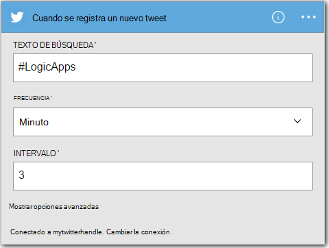
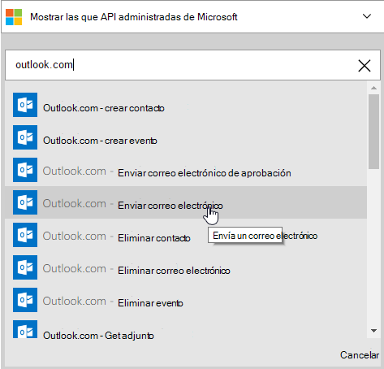
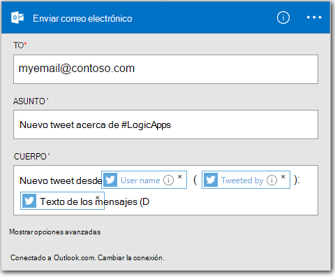

<properties
    pageTitle="Crear una lógica de la aplicación | Microsoft Azure"
    description="Aprenda a crear aplicaciones de lógica conectar servicios de SaaS"
    authors="jeffhollan"
    manager="dwrede"
    editor=""
    services="logic-apps"
    documentationCenter=""/>

<tags
    ms.service="logic-apps"
    ms.workload="na"
    ms.tgt_pltfrm="na"
    ms.devlang="na"
    ms.topic="get-started-article"
    ms.date="10/18/2016"
    ms.author="jehollan"/>

# Crear una nueva aplicación de lógica conectar servicios de SaaS

Este tema muestra cómo, en tan sólo unos minutos, puede empezar a trabajar con [Aplicaciones de Azure lógica](app-service-logic-what-are-logic-apps.md). Guiaremos a través de un flujo de trabajo simple que le permite enviar tweets interesantes a su correo electrónico.

Para usar este escenario, es necesario:

- Una suscripción de Azure
- Una cuenta de Twitter
- Un Outlook.com o un buzón alojado de Office 365

## Crear una nueva aplicación lógica al correo electrónico tweets

1. En el [panel de portal de Azure](https://portal.azure.com), seleccione **nuevo**. 
2. En la barra de búsqueda, buscar 'lógica app' y, a continuación, seleccione **La aplicación lógica**. También puede seleccionar **nuevo**, **Web + Mobile**y seleccione la **Lógica de la aplicación**. 
3. Escriba un nombre para la lógica de la aplicación, seleccione una ubicación, el grupo de recursos y seleccione **crear**.  Si selecciona **fijar a Mi panel** se abrirá automáticamente la lógica de la aplicación una vez implementado.  
4. Después de abrir la lógica de la aplicación por primera vez puede seleccionar desde una plantilla para iniciar.  Por ahora, haga clic en **La aplicación lógica en blanco** para generar esto desde el principio. 
1. El primer elemento que debe crear es el desencadenador.  Éste es el evento que se iniciará la aplicación lógica.  Buscar en el cuadro de búsqueda de desencadenador de **twitter** y selecciónelo.
7. Ahora tendrá que escribir en un término de búsqueda para desencadenar en.  Determinan la **frecuencia** y el **intervalo de** la frecuencia con la lógica de la aplicación buscará nuevos tweets (y todos los tweets durante el que el intervalo de tiempo de retorno).
    

5. Seleccione el botón de **nuevo paso** y, a continuación, elija **Agregar una acción** o **Agregar una condición**
6. Cuando se selecciona **una acción de agregar**, puede buscar de los [conectores disponibles](../connectors/apis-list.md) para elegir una acción. Por ejemplo, puede seleccionar **Outlook.com - enviar correo electrónico** para enviar correo desde una dirección de outlook.com:  
    

7. Ahora usted tiene que rellenar los parámetros para el correo electrónico que desee:  

8. Por último, puede seleccionar **Guardar** para realizar la lógica de la aplicación live.

## Administrar la lógica de la aplicación después de su creación

Ahora la lógica de la aplicación está en funcionamiento. Comprobará periódicamente para tweets con el término de búsqueda especificado. Cuando encuentra un tweet coincidente, enviará un correo electrónico. Por último, podrá ver cómo deshabilitar la aplicación o ver cómo lo está haciendo.

1. Ir al [Portal de Azure](https://portal.azure.com)

1. Haga clic en **Examinar** en el lado izquierdo de la pantalla y seleccione **Aplicaciones de lógica**.

2. Haga clic en la nueva aplicación de lógica que acaba de crear para ver el estado actual e información general.

3. Para editar su nueva lógica de la aplicación, haga clic en **Editar**.

5. Para desactivar la aplicación, haga clic en **desactivar** en la barra de comandos.

1. Ver historiales de ejecución y desencadenador para supervisar cuándo se ejecuta la lógica de la aplicación.  Puede hacer clic en **Actualizar** para ver los datos más recientes.

En menos de 5 minutos podía configurar una lógica simple de la aplicación en la nube. Para obtener más información acerca de las características de aplicaciones de lógica, consulte [usar las opciones de lógica de la aplicación]. Para obtener información acerca de las definiciones de la lógica de la aplicación ellos mismos, vea [crear definiciones de lógica de la aplicación](app-service-logic-author-definitions.md).

<!-- Shared links -->
[Azure portal]: https://portal.azure.com
[Utilizar características de lógica de la aplicación]: app-service-logic-create-a-logic-app.md
