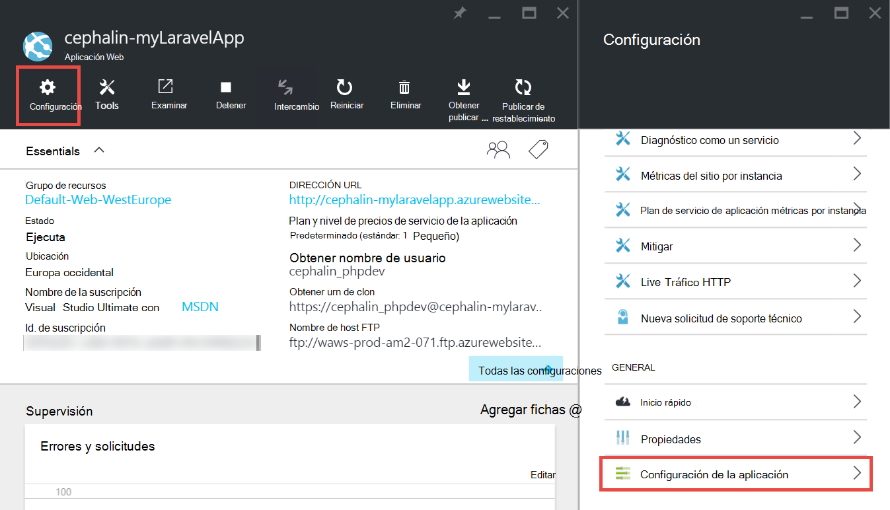

<properties
    pageTitle="Crear, configurar e implementar una aplicación web PHP en Azure"
    description="Un tutorial que muestra cómo ejecutar una aplicación web PHP (Laravel) en el servicio de aplicación de Azure. Obtenga información sobre cómo configurar el servicio de aplicación Azure para satisfacer los requerimientos de la framework PHP que elija."
    services="app-service\web"
    documentationCenter="php"
    authors="cephalin"
    manager="wpickett"
    editor=""
    tags="mysql"/>

<tags
    ms.service="app-service-web"
    ms.workload="web"
    ms.tgt_pltfrm="na"
    ms.devlang="PHP"
    ms.topic="article"
    ms.date="06/03/2016" 
    ms.author="cephalin"/>

# Crear, configurar e implementar una aplicación web PHP en Azure

[AZURE.INCLUDE [tabs](../../includes/app-service-web-get-started-nav-tabs.md)]

Este tutorial muestra cómo crear, configurar e implementar una aplicación web PHP para Azure y cómo configurar el servicio de aplicación de Azure para cumplir los requisitos de su aplicación web PHP. Al final del tutorial, tendrá un trabajo [Laravel](https://www.laravel.com/) web app ejecutándose en vivo en el [Servicio de aplicación de Azure](../app-service/app-service-value-prop-what-is.md).

Como desarrollador de PHP, puede traer el marco PHP favorito en Azure. Este tutorial utiliza Laravel simplemente como un ejemplo concreto de la aplicación. Usted aprenderá: 

- Implementar mediante Git
- Versión PHP de conjunto
- Utilizar un archivo de inicio que no está en el directorio raíz de la aplicación
- Variables de entorno específicas de acceso
- Actualizar la aplicación en Azure

Puede aplicar lo que aprenda aquí a otras aplicaciones web PHP que se despliega en Azure.

>[AZURE.INCLUDE [app-service-linux](../../includes/app-service-linux.md)] 

## Requisitos previos

- Instalar [PHP 5.6.x](http://php.net/downloads.php) (soporte de PHP 7 es beta)
- Instalar [Composer](https://getcomposer.org/download/)
- Instalar la [CLI de Azure](../xplat-cli-install.md)
- Instalar [Git](http://www.git-scm.com/downloads)
- Obtener una cuenta de Microsoft Azure. Si no tienes una cuenta, puede [registrarse para una prueba gratuita](/pricing/free-trial/?WT.mc_id=A261C142F) o [activar las ventajas del suscriptor de Visual Studio](/pricing/member-offers/msdn-benefits-details/?WT.mc_id=A261C142F).

>[AZURE.NOTE] Ver una aplicación web en acción. [Pruebe la aplicación servicio](http://go.microsoft.com/fwlink/?LinkId=523751) inmediatamente y crear una aplicación de corta duración starter: no requerida ninguna tarjeta de crédito, sin compromisos.

## Crear una aplicación PHP (Laravel) en el equipo de desarrollo

1. Abra un nuevo símbolo del sistema Windows, ventana de PowerShell, shell de Linux o terminal de OS X. Ejecute los comandos siguientes para comprobar que las herramientas necesarias están instaladas correctamente en el equipo. 

        php --version
        composer --version
        azure --version
        git --version

    

    Si no ha instalado las herramientas, vea [requisitos previos](#Prerequisites) para obtener vínculos de descarga.
    
2. Laravel instalación de este modo:

        composer global require "laravel/installer

3. `CD`en un directorio de trabajo y cree una nueva aplicación de Laravel de este modo:

        cd <working_directory>
        laravel new <app_name>

4. `CD`en el recién creado `<app_name>` directory y prueba de la aplicación de este modo:

        cd <app_name>
        php artisan serve
        
    Puede ir a http://localhost:8000 en un explorador ahora y vea la pantalla de inicio de Laravel.
    
    
    
Tan lejos, sólo el flujo de trabajo normal de Laravel y no está aquí para <a href="https://laravel.com/docs/5.2" rel="nofollow">aprender Laravel</a>. Así que continuemos.

## Crear una aplicación web de Azure y configurar distribución Git

>[AZURE.NOTE] "Esperar! ¿Qué ocurre si deseo implementar con FTP?" Hay un [tutorial FTP](web-sites-php-mysql-deploy-use-ftp.md) para sus necesidades. 

Con la CLI de Azure, puede crear una aplicación web de servicio de la aplicación de Azure y configurarla para implementación de Git con una sola línea de comandos. Hagamos esto.

1. Cambiar al modo de ASM y conéctese a Azure:

        azure config mode asm
        azure login
    
    Siga el mensaje de ayuda para continuar el proceso de inicio de sesión.
    
    

4. Ejecute el comando para crear la aplicación web de Azure con la implementación de la Git. Cuando se le pida, especifique el número de la región deseada.

        azure site create --git <app_name>
    
    
    
    >[AZURE.NOTE] Si nunca ha establecido credenciales de distribución para la suscripción de Azure, se le pedirá adecuado para crearlos. Estas credenciales, no las credenciales de cuenta de Azure, se utilizan por el servicio de la aplicación sólo para las implementaciones de Git y los inicios de sesión FTP. 
    
    Este comando crea un nuevo repositorio de Git en el directorio actual (con `git init`) y se conecta al repositorio en Azure como remoto Git (con `git remote add`).

<a name="configure"/>
## Configurar la aplicación web de Azure

Para que la aplicación Laravel trabajar en Azure, debe prestar atención a varias cosas. Realizará este ejercicio similar para el marco PHP de elección.

- Configurar PHP 5.5.9 o superior. Ver [Últimos Laravel 5.2 servidor requisitos](https://laravel.com/docs/5.2#server-requirements) para la lista completa de requisitos del servidor. El resto de la lista son extensiones que ya están habilitadas las instalaciones de PHP de Azure. 
- Establecer las variables de entorno que la aplicación necesita. Laravel utiliza el `.env` archivo para facilitar la definición de variables de entorno. Sin embargo, desde entonces no debe estar comprometida en control de código fuente (consulte [Configuración del entorno de Laravel](https://laravel.com/docs/5.2/configuration#environment-configuration), se establece la configuración de la aplicación de su aplicación web Azure en su lugar.
- Asegúrese de que señala la entrada de la aplicación Laravel, `public/index.php`, se carga primero. Consulte [Descripción general del ciclo de vida de Laravel](https://laravel.com/docs/5.2/lifecycle#lifecycle-overview). En otras palabras, debe establecer la dirección URL de raíz de la aplicación web para que señale a la `public` directory.
- Habilitar la extensión de Composer en Azure, ya que tienen un composer.json. De este modo, puede dejar que Composer se preocupe acerca de cómo obtener los paquetes necesarios al implementar con `git push`. Es una cuestión de comodidad. Si no habilita la automatización de Composer, sólo debe quitar `/vendor` desde el `.gitignore` de archivos para que incluya Git ("ONU-omite") todo el contenido de la `vendor` directorio cuando confirmación e implementar código.

Vamos a configurar estas tareas secuencialmente.

4. Defina la versión PHP que requiere su aplicación Laravel.

        azure site set --php-version 5.6

    Haya terminado la configuración de la versión PHP! 
    
4. Generar un nuevo `APP_KEY` para su Azure web app y establézcalo como configuración de la aplicación para las aplicaciones web de Azure.

        php artisan key:generate --show
        azure site appsetting add APP_KEY="<output_of_php_artisan_key:generate_--show>"

4. Además, habilitar la depuración de Laravel con el fin de tener preferencia sobre cualquier críptico `Whoops, looks like something went wrong.` página.

        azure site appsetting add APP_DEBUG=true

    Ha terminado de establecer variables de entorno.
    
    >[AZURE.NOTE] Espere, vamos a ralentizar un poco y explique lo que hace Laravel y lo hace aquí Azure. Laravel utiliza el `.env` archivo en el directorio raíz para proporcionar variables de entorno para la aplicación, donde encontrará la línea `APP_DEBUG=true` (y también `APP_KEY=...`). Se tiene acceso a esta variable en `config/app.php` por el código de     `'debug' => env('APP_DEBUG', false),`. [env()](https://laravel.com/docs/5.2/helpers#method-env) es un método auxiliar Laravel que utiliza el PHP [getenv()](http://php.net/manual/en/function.getenv.php) en segundo plano.
    >
    >Sin embargo, `.env` se omite por Git porque está señalada el `.gitignore` archivo en el directorio raíz. En pocas palabras, `.env`  
 en la Git local repositorio no se inserta en Azure con el resto de los archivos. Por supuesto, se puede quitar esa línea de `.gitignore`, pero ya hemos establecido que no se recomienda confirmar este archivo en el control de código fuente. No obstante, necesitará una manera de especificar estas variables de entorno en Azure. 
    >
    >La buena noticia es que la configuración de la aplicación en el servicio de aplicación de Azure admite [getenv()](http://php.net/manual/en/function.getenv.php)  
 en PHP. Así que mientras puede utilizar FTP u otro medio para cargar manualmente un `.env` archivo en Azure, basta con especificar las variables que desee como configuración de la aplicación de Azure sin un `.env` en Azure, al igual que acaba de hacer. Además, si una variable está en ambos un `.env` de archivos y configuración de la aplicación de Azure, la configuración de la aplicación de Azure gana.     

4. La última dos tareas (configurando el directorio virtual y habilitación de compositor) requiere el [portal de Azure](https://portal.azure.com), así que inicie sesión en el [portal](https://portal.azure.com) con tu cuenta de Azure.

4. Desde el menú de la izquierda, haga clic en **Servicios de la aplicación** > **&lt;app_name >** > **Herramientas**.

    
    
    >[AZURE.TIP] Si hace clic en **configuración** , en lugar de **Herramientas**, podrá tener acceso a la **Configuración de la aplicación**  
 blade, que le permite establece versiones PHP, configuración de aplicaciones y directorios virtuales como usted acaba de hacer. 
    
4. Haga clic en **extensiones** > **Agregar** para agregar una extensión.

4. Seleccione **Composer** en la **extensión de elegir** [blade](../azure-portal-overview.md) (*blade*: abre horizontalmente en una página de portal).

4. En la hoja de **aceptación de condiciones legales** , haga clic en **Aceptar** . 

5. En el módulo de **extensión de agregar** , haga clic en **Aceptar** .

    Cuando haya terminado Azure agregando la extensión, debería ver un mensaje emergente descriptivo en la esquina, así como  **Compositor** enumerados en la hoja de **extensiones** .

    

    ¡Habilitación de Composer haya terminado!
    
4. En el módulo de su aplicación web, haga clic en **configuración de** > **Configuración de la aplicación**.

    

    En la hoja de **Configuración de la aplicación** , tenga en cuenta la versión PHP establecidos anteriormente:

    

    y la configuración de la aplicación agregada:
    
    

4. Desplácese hasta el final de la hoja y cambie el directorio raíz virtual para que apunte a **site\wwwroot\public** en lugar de **site\wwwroot**.

    

4. Haga clic en **Guardar** en la parte superior de la hoja.

    Termine configurando el directorio virtual! 

## Implementar su aplicación web con Git (y las variables de entorno)

Está listo para implementar el código ahora. Realizará este en el símbolo del sistema o terminal.

4. Confirmar todos los cambios e implementar el código a la aplicación web de Azure como lo haría en cualquier repositorio Git:

        git add .
        git commit -m "Hurray! My first commit for my Azure app!"
        git push azure master 

    Cuando se ejecuta `git push`, se le pedirá que proporcione su contraseña de implementación Git. Si se solicita que crear credenciales de distribución de `azure site create` anterior, escriba la contraseña que utilizó.
    
5. Veamos lo ejecuta en el explorador mediante la ejecución de este comando:

        azure site browse

    El explorador debe mostrar la pantalla de inicio de Laravel.
    
    
    
    Enhorabuena, ahora se ejecuta una aplicación web de Laravel en Azure.
             
## Solucionar errores comunes

Éstos son algunos los errores que puede encontrar al seguir este tutorial:

- [CLI Azure muestra "'sitio' no es un comando de azure"](#clierror)
- [La aplicación Web muestra el error HTTP 403](#http403)
- [La aplicación Web muestra "Chillidos, parece algo salió mal."](#whoops)
- [La aplicación Web no muestra "admitido cifrador encontrado."](#encryptor)

### CLI Azure muestra "'sitio' no es un comando de azure"

Cuando se ejecuta `azure site *` en el terminal de línea de comandos, puede ver el error`error:   'site' is not an azure command. See 'azure help'.` 

Suele ser el resultado de conmutación en el modo "ARM" (Azure Resource Manager). Para resolver este problema, cambie en modo "ASM" (administración de servicios de Azure) mediante la ejecución de `azure config mode asm`.

### La aplicación Web muestra el error HTTP 403

Ha implementado su aplicación web a Azure correctamente, pero cuando vaya a la aplicación web de Azure, obtendrá un `HTTP 403` o`You do not have permission to view this directory or page.`

Esto es más probable porque la aplicación web no puede encontrar el punto de entrada a la aplicación Laravel. Asegúrese de que ha cambiado el directorio raíz virtual para que apunte a `site\wwwroot\public`, donde de Laravel `index.php` es (vea [Configurar la aplicación web de Azure](#configure)).

### La aplicación Web muestra "Chillidos, parece algo salió mal."

Ha implementado su aplicación web a Azure correctamente, pero cuando vaya a la aplicación web de Azure, recibe el mensaje críptico`Whoops, looks like something went wrong.`

Para obtener un error más descriptivo, habilitar la depuración Laravel estableciendo `APP_DEBUG` variable de entorno `true` (vea [Configurar la aplicación web de Azure](#configure)).

### La aplicación Web no muestra "admitido cifrador encontrado."

Ha implementado su aplicación web a Azure correctamente, pero cuando vaya a la aplicación web de Azure, obtendrá el mensaje de error siguiente:

    
Es un error desagradable, pero al menos no es críptico desde que se activó la depuración Laravel. Una búsqueda rápida de la cadena de error en los foros de Laravel mostrar que es debido a que no se establece la APP_KEY `.env`, o en su caso, no tiene `.env` en Azure en absoluto. Puede solucionar este problema agregando configuración `APP_KEY` como una aplicación de Azure configuración (vea [Configurar la aplicación web de Azure](#configure)).
    
## Próximos pasos

Obtenga información sobre cómo agregar datos a la aplicación mediante la [creación de una base de datos MySQL en Azure](../store-php-create-mysql-database.md). Mirad vínculos más útiles para PHP en Azure a continuación:

- [Centro para desarrolladores de PHP](/develop/php/).
- [Crear una aplicación web de Azure Marketplace](app-service-web-create-web-app-from-marketplace.md)
- [Configurar PHP en aplicaciones de Azure de la aplicación de servicio Web](web-sites-php-configure.md)
- [Convertir WordPress multisitio en servicio de la aplicación de Azure](web-sites-php-convert-wordpress-multisite.md)
- [WordPress de clase empresarial en servicio de la aplicación de Azure](web-sites-php-enterprise-wordpress.md)
