<properties
    pageTitle="Implementar una aplicación ASP.NET al servicio de la aplicación de Azure usando Visual Studio | Microsoft Azure"
    description="Aprenda a implementar un proyecto web ASP.NET en una aplicación web nueva en el servicio de la aplicación de Azure, utilizando Visual Studio."
    services="app-service\web"
    documentationCenter=".net"
    authors="tdykstra"
    manager="wpickett"
    editor=""/>

<tags
    ms.service="app-service-web"
    ms.workload="web"
    ms.tgt_pltfrm="na"
    ms.devlang="dotnet"
    ms.topic="get-started-article"
    ms.date="07/22/2016"
    ms.author="rachelap"/>

# Implementar una aplicación web ASP.NET al servicio de la aplicación de Azure, utilizando Visual Studio

[AZURE.INCLUDE [tabs](../../includes/app-service-web-get-started-nav-tabs.md)]

## Información general

Este tutorial muestra cómo implementar una aplicación web ASP.NET a una [aplicación web en el servicio de aplicación de Azure](app-service-web-overview.md) con Visual Studio 2015.

El tutorial se supone que un desarrollador ASP.NET que no tiene ninguna experiencia con el uso de Azure. Cuando haya terminado, tendrá una aplicación web simple arriba y ejecutan en la nube.

Aprenderá:

* Cómo crear una nueva aplicación web de servicio de la aplicación mientras se crea un nuevo proyecto web en Visual Studio.
* Cómo implementar un proyecto web para una aplicación de servicio de la aplicación web mediante Visual Studio.

El diagrama ilustra lo que hacer en el tutorial.

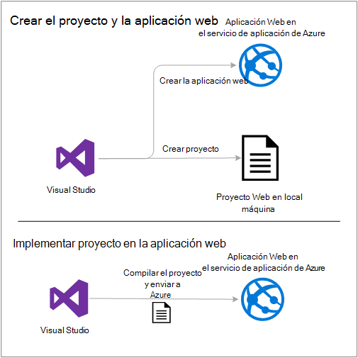

Al final del tutorial, una sección de [solución de problemas](#troubleshooting) proporciona ideas sobre qué hacer si algo no funciona, y una sección de [pasos siguiente](#next-steps) proporciona vínculos a otros tutoriales que profundice más sobre cómo utilizar el servicio de aplicación de Azure.

Como se trata de un tutorial de introducción, se muestra cómo implementar el proyecto de web es una simple que no utiliza una base de datos y no realiza autenticación ni autorización. Para obtener vínculos a temas más avanzados de implementación, vea [cómo implementar una aplicación web de Azure](web-sites-deploy.md).

Aparte el tiempo necesario para instalar el SDK de Azure para. NET, este tutorial tardará unos 10 a 15 minutos en completarse.

## Requisitos previos

* El tutorial se supone que ya ha trabajado con MVC de ASP.NET y Visual Studio. Si necesita una introducción, vea [Introducción a ASP.NET MVC 5](http://www.asp.net/mvc/overview/getting-started/introduction/getting-started).

* Necesita una cuenta de Azure. Puede [Abrir una cuenta gratuita de Azure](/pricing/free-trial/?WT.mc_id=A261C142F) o [beneficios para suscriptores activar Visual Studio](/pricing/member-offers/msdn-benefits-details/?WT.mc_id=A261C142F). 

    Si desea empezar a trabajar con el servicio de aplicación de Azure antes de registrarse para una cuenta de Azure, vaya a [Tratar de servicio de la aplicación](http://go.microsoft.com/fwlink/?LinkId=523751). Allí puede crear una aplicación de inicio de corta duración en servicio de la aplicación: no se requiere tarjeta crédito y sin compromisos.

## Configurar el entorno de desarrollo

El tutorial está escrito para Visual Studio 2015 con [Azure SDK para .NET](../dotnet-sdk.md) 2,9 o posterior. 

* [Descargar el último SDK de Azure para Visual Studio 2015](http://go.microsoft.com/fwlink/?linkid=518003). El SDK instala Visual Studio 2015 si aún no lo tiene.

    >[AZURE.NOTE] Dependiendo de cuántas de las dependencias SDK ya tiene en su equipo, instalar el SDK podría tardar mucho tiempo, desde varios minutos a media hora o más.

Si tiene Visual Studio 2013 y prefiere utilice, puede [descargar el último SDK de Azure para Visual Studio de 2013](http://go.microsoft.com/fwlink/?LinkID=324322). Algunas pantallas tendrán un aspecto diferentes de las ilustraciones.

## Configurar un nuevo proyecto web

El siguiente paso es crear un proyecto web en Visual Studio y una aplicación web en el servicio de aplicación de Azure. En esta sección del tutorial se configura el nuevo proyecto web. 

1. Abra Visual Studio 2015.

2. Haga clic en **archivo > Nuevo > proyecto**.

3. En el cuadro de diálogo **Nuevo proyecto** , haga clic en **Visual C# > Web > ASP.NET Web Application**.

3. Asegúrese de que **.NET Framework 4.5.2** está seleccionado como el marco de trabajo de destino.

4.  [Perspectivas de aplicación de Azure](../application-insights/app-insights-overview.md) supervisa su aplicación web para disponibilidad, performance y uso. Se selecciona la casilla de verificación **Agregar perspectivas de aplicación al proyecto** por crear un proyecto web después de instalar Visual Studio de forma predeterminada la primera vez. Desactive la casilla de verificación si está activada, pero no desea probar las perspectivas de aplicación.

4. Nombre de la aplicación **MyExample**y, a continuación, haga clic en **Aceptar**.

    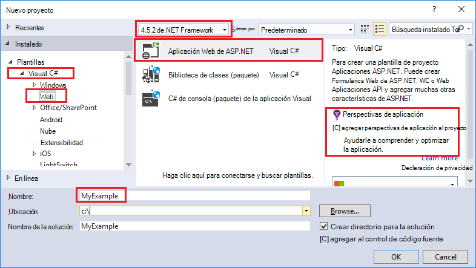

5. En el cuadro de diálogo **Nuevo proyecto ASP.NET** , seleccione la plantilla **MVC** y, a continuación, haga clic en **Autenticación de cambio**.

    Para este tutorial, implementar un proyecto web de ASP.NET MVC. Si desea obtener información sobre cómo implementar un proyecto ASP.NET Web API, consulte la sección [pasos siguientes](#next-steps) . 

    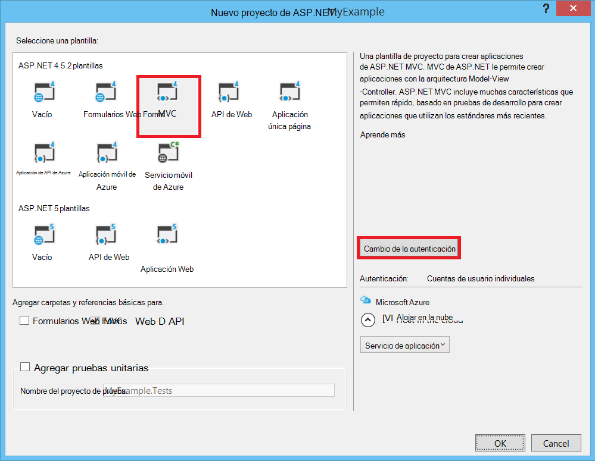

6. En el cuadro de diálogo **Cambio de la autenticación** , haga clic en **Sin autenticación**y, a continuación, haga clic en **Aceptar**.

    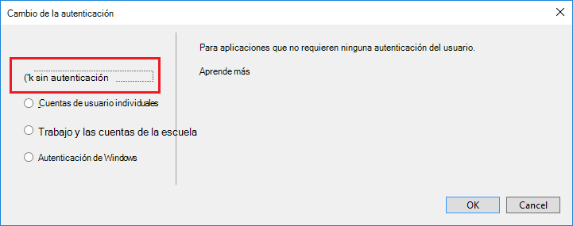

    Para este tutorial de iniciación está implementando una aplicación sencilla que no realiza el registro de usuario.

5. En la sección **Microsoft Azure** del cuadro de diálogo **Nuevo proyecto de ASP.NET** , asegúrese de que está seleccionada la opción **alojar en la nube** y que el **Servicio de aplicación** está seleccionado en la lista desplegable.

    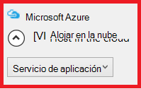

    Esta configuración directa de Visual Studio para crear una aplicación web de Azure para el proyecto web.

6. Haga clic en **Aceptar**

## Configurar recursos de Azure para una nueva aplicación web

Ahora Visual Studio para indicar acerca de los recursos de Azure que desee crear.

5. En el cuadro de diálogo **Crear aplicación de servicio** , haga clic en **Agregar una cuenta**y, a continuación, iniciar sesión en Azure con el identificador y la contraseña de la cuenta que utilice para administrar la suscripción de Azure.

    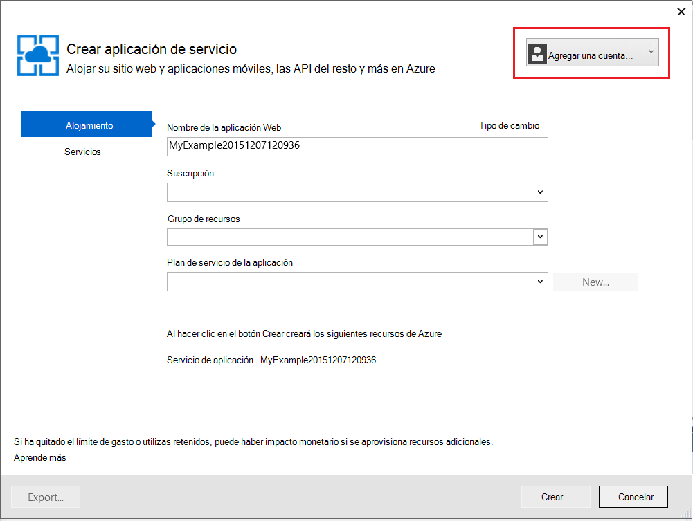

    Si ha iniciado anteriormente en el mismo equipo, no verá el botón de **Agregar una cuenta** . En ese caso, puede omitir este paso o es posible que necesite volver a especificar sus credenciales.
 
3. Escriba un **Nombre de la aplicación Web** que es único en el dominio *azurewebsites.net* . Por ejemplo, puede denominarlo MyExample con números a la derecha para que sea único, como MyExample810. Si se crea un nombre de web predeterminado, será único y se puede utilizar.

    Si alguien más ya ha utilizado el nombre que especifique, verá un signo de admiración rojo a la derecha en lugar de una marca de verificación verde y sólo tiene que especificar un nombre diferente.

    La dirección URL de la aplicación es este nombre plus *. azurewebsites.net*. Por ejemplo, si el nombre es `MyExample810`, la dirección URL es `myexample810.azurewebsites.net`.

    También puede utilizar un dominio personalizado con una aplicación web de Azure. Para obtener más información, consulte [configurar un nombre de dominio personalizado en el servicio de aplicación de Azure](web-sites-custom-domain-name.md).

6. Haga clic en el botón **nuevo** situado junto al cuadro de **Grupo de recursos** y, a continuación, escriba "MyExample" u otro nombre si lo prefiere. 

    

    Un grupo de recursos es una colección de recursos Azure como aplicaciones web, bases de datos y las máquinas virtuales. Para ver un tutorial, es generalmente mejor crear un nuevo grupo de recursos, ya es fácil eliminar en un solo paso cualquier Azure recursos que ha creado para el tutorial. Para obtener más información, vea [Introducción al administrador de recursos de Azure](../azure-resource-manager/resource-group-overview.md).

4. Haga clic en el botón **nuevo** junto a la lista desplegable **El Plan de servicio de la aplicación** .

    

    Aparece el cuadro de diálogo **Configurar el Plan de servicio de la aplicación** .

    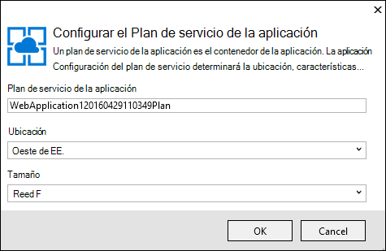

    En los pasos siguientes para configurar un plan de servicio de la aplicación del nuevo grupo de recursos. Un plan de servicio de la aplicación especifica los recursos de proceso que se ejecuta la aplicación web en. Por ejemplo, si elige el nivel libre, su aplicación API se ejecuta en VMs compartidas, mientras que para algunos niveles de pagadas se ejecuta en máquinas virtuales dedicadas. Para obtener más información, vea [Resumen de planes de servicio de la aplicación](../app-service/azure-web-sites-web-hosting-plans-in-depth-overview.md).

5. En el cuadro de diálogo **Configurar el Plan de servicio de la aplicación** , escriba "MyExamplePlan" u otro nombre si lo prefiere.

5. En la lista desplegable **ubicación** , elija la ubicación más cercana a usted.

    Esta opción especifica qué datacenter Azure se ejecutará la aplicación en. Para este tutorial, puede seleccionar cualquier región y no hará una diferencia notable. Pero para una aplicación de producción, desea que el servidor sea lo más cerca posible a los clientes que tienen acceso a ella, para minimizar la [latencia](http://www.bing.com/search?q=web%20latency%20introduction&qs=n&form=QBRE&pq=web%20latency%20introduction&sc=1-24&sp=-1&sk=&cvid=eefff99dfc864d25a75a83740f1e0090).

5. En la lista desplegable **tamaño** , haga clic en **libre**.

    Para este tutorial, el nivel de precios libre ofrecerá buena rendimiento suficiente.

6. En el cuadro de diálogo **Configurar el Plan de servicio de la aplicación** , haga clic en **Aceptar**.

7. En el cuadro de diálogo **Crear servicio de la aplicación** , haga clic en **crear**.

## Visual Studio crea la aplicación web y proyecto

En poco tiempo, normalmente menos de un minuto, Visual Studio crea el proyecto web y la aplicación web.  

La ventana **Explorador de soluciones** muestra los archivos y carpetas en el nuevo proyecto.

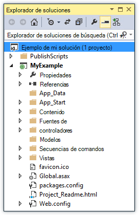

La ventana de **Actividad de servicio de la aplicación de Azure** muestra que se ha creado la aplicación web.

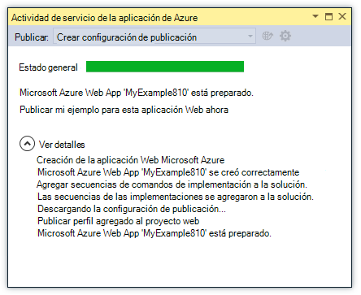

La ventana del **Explorador de nube** permite ver y administrar recursos de Azure, incluyendo la nueva aplicación web que acaba de crear.

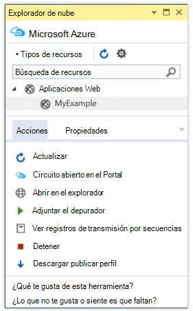
    
## Implementar el proyecto web en la aplicación web de Azure

En esta sección, implementar el proyecto web para la aplicación web.

1. En el **Explorador de soluciones**, haga clic en el proyecto y elija **Publicar**.

    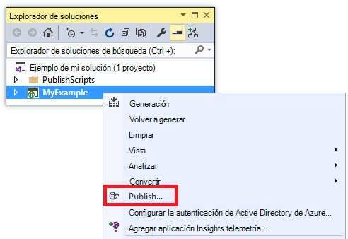

    En unos segundos, aparece el Asistente de **Publicación Web** . El asistente se abre en un *perfil de publicación* que tenga la configuración para implementar el proyecto web en la nueva aplicación web.

    El perfil de publicación incluye un nombre de usuario y una contraseña para la implementación.  Estas credenciales se han generado para usted y no tener que escribirlas. La contraseña está cifrada en un archivo oculto de específica del usuario en el `Properties\PublishProfiles` carpeta.
 
8. En la ficha **conexión** del Asistente para la **Publicación Web** , haga clic en **siguiente**.

    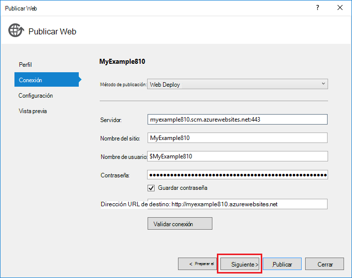

    A continuación es la ficha **configuración** . Aquí puede cambiar la configuración de compilación para implementar una versión de depuración para la [depuración remota](../app-service-web/web-sites-dotnet-troubleshoot-visual-studio.md#remotedebug). La ficha también ofrece varias [Opciones de publicación del archivo](https://msdn.microsoft.com/library/dd465337.aspx#Anchor_2).

10. En la ficha **configuración** , haga clic en **siguiente**.

    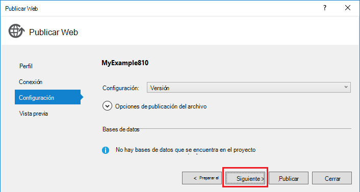

    La ficha **vista previa** es el siguiente. Aquí tienes una oportunidad para ver archivos que se van a copiar desde el proyecto a la API de la aplicación. Al implementar un proyecto para una aplicación de API que ya implementado en versiones anteriores, se copian sólo los archivos modificados. Si desea ver una lista de lo que se copiará, hacer clic en el botón **Vista previa de inicio** .

11. En la ficha **vista previa** , haga clic en **Publicar**.

    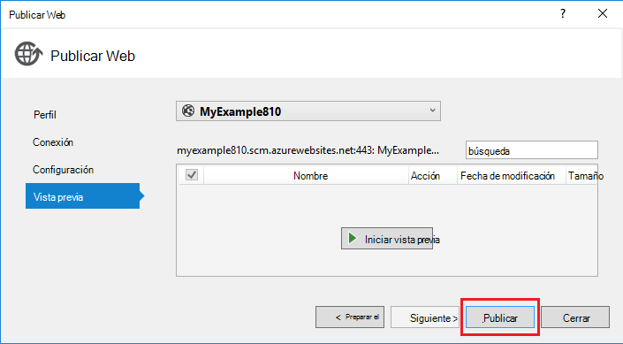

    Al hacer clic en **Publicar**, Visual Studio inicia el proceso de copiar los archivos al servidor de Azure. Esto puede tardar un minuto o dos.

    Las ventanas de **salida** y la **Actividad de servicio de la aplicación de Azure** mostrar las acciones de implementación tomadas y notificar la finalización correcta de la implementación.

    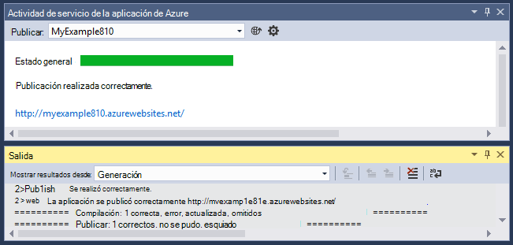

    Tras una implementación correcta, el explorador predeterminado se abre automáticamente la dirección URL de la aplicación web implementada, y ahora se ejecuta la aplicación que creó en la nube. La dirección URL en la barra de direcciones del navegador muestra que la aplicación web se carga desde Internet.

    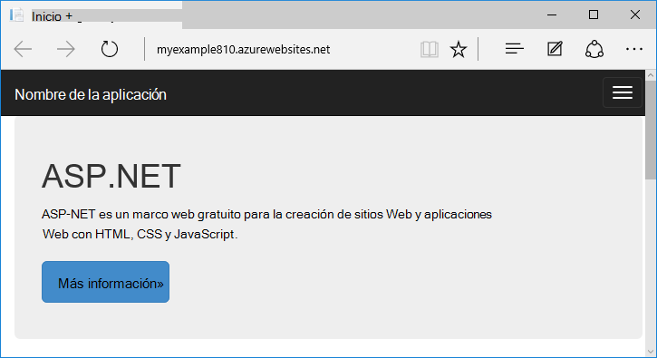

    > [AZURE.TIP]Puede habilitar la barra de herramientas **Web uno haga clic en publicar** para su implementación rápida. Haga clic en **Vista > barras de herramientas**y, a continuación, seleccione **Web uno haga clic en publicar**. Puede utilizar la barra de herramientas para seleccionar un perfil, haga clic en un botón para publicar o haga clic en un botón para abrir al Asistente de **Publicación Web** .
    > 

## Solución de problemas

Si surge un problema durante este tutorial, asegúrese de que está utilizando la versión más reciente del SDK de Azure para. NET. La forma más sencilla de hacerlo es [descargar el SDK de Azure para Visual Studio 2015](http://go.microsoft.com/fwlink/?linkid=518003). Si tiene instalada la versión actual, el instalador de plataforma Web permite saber que no es necesario realizar ninguna instalación.

Si se encuentra en una red corporativa y está intentando implementar al servicio de la aplicación de Azure a través de un firewall, asegúrese de que los puertos 443 y 8172 están abiertos para Web Deploy. Si no puede abrir esos puertos, consulte la siguiente sección de pasos siguientes para otras opciones de implementación.

Una vez que la aplicación web ASP.NET se ejecuta en el servicio de aplicación de Azure, desea obtener más información acerca de las características de Visual Studio que simplifican la solución de problemas. Para obtener información acerca del registro, la depuración remota y obtener más información, vean [Azure de solución de problemas de las aplicaciones web en Visual Studio](web-sites-dotnet-troubleshoot-visual-studio.md).

## Próximos pasos

En este tutorial, ha visto cómo crear una aplicación web simple e implementarlo en una aplicación web de Azure. Éstos son algunos temas relacionados y recursos para conocer más acerca del servicio de aplicación de Azure:

* Supervisar y administrar la aplicación web en el [portal de Azure](https://portal.azure.com/). 

    Para obtener más información, vea [información general sobre el portal de Azure](/services/management-portal/) y [Configurar web apps en el servicio de aplicación de Azure](web-sites-configure.md).

* Implementar un proyecto web existente en una nueva aplicación web, utilizando Visual Studio

    Haga clic en el proyecto en **Explorador de soluciones**y, a continuación, haga clic en **Publicar**. Elija el **Servicio de Microsoft Azure App** como el destino de publicación y, a continuación, haga clic en **nuevo**. Los cuadros de diálogo, a continuación, son los mismos que ha visto en este tutorial.

* Implementar un proyecto web desde el control de código fuente

    Para obtener información acerca de cómo [automatizar la implementación](http://www.asp.net/aspnet/overview/developing-apps-with-windows-azure/building-real-world-cloud-apps-with-windows-azure/continuous-integration-and-continuous-delivery) de un [sistema de control de código fuente](http://www.asp.net/aspnet/overview/developing-apps-with-windows-azure/building-real-world-cloud-apps-with-windows-azure/source-control), vea [Introducción a aplicaciones web en el servicio de aplicación de Azure](app-service-web-get-started.md) y [cómo implementar una aplicación web de Azure](web-sites-deploy.md).

* Implementar una API Web de ASP.NET en una aplicación de API de servicio de la aplicación de Azure

    Ha visto cómo crear una instancia del servicio de aplicación de Azure que está pensado principalmente para alojar un sitio Web. Servicio de la aplicación también ofrece características para hospedaje Web API, como la compatibilidad con CORS y soporte de metadatos de la API de generación de código de cliente. Puede utilizar funciones de la API en una aplicación web, pero si desea principalmente alojar una API en una instancia de servicio de la aplicación, una **aplicación de API** sería una opción mejor. Para obtener más información, vea [Introducción a aplicaciones de API y ASP.NET en el servicio de aplicación de Azure](../app-service-api/app-service-api-dotnet-get-started.md). 

* Agregar un nombre de dominio personalizado y SSL

    Para obtener información acerca de cómo utilizar SSL y su propio dominio (por ejemplo, www.contoso.com en lugar de contoso.azurewebsites.net), consulte los siguientes recursos:

    * [Configurar un nombre de dominio personalizado en el servicio de aplicación de Azure](web-sites-custom-domain-name.md)
    * [Habilitar HTTPS para un sitio Web de Azure](web-sites-configure-ssl-certificate.md)

* Eliminar el grupo de recursos que contiene su aplicación web y los recursos relacionados de Azure cuando haya terminado con ellos.

    Para obtener información acerca de cómo trabajar con grupos de recursos en el portal de Azure, vea [implementar recursos con plantillas de administrador de recursos y el portal de Azure](../resource-group-template-deploy-portal.md).   

*   Para obtener más ejemplos de creación de una aplicación Web de ASP.NET en la aplicación de servicio, consulte [crear e implementar una aplicación web ASP.NET en el servicio de aplicación de Azure](https://github.com/Microsoft/HealthClinic.biz/wiki/Create-and-deploy-an-ASP.NET-web-app-in-Azure-App-Service) y [crear e implementar una aplicación en Azure App servicio móvil](https://github.com/Microsoft/HealthClinic.biz/wiki/Create-and-deploy-a-mobile-app-in-Azure-App-Service) desde el [HealthClinic.biz](https://github.com/Microsoft/HealthClinic.biz) 2015 Connect [demo](https://blogs.msdn.microsoft.com/visualstudio/2015/12/08/connectdemos-2015-healthclinic-biz/). Para más tutoriales de la demostración HealthClinic.biz, vea [Tutoriales de herramientas de desarrollador de Azure](https://github.com/Microsoft/HealthClinic.biz/wiki/Azure-Developer-Tools-Quickstarts).
