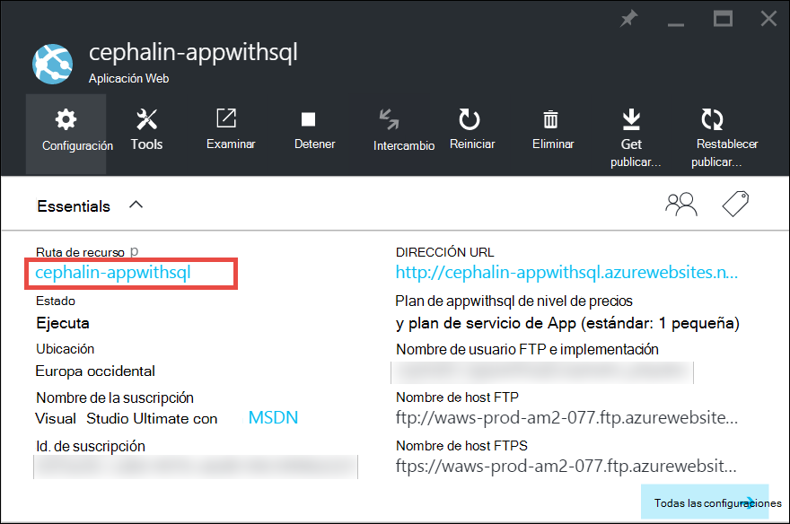
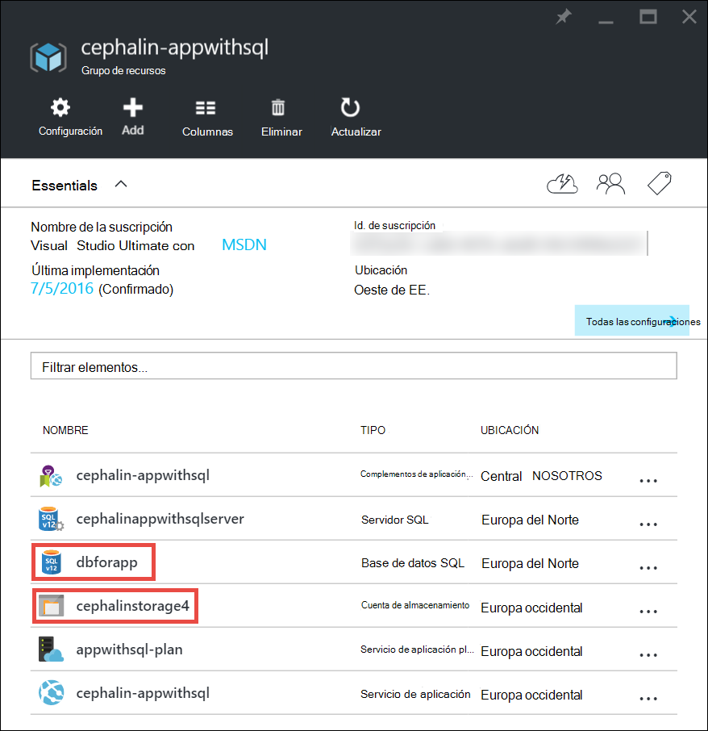
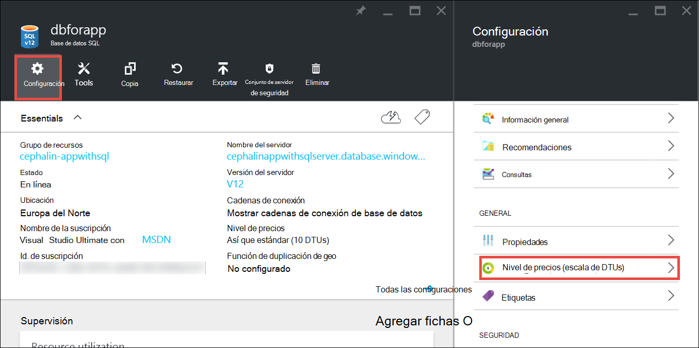
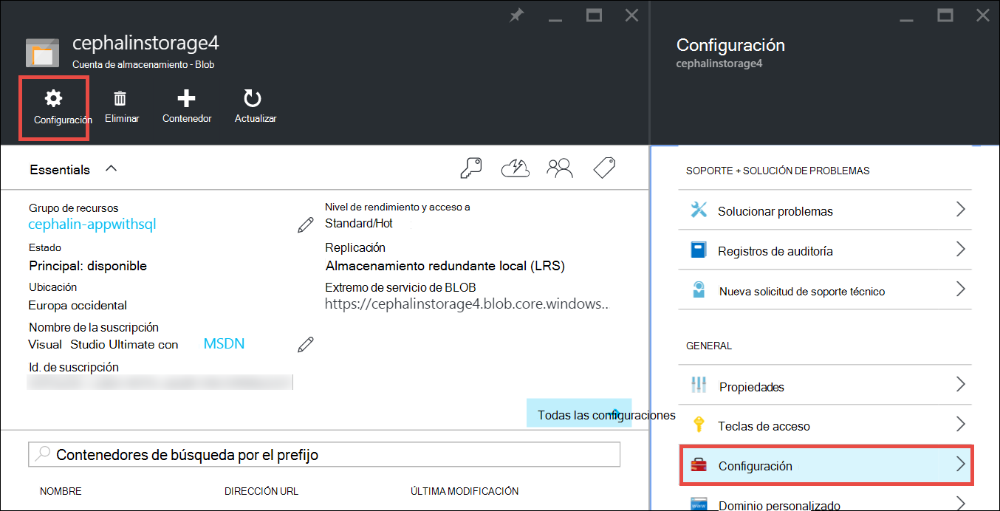

<properties
    pageTitle="Escalar una aplicación en Azure | Microsoft Azure"
    description="Aprenda a escalar una servicio de Azure App para agregar capacidad y funcionalidades de la aplicación."
    services="app-service"
    documentationCenter=""
    authors="cephalin"
    manager="wpickett"
    editor="mollybos"/>

<tags
    ms.service="app-service"
    ms.workload="na"
    ms.tgt_pltfrm="na"
    ms.devlang="na"
    ms.topic="article"
    ms.date="07/05/2016"
    ms.author="cephalin"/>

# Escalar una aplicación en Azure #

En este artículo se muestra cómo ampliar la aplicación de servicio de la aplicación de Azure. Hay dos flujos de trabajo para la escala de la escala, seguridad y escalado y este artículo explica la escala del flujo de trabajo.

- [Escalar](https://en.wikipedia.org/wiki/Scalability#Horizontal_and_vertical_scaling): obtener más CPU, memoria, espacio en disco y características adicionales como dedicadas máquinas virtuales (VMs), dominios personalizados y certificados, staging ranuras, ajuste automático y mucho más. Escalar cambiando el nivel de precios del plan de servicio de la aplicación que pertenece la aplicación.
- [Escala horizontal](https://en.wikipedia.org/wiki/Scalability#Horizontal_and_vertical_scaling): aumentar el número de instancias VM que se ejecutan las aplicaciones.
Se puede escalar a instancias como máximo 20, dependiendo de su nivel de precios. [Entornos de la aplicación de servicios](../app-service/app-service-app-service-environments-readme.md) de nivel **Premium** aumentará aún más el número de escalado a 50 instancias. Para obtener más información sobre el escalado, vea [recuento de la instancia la escala manual o automáticamente](../monitoring-and-diagnostics/insights-how-to-scale.md). Allí encontrará información acerca de cómo usar ajuste automático, que es escalar automáticamente basado en planificaciones y reglas predefinidas de recuento de la instancia.

Los valores de escala tienen sólo segundos para aplicar y afecta a todas las aplicaciones en su [plan de servicio de la aplicación](../app-service/azure-web-sites-web-hosting-plans-in-depth-overview.md).
No requieren cambiar el código o volver a implementar la aplicación.

Para obtener información sobre las características individuales de la aplicación de planes de servicio y precios, consulte [Detalles de precios de servicio de la aplicación](/pricing/details/web-sites/).  

> [AZURE.NOTE] Antes de cambiar un plan de servicio de la aplicación desde el nivel **libre** , quite primero los [límites de gastos](/pricing/spending-limits/) en lugar de la suscripción de Azure. Para ver o cambiar las opciones de su suscripción de servicio de la aplicación de Azure de Microsoft, consulte [Microsoft Azure suscripciones][azuresubscriptions].

## Escalar su nivel de precios

1. En el explorador, abra el [portal de Azure][portal].

2. En el módulo de su aplicación, **toda**la configuración y, a continuación, haga clic en **Escala**.

    ![Desplácese para escalar su aplicación de Azure.][ChooseWHP]

4. Elija su nivel y, a continuación, haga clic en **Seleccionar**.

    La ficha **notificaciones** parpadeará verde **éxito** tras completar la operación.

## Escalar recursos relacionados
Si su aplicación depende de otros servicios, como la base de datos de SQL Azure o el almacenamiento de Azure, también puede escalar los recursos según sus necesidades. Estos recursos no se escalan con el plan de servicio de la aplicación y se deben escalar por separado.

1. En **Essentials**, haga clic en el vínculo del **grupo de recursos** .

    

2. En la parte de **Resumen** de la hoja del **grupo de recursos** , haga clic en un recurso que desea escalar. Captura de pantalla siguiente muestra un recurso de base de datos de SQL y un recurso de almacenamiento de Azure.

    

3. Para un recurso de base de datos de SQL, haga clic en **configuración de** > nivel de**nivel de precios** para escalar los precios.

    

    También puede activar [replicación geo](../sql-database/sql-database-geo-replication-overview.md) para la instancia de base de datos de SQL.

    Para un recurso de almacenamiento de Azure, haga clic en **configuración de** > **configuración** escalar sus opciones de almacenamiento.

    

## Obtenga información sobre funciones para programadores
Según el nivel de precios, están disponibles las siguientes características orientadas al desarrollador:

### Valor de bits ###

- Los niveles **básico**, **estándar**y **Premium** admiten aplicaciones de 32 bits y de 64 bits.
- Los niveles del plan de **Shared** de **libre** y admiten aplicaciones de 32 bits sólo.

### Compatibilidad del depurador ###

- Compatibilidad del depurador está disponible para los modos **libre**, **Shared**y **básicas** en una conexión por plan de servicio de la aplicación.
- Compatibilidad del depurador está disponible para los modos **estándar** y **Premium** en cinco conexiones simultáneas por plan de servicio de la aplicación.

## Obtenga información acerca de otras características

- Para obtener información detallada acerca de todas las restantes características de los planes de servicio de la aplicación, incluyendo los precios y características de interés para todos los usuarios (incluidos los programadores), ver [Detalles de precios de servicio de la aplicación](/pricing/details/web-sites/).

>[AZURE.NOTE] Si desea empezar a trabajar con el servicio de aplicación de Azure antes de registrarse para una cuenta de Azure, vaya a [Tratar de servicio de la aplicación](http://go.microsoft.com/fwlink/?LinkId=523751) donde se puede crear inmediatamente una aplicación web de starter de corta duración en servicio de la aplicación. Tarjetas de crédito no son necesarios y no hay ningún compromisos.

## Próximos pasos

- Para empezar con Azure, consulte la [Versión de prueba gratuita de Microsoft Azure](/pricing/free-trial/).
- Para obtener información sobre precios, soporte técnico y SLA, visite los siguientes vínculos.

    [Información de precios de transferencias de datos](/pricing/details/data-transfers/)

    [Planes de soporte de Azure de Microsoft](/support/plans/)

    [Acuerdos de nivel de servicio](/support/legal/sla/)

    [Detalles de precios de base de datos SQL](/pricing/details/sql-database/)

    [Máquina virtual y tamaños de servicio de nube de Microsoft Azure][vmsizes]

    [Detalles de precios de servicio de la aplicación](/pricing/details/app-service/)

    [Detalles - conexiones SSL de los precios de servicio de la aplicación](/pricing/details/web-sites/#ssl-connections)

- Para obtener información acerca del servicio de aplicación de Azure, mejores prácticas, incluida la creación de una arquitectura escalable y resistente, vea [mejores prácticas: servicio Web Apps de Azure App](http://blogs.msdn.com/b/windowsazure/archive/2014/02/10/best-practices-windows-azure-websites-waws.aspx).

- Para ver vídeos sobre la escala de aplicaciones de servicio de la aplicación, consulte los siguientes recursos:

    - [Cuándo se debe escalar sitios Web Azure - con Stefan Schackow](/documentation/videos/azure-web-sites-free-vs-standard-scaling/)
    - [Sitios Web de Azure, CPU de escala automática o programada - con Stefan Schackow](/documentation/videos/auto-scaling-azure-web-sites/)
    - [Escala de sitios Web cómo Azure - con Stefan Schackow](/documentation/videos/how-azure-web-sites-scale/)

<!-- LINKS -->
[vmsizes]:/pricing/details/app-service/
[SQLaccountsbilling]:http://go.microsoft.com/fwlink/?LinkId=234930
[azuresubscriptions]:http://go.microsoft.com/fwlink/?LinkID=235288
[portal]: https://portal.azure.com/

<!-- IMAGES -->
[ChooseWHP]: ./media/web-sites-scale/scale1ChooseWHP.png
[ChooseBasicInstances]: ./media/web-sites-scale/scale2InstancesBasic.png
[SaveButton]: ./media/web-sites-scale/05SaveButton.png
[BasicComplete]: ./media/web-sites-scale/06BasicComplete.png
[ScaleStandard]: ./media/web-sites-scale/scale3InstancesStandard.png
[Autoscale]: ./media/web-sites-scale/scale4AutoScale.png
[SetTargetMetrics]: ./media/web-sites-scale/scale5AutoScaleTargetMetrics.png
[SetFirstRule]: ./media/web-sites-scale/scale6AutoScaleFirstRule.png
[SetSecondRule]: ./media/web-sites-scale/scale7AutoScaleSecondRule.png
[SetThirdRule]: ./media/web-sites-scale/scale8AutoScaleThirdRule.png
[SetRulesFinal]: ./media/web-sites-scale/scale9AutoScaleFinal.png
[ResourceGroup]: ./media/web-sites-scale/scale10ResourceGroup.png
[ScaleDatabase]: ./media/web-sites-scale/scale11SQLScale.png
[GeoReplication]: ./media/web-sites-scale/scale12SQLGeoReplication.png
