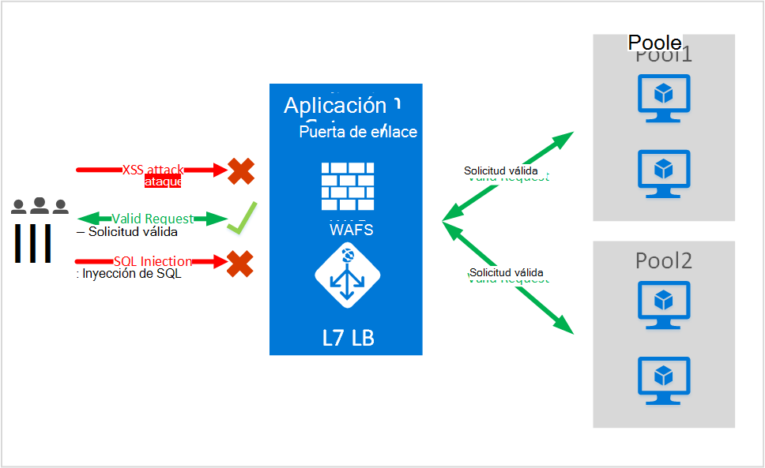
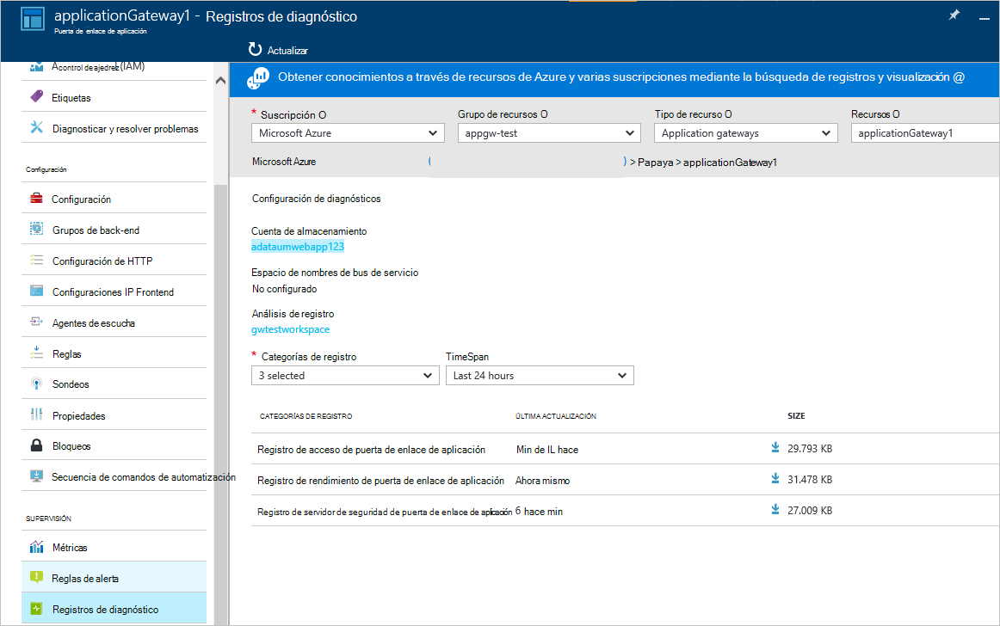

<properties
   pageTitle="Introducción al Firewall de aplicación Web (WAF) para la puerta de enlace de aplicación | Microsoft Azure"
   description="Esta página proporciona una visión general de Firewall de aplicación Web (WAF) para la puerta de enlace de aplicación "
   documentationCenter="na"
   services="application-gateway"
   authors="amsriva"
   manager="rossort"
   editor="amsriva"/>
<tags
   ms.service="application-gateway"
   ms.devlang="na"
   ms.topic="hero-article"
   ms.tgt_pltfrm="na"
   ms.workload="infrastructure-services"
   ms.date="10/25/2016"
   ms.author="amsriva"/>

# Servidor de aplicaciones Web de aplicación Gateway (vista previa)

Servidor de aplicaciones Web (WAF) es una característica de puerta de enlace de la aplicación para azure proporciona protección a aplicaciones web que aprovechan la puerta de enlace de aplicaciones para las funciones estándar de Control de entrega de aplicaciones (ADC). Para ello, el servidor de aplicaciones Web protegerlas contra la mayoría de la OWASP top 10 web vulnerabilidades comunes. Las aplicaciones Web son cada vez más objetivos de ataques malintencionados que aprovechan vulnerabilidades conocidas comunes. Comunes entre estos ataques son los ataques de inyección SQL, ataques de scripting entre sitios para nombrar algunos. Prevención de ataques de este tipo en código de aplicación puede ser difícil y puede requerir mantenimiento riguroso, revisión y supervisión en varias capas de la topología de la aplicación. Un servidor de seguridad de aplicación web centralizada para protegerse contra los ataques de la web simplifica mucho la administración de seguridad y le ofrece la mejor garantía a la aplicación contra las amenazas de las intrusiones. Una solución WAFS también puede reaccionar ante una amenaza de seguridad más rápida por la revisión de una vulnerabilidad conocida en una ubicación central en lugar de proteger cada una de las aplicaciones web individuales. Puertas de enlace de aplicación existentes se pueden convertir fácilmente a una puerta de enlace de la aplicación con el servidor de aplicaciones web.

Puerta de enlace de aplicación funciona como un controlador de entrega de aplicaciones y ofrece la terminación SSL, afinidad de sesión basada en cookies, la carga por turnos distribución contenido basado enrutamiento, capacidad de alojar varias mejoras de seguridad y sitios Web. Mejoras de seguridad ofrecidas por la puerta de enlace de aplicación incluyen administración de directivas de SSL compatibilidad con SSL de extremo a extremo. Estamos fortaleciendo introduciendo WAFS (servidor de aplicaciones web) integrada en el ADC que ofrece capacidades de seguridad de la aplicación de nuestro servicio. Esto proporciona un fácil de configurar una ubicación central para administrar y proteger las aplicaciones web contra vulnerabilidades comunes de web.

Configurar WAFS en puerta de enlace de aplicación proporciona las siguientes ventajas:

- Proteger la aplicación web de web vulnerabilidades y ataques sin necesidad de modificar el código de backend.
- Proteger varias aplicaciones web al mismo tiempo detrás de una puerta de enlace de la aplicación. Puerta de enlace de aplicación admite hasta 20 sitios Web detrás de una sola puerta de enlace puede protegerse contra los ataques de la web de hospedaje.
- Supervisar la aplicación web frente a ataques mediante informes en tiempo real generados por la aplicación gateway WAFS registros.
- Ciertos controles de cumplimiento de normas requieren todos los puntos de extremo enfrentadas internet esté protegida por una solución WAFS. Al usar puerta de enlace de aplicación con WAFS habilitado, puede cumplir estos requisitos de cumplimiento de normas.

## Información general

WAFS de puerta de enlace de aplicaciones se ofrece en un nuevo SKU (WAFS SKU) y viene preconfigurado con ModSecurity y conjunto de reglas del núcleo OWASP ofrecen protección básica contra la mayoría de la OWASP top 10 web vulnerabilidades comunes.

- Protección de la inyección de SQL
- Cruz de protección de secuencias de comandos de sitios
- Protección común ataques Web como inyección de comandos, solicitudes HTTP no autorizadas, respuesta HTTP que divide y ataques de inserción de archivos remotos
- Protección contra las violaciones de protocolo HTTP
- Protección contra anomalías de protocolo HTTP como la falta de host de agente de usuario y Aceptar encabezados
- HTTP DoS protecciones incluidas HTTP inundaciones y la prevención de DoS HTTP lento
- Prevención contra bots, rastreadores y escáneres
- Detección de configuraciones erróneas comunes aplicación (es decir, Apache, IIS, etcetera)

## WAFS modos

WAFS de puerta de enlace de aplicaciones puede configurarse para ejecutarse en los dos modos siguientes:

- **Modo de detección** : cuando se configura para ejecutarse en modo de detección, WAFS de puerta de enlace de aplicación supervisa y registra todas las alertas de amenaza en un archivo de registro. Debe asegurarse de que el registro de diagnósticos para puerta de enlace de aplicaciones está activado en la sección de diagnósticos. También necesitará asegurarse de que el registro WAFS está seleccionado y activado.
- **Modo de prevención** : cuando se configura para ejecutarse en modo de prevención, Application Gateway activamente bloquea intrusiones y ataques detectados por sus reglas. El atacante recibe una excepción 403 acceso no autorizado y se termina la conexión. Modo de prevención continúa iniciar este tipo de ataques en los registros de WAFS.

## WAFS de puerta de enlace de aplicación informes

WAFS de puerta de enlace de aplicación proporciona informes detallados sobre cada amenaza que detecte. El registro está integrado con los registros de diagnóstico de Azure y alertas se registran en un formato json.

    {
        "resourceId": "/SUBSCRIPTIONS/<subscriptionId>/RESOURCEGROUPS/<resourceGroupName>/PROVIDERS/MICROSOFT.NETWORK/APPLICATIONGATEWAYS/<applicationGatewayName>",
        "operationName": "ApplicationGatewayFirewall",
        "time": "2016-09-20T00:40:04.9138513Z",
        "category": "ApplicationGatewayFirewallLog",
        "properties":     {
            "instanceId":"ApplicationGatewayRole_IN_0",
            "clientIp":"108.41.16.164",
            "clientPort":1815,
            "requestUri":"/wavsep/active/RXSS-Detection-Evaluation-POST/",
            "ruleId":"OWASP_973336",
            "message":"XSS Filter - Category 1: Script Tag Vector",
            "action":"Logged",
            "site":"Global",
            "message":"XSS Filter - Category 1: Script Tag Vector",
            "details":{"message":" Warning. Pattern match "(?i)(<script","file":"/owasp_crs/base_rules/modsecurity_crs_41_xss_attacks.conf","line":"14"}}
    }

## Precios de SKU WAFS de puerta de enlace de aplicación

Durante la vista previa, no hay ningún cargo adicional para el uso de WAFS de puerta de enlace de aplicación. Seguirán cobrando en gastos de SKU básicas existentes. Le comunicaríamos los cargos WAFS SKU en el momento de disponibilidad general. Los clientes que han decidido implementar Application Gateway en SKU WAFS comenzaría acumulando SKU WAFS sólo después de anuncio de disponibilidad general de precios.

## Próximos pasos

Después de aprender más sobre las capacidades de WAFS, visite [cómo configurar Firewall de aplicación Web de puerta de enlace de aplicaciones](application-gateway-web-application-firewall-portal.md).
