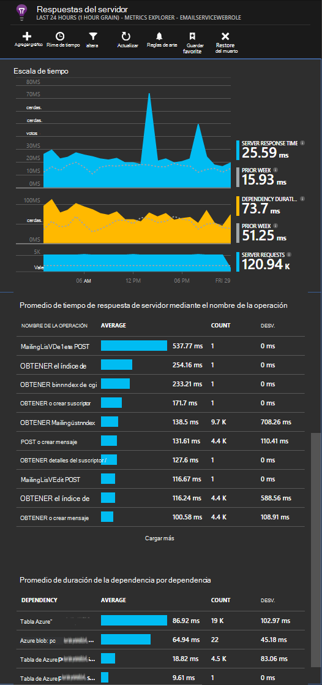

<properties
   pageTitle="Perspectivas de aplicación para los servicios de nube de Azure"
   description="Supervisar sus roles de web y trabajador eficazmente con los conocimientos de aplicación"
   services="application-insights"
   documentationCenter=""
   authors="soubhagyadash"
   manager="douge"
   editor="alancameronwills"/>

<tags
   ms.service="application-insights"
   ms.devlang="na"
   ms.tgt_pltfrm="ibiza"
   ms.topic="article"
   ms.workload="tbd"
   ms.date="03/02/2016"
   ms.author="sdash"/>

# <a name="application-insights-for-azure-cloud-services"></a>Perspectivas de aplicación para los servicios de nube de Azure


*Perspectivas de aplicación está en la vista previa*

[Aplicaciones de servicio de nube de Microsoft Azure](https://azure.microsoft.com/services/cloud-services/) pueden controlarse mediante [Perspectivas de aplicación de Visual Studio] [ start] para uso, errores, rendimiento y disponibilidad. Con los comentarios que obtener acerca del rendimiento y la eficacia de su aplicación en estado salvaje, puede tomar decisiones informadas sobre la dirección del diseño de cada ciclo de vida de desarrollo.


Necesitará una suscripción con [Microsoft Azure](http://azure.com). Iniciar sesión con una cuenta de Microsoft, que podría tener para Windows, XBox Live u otros servicios de nube de Microsoft. 


#### <a name="sample-application-instrumented-with-application-insights"></a>Aplicación de ejemplo instrumentado con perspectivas de aplicación

Eche un vistazo a esta [aplicación de ejemplo](https://github.com/Microsoft/ApplicationInsights-Home/tree/master/Samples/AzureEmailService) en el que las perspectivas de aplicación se agrega a un servicio de nube con dos funciones de trabajo alojadas en Azure. 

A continuación explica cómo adaptar su propio proyecto de servicio de nube de la misma manera.

## <a name="create-an-application-insights-resource-for-each-role"></a>Crear un recurso de información de aplicación para cada rol

Un recurso de información de aplicación es donde se analiza y muestra los datos de telemetría.  

1.  En el [portal de Azure][portal], cree un nuevo recurso de información de aplicación. Tipo de aplicación, seleccione la aplicación ASP.NET. 

    

2.  Realizar una copia de la clave de la instrumentación. Tendrá poco tiempo para configurar el SDK.

    


Generalmente, es [mejor crear un recurso independiente para los datos de cada función de web y trabajador](app-insights-separate-resources.md). 

Como alternativa, puede enviar los datos de todas las funciones en un solo recurso, pero establecer una [propiedad predeterminada] [ apidefaults] para que pueda filtrar o agrupar los resultados de cada función.

## <a name="sdk"></a>Instalar el SDK en cada proyecto


1. En Visual Studio, editar los paquetes de NuGet de su proyecto de aplicación de nube.

    


2. Para las funciones web, agregue el paquete de NuGet de [Perspectivas de aplicación para el Web](http://www.nuget.org/packages/Microsoft.ApplicationInsights.Web) . Esta versión del SDK incluye módulos que agregar contexto de servidor, como la información de funciones. Para las funciones de trabajo, utilice [Información de aplicaciones para servidores de Windows](https://www.nuget.org/packages/Microsoft.ApplicationInsights.WindowsServer/).

    


3. Configurar el SDK para enviar datos al recurso de información de aplicación.

    Establecer la clave de instrumentación como una opción de configuración en el archivo `ServiceConfiguration.Cloud.cscfg`. (El[código de ejemplo](https://github.com/Microsoft/ApplicationInsights-Home/blob/master/Samples/AzureEmailService/AzureEmailService/ServiceConfiguration.Cloud.cscfg)).
 
    ```XML
     <Role name="WorkerRoleA"> 
      <Setting name="APPINSIGHTS_INSTRUMENTATIONKEY" value="YOUR IKEY" /> 
     </Role>
    ```
 
    En una función de inicio adecuado, establezca la clave de instrumentación desde la opción de configuración:

    ```C#
     TelemetryConfiguration.Active.InstrumentationKey = RoleEnvironment.GetConfigurationSettingValue("APPINSIGHTS_INSTRUMENTATIONKEY");
    ```

    Nota, el mismo nombre de `APPINSIGHTS_INSTRUMENTATIONKEY` de la configuración se usará la configuración por diagnóstico de Azure reporting. 


    Haga esto para cada función en la aplicación. Vea los ejemplos:
 
 * [Función Web](https://github.com/Microsoft/ApplicationInsights-Home/blob/master/Samples/AzureEmailService/MvcWebRole/Global.asax.cs#L27)
 * [Función de trabajador](https://github.com/Microsoft/ApplicationInsights-Home/blob/master/Samples/AzureEmailService/WorkerRoleA/WorkerRoleA.cs#L232)
 * [Para páginas web](https://github.com/Microsoft/ApplicationInsights-Home/blob/master/Samples/AzureEmailService/MvcWebRole/Views/Shared/_Layout.cshtml#L13)   

4. Establezca el archivo ApplicationInsights.config se copia siempre en el directorio de salida. 

    (En el archivo .config, verá mensajes pidiéndole colocar allí la clave de la instrumentación. Sin embargo, para aplicaciones de nube es mejor para establecerla desde el archivo .cscfg. Esto garantiza que la función está identificada correctamente en el portal.)


#### <a name="run-and-publish-the-app"></a>Ejecutar y publicar la aplicación

Ejecute la aplicación y firmar en Azure. Abrir los recursos de las perspectivas de aplicación que creó, y verá que aparecen en [la búsqueda](app-insights-diagnostic-search.md)de puntos de datos individuales y los datos agregados en el [Explorador de métrica](app-insights-metrics-explorer.md). 

Agregar más telemetría - vea las secciones siguientes: y, a continuación, publicar la aplicación para obtener los comentarios de diagnóstico y uso directo. 


#### <a name="no-data"></a>¿No hay datos?

* Abra la [búsqueda] [ diagnostic] mosaico, para ver los eventos individuales.
* Utilice la aplicación, abrir diferentes páginas para que genera algunos telemetría.
* Espere unos segundos y haga clic en actualizar.
* Vea [solucionar problemas de][qna].


## <a name="more-telemetry"></a>Más de telemetría

En las secciones siguientes muestran cómo obtener telemetría adicional de distintos aspectos de la aplicación.


## <a name="track-requests-from-worker-roles"></a>Solicitudes de seguimiento de las funciones de trabajo

En los roles de web, el módulo de solicitudes automáticamente recopila datos sobre las solicitudes HTTP. Vea el [ejemplo MVCWebRole](https://github.com/Microsoft/ApplicationInsights-Home/tree/master/Samples/AzureEmailService/MvcWebRole) para obtener ejemplos de cómo puede reemplazar el comportamiento predeterminado de la colección. 

Puede capturar el rendimiento de las llamadas a las funciones de trabajo realizando un seguimiento de ellos en la misma forma que las solicitudes HTTP. En las perspectivas de aplicación, el tipo de solicitud telemetría mide una unidad de trabajo del lado servidor con nombre que se puede programar y puede triunfan o fracasan por separado. Mientras que las solicitudes HTTP se capturan automáticamente por el SDK, puede insertar su propio código para realizar el seguimiento de solicitudes a las funciones de trabajo.

Vea las dos funciones de trabajo de ejemplo instrumentadas para solicitudes de informe: [WorkerRoleA](https://github.com/Microsoft/ApplicationInsights-Home/tree/master/Samples/AzureEmailService/WorkerRoleA) y [WorkerRoleB](https://github.com/Microsoft/ApplicationInsights-Home/tree/master/Samples/AzureEmailService/WorkerRoleB)

## <a name="azure-diagnostics"></a>Diagnóstico de Azure

Datos de [Diagnóstico de Azure](../vs-azure-tools-diagnostics-for-cloud-services-and-virtual-machines.md) incluyen eventos de administración de funciones, contadores de rendimiento y registros de la aplicación. Puede tener estos enviados a las perspectivas de aplicación de modo que podrá verlas junto con el resto de la telemetría, lo que permite diagnosticar problemas.

Diagnóstico de Azure es particularmente útil si una función se produce un error inesperadamente o no puede iniciarse.

1. Haga clic en la función (no en el proyecto) para abrir sus propiedades y seleccione **Habilitar diagnósticos**, **Enviar diagnósticos para las perspectivas de aplicación**.

    

    **O si la aplicación está ya publicada y se ejecuta**, Abrir Explorador de servidores o explorador de nube, haga clic en la aplicación y seleccionar la misma opción.

3.  Seleccione el mismo recurso de las perspectivas de aplicación como la telemetría otro.

    Si lo desea, puede establecer un recurso diferente en las configuraciones de servicio diferente (nube, Local) para ayudar a mantener los datos de desarrollo separadas de datos activos.

3. De forma opcional, [excluir algunos de los diagnósticos de Azure](app-insights-azure-diagnostics.md) que desea que se reenvíen a las perspectivas de aplicación. El valor predeterminado es todo.

### <a name="view-azure-diagnostic-events"></a>Ver eventos de diagnóstico de Azure

Dónde encontrar los diagnósticos:

* Contadores de rendimiento se muestran como métrica personalizada. 
* Registros de sucesos de Windows se muestran como seguimientos y eventos personalizados.
* Registros de aplicación, los registros ETW y los registros de la infraestructura de diagnóstico aparecen como trazas.

Para ver los contadores de rendimiento y recuentos de eventos, abra [El Explorador de métricas](app-insights-metrics-explorer.md) y agregar un nuevo gráfico:


Utilice [Buscar](app-insights-diagnostic-search.md) para buscar en los registros de seguimiento de diversos enviados por diagnóstico de Azure. Por ejemplo, si tenía una excepción sueltos en un papel que causó la función averías y reciclaje, que información aparecería en el canal de Windows registro de sucesos. Puede utilizar la funcionalidad de búsqueda para mirar el error del registro de sucesos de Windows y obtener el seguimiento de pila completo para la excepción de lo que le permite encontrar la causa raíz del problema.


## <a name="app-diagnostics"></a>Diagnóstico de la aplicación

Diagnóstico de Azure incluye automáticamente las entradas de registro que la aplicación se genera utilizando System.Diagnostics.Trace. 

Pero si ya utiliza los marcos Log4N o nRegistro, también puede [capturar sus rastros del registro][netlogs].

[Realizar un seguimiento de las métricas y eventos personalizados] [ api] en cliente o servidor o ambos, para obtener más información acerca del rendimiento y el uso de la aplicación.

## <a name="dependencies"></a>Dependencias

SDK de perspectivas de aplicación puede notificar llamadas que hace que su aplicación a dependencias externas como las API de resto y servidores SQL. Esto le permite ver si una dependencia en particular está causando respuestas lentas o errores.

Si su aplicación utiliza 4.6 o posterior de .NET framework, no es necesario hacer nada más. 

De lo contrario, configure la función web o trabajador con el Monitor del [Agente de perspectivas de aplicación](app-insights-monitor-performance-live-website-now.md) también conocido como "estado".

Para utilizar al agente de perspectivas de aplicación con sus roles de trabajador/web:

* Agregar la carpeta [AppInsightsAgent](https://github.com/Microsoft/ApplicationInsights-Home/tree/master/Samples/AzureEmailService/WorkerRoleA/AppInsightsAgent) y los dos archivos en ella a los proyectos de papel de web y trabajador. Asegúrese de establecer sus propiedades de compilación para que siempre se copian en el directorio de salida. Estos archivos instalan al agente.
* Agregue la tarea de inicio en el archivo CSDEF como se muestra [aquí](https://github.com/Microsoft/ApplicationInsights-Home/tree/master/Samples/AzureEmailService/AzureEmailService/ServiceDefinition.csdef#L18).
* Nota: *Los roles de trabajo* requieren tres variables de entorno como se muestra [aquí](https://github.com/Microsoft/ApplicationInsights-Home/tree/master/Samples/AzureEmailService/AzureEmailService/ServiceDefinition.csdef#L44). Esto no es necesario para las funciones web.

### <a name="dependency-reports"></a>Informes de dependencia

Aquí es un ejemplo de lo que se ve en el portal de las perspectivas de aplicación:

* Diagnósticos enriquecidos con solicitudes automáticamente correlacionadas y dependencias:

    

* Rendimiento de la función de web, con información de dependencia:

    

* Esta es una captura de pantalla en las solicitudes y la información de dependencia de una función de trabajador:

    

## <a name="exceptions"></a>Excepciones

Vea [Supervisión de excepciones en las perspectivas de aplicación](app-insights-asp-net-exceptions.md) para obtener información sobre cómo puede recopilar las excepciones no controladas de los tipos de aplicaciones web distintas.

La función de ejemplo web tiene controladores de MVC5 y 2 de la API de Web. Se capturan las excepciones no controladas de 2 por el siguiente:

* [AiHandleErrorAttribute](https://github.com/Microsoft/ApplicationInsights-Home/blob/master/Samples/AzureEmailService/MvcWebRole/Telemetry/AiHandleErrorAttribute.cs) configurar [aquí](https://github.com/Microsoft/ApplicationInsights-Home/blob/master/Samples/AzureEmailService/MvcWebRole/App_Start/FilterConfig.cs#L12) para los controladores de MVC5
* [AiWebApiExceptionLogger](https://github.com/Microsoft/ApplicationInsights-Home/blob/master/Samples/AzureEmailService/MvcWebRole/Telemetry/AiWebApiExceptionLogger.cs) configurar [aquí](https://github.com/Microsoft/ApplicationInsights-Home/blob/master/Samples/AzureEmailService/MvcWebRole/App_Start/WebApiConfig.cs#L25) para los controladores Web API 2

Para las funciones de trabajo, hay dos maneras de realizar el seguimiento de las excepciones.

* TrackException(ex)
* Si ha agregado el paquete de NuGet perspectivas de aplicación escucha de seguimiento, puede utilizar System.Diagnostics.Trace para registrar las excepciones. [Ejemplo de código.](https://github.com/Microsoft/ApplicationInsights-Home/blob/master/Samples/AzureEmailService/WorkerRoleA/WorkerRoleA.cs#L107)

## <a name="performance-counters"></a>Contadores de rendimiento

De forma predeterminada, se recopilan los siguientes contadores:

    * \Process(??APP_WIN32_PROC??)\% tiempo de procesador
    * \Memory\Available bytes
    * \.NET CLR Exceptions(??APP_CLR_PROC??)\# de excepciones producidas por segundo
    * \Process (??. APP_WIN32_PROC??) \Private bytes
    * \Process (??. APP_WIN32_PROC??) \IO Bytes de datos/seg.
    * \Processor(_Total)%\% tiempo de procesador

Además, lo siguiente también se recopila para roles de web:

    * Aplicaciones de \ASP.NET (??. APP_W3SVC_PROC??) \Requests/SEC    
    * Aplicaciones de \ASP.NET (??. APP_W3SVC_PROC??) Tiempo de ejecución \Request
    * Aplicaciones de \ASP.NET (??. APP_W3SVC_PROC??) \Requests en la cola de la aplicación

Puede especificar adicionales personalizados u otros contadores de rendimiento de windows como se muestra [aquí](https://github.com/Microsoft/ApplicationInsights-Home/blob/master/Samples/AzureEmailService/WorkerRoleA/ApplicationInsights.config#L14)

  

## <a name="correlated-telemetry-for-worker-roles"></a>Telemetría correlacionada para funciones de trabajo

Es una experiencia enriquecida de diagnóstico, cuando puede ver qué le llevó a una solicitud de error o de alta latencia. Con las funciones de web, el SDK configura automáticamente la correlación entre la telemetría relacionado. Para las funciones de trabajo, puede utilizar a un inicializador de telemetría personalizado para definir un atributo de contexto Operation.Id común para toda la telemetría lograr esto. Esto le permitirá ver si se produjo el problema de latencia o falla debido a una dependencia o su código, de un vistazo! 

Le mostramos cómo:

* Establezca la Id de correlación en un CallContext como se muestra [aquí](https://github.com/Microsoft/ApplicationInsights-Home/blob/master/Samples/AzureEmailService/WorkerRoleA/WorkerRoleA.cs#L36). En este caso, estamos utilizando el ID de solicitud como el identificador de correlación
* Agregar una implementación personalizada de TelemetryInitializer, que establezca el Operation.Id en el correlationId indicado. Se muestra a continuación: [ItemCorrelationTelemetryInitializer](https://github.com/Microsoft/ApplicationInsights-Home/blob/master/Samples/AzureEmailService/WorkerRoleA/Telemetry/ItemCorrelationTelemetryInitializer.cs#L13)
* Agregue al inicializador de telemetría personalizado. Puede hacerlo en el archivo ApplicationInsights.config o en el código como se muestra [aquí](https://github.com/Microsoft/ApplicationInsights-Home/blob/master/Samples/AzureEmailService/WorkerRoleA/WorkerRoleA.cs#L233)

¡Eso es todo! La experiencia del portal ya está dispuesta a ayudar a ver la telemetría asociado todos un vistazo:


## <a name="client-telemetry"></a>Telemetría de cliente

[Agregue el SDK de JavaScript a sus páginas web] [ client] para obtener la telemetría basada en navegador, como recuentos de vista de página, los tiempos de carga de página, excepciones de secuencia de comandos y permiten escribir telemetría personalizado en los scripts de la página.

## <a name="availability-tests"></a>Pruebas de disponibilidad

[Configurar pruebas web] [ availability] para asegurarse de que la aplicación permanece activa y capacidad de respuesta.


## <a name="example"></a>Ejemplo

[En el ejemplo se](https://github.com/Microsoft/ApplicationInsights-Home/tree/master/Samples/AzureEmailService) controla un servicio que tiene una función web y dos funciones de trabajo.

## <a name="exception-method-not-found-on-running-in-azure-cloud-services"></a>Excepción "método no encontrado" en ejecución en los servicios de nube de Azure

¿Crear 4.6. NET? 4.6 no se admite automáticamente en las funciones de servicios de nube de Azure. [Instalar 4.6 en cada función](../cloud-services/cloud-services-dotnet-install-dotnet.md) antes de ejecutar la aplicación.

## <a name="related-topics"></a>Temas relacionados

* [Configurar envío diagnóstico de Azure en las perspectivas de aplicación](app-insights-azure-diagnostics.md)
* [Uso de PowerShell para enviar diagnóstico de Azure en las perspectivas de aplicación](app-insights-powershell-azure-diagnostics.md)


[api]: app-insights-api-custom-events-metrics.md
[apidefaults]: app-insights-api-custom-events-metrics.md#default-properties
[apidynamicikey]: app-insights-separate-resources.md#dynamic-ikey
[availability]: app-insights-monitor-web-app-availability.md
[azure]: app-insights-azure.md
[client]: app-insights-javascript.md
[diagnostic]: app-insights-diagnostic-search.md
[netlogs]: app-insights-asp-net-trace-logs.md
[portal]: http://portal.azure.com/
[qna]: app-insights-troubleshoot-faq.md
[redfield]: app-insights-monitor-performance-live-website-now.md
[start]: app-insights-overview.md 
