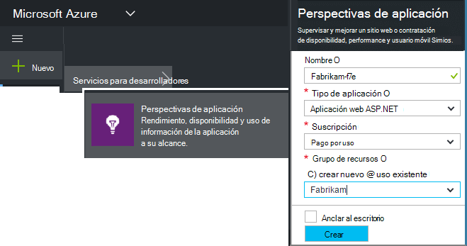
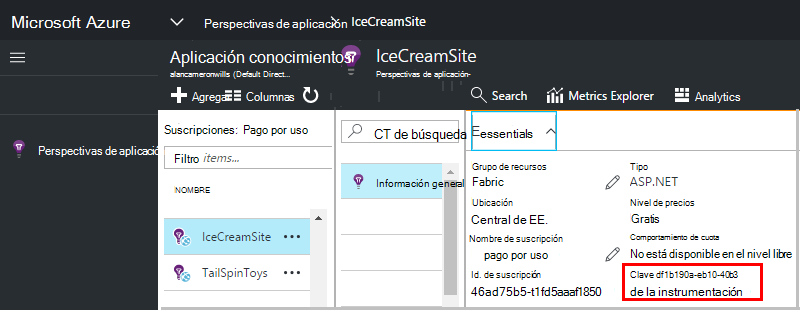

<properties 
    pageTitle="Crear un nuevo recurso de aplicación Insights | Microsoft Azure" 
    description="Configurar la supervisión de las perspectivas de aplicación para una nueva aplicación de live. Enfoque basado en Web." 
    services="application-insights" 
    documentationCenter=""
    authors="alancameronwills" 
    manager="douge"/>

<tags 
    ms.service="application-insights" 
    ms.workload="tbd" 
    ms.tgt_pltfrm="ibiza" 
    ms.devlang="na" 
    ms.topic="article" 
    ms.date="08/26/2016" 
    ms.author="awills"/>

# Crear un recurso de aplicación Insights

Perspectivas de aplicación de Visual Studio muestra datos acerca de la aplicación en un *recurso*de Microsoft Azure. Creando un nuevo recurso, por tanto, forma parte de la [configuración de las perspectivas de aplicación para supervisar una nueva aplicación de][start]. En muchos casos, esto puede realizarse automáticamente por el IDE y que es la forma recomendada, que está disponible. Pero en algunos casos, se crea un recurso manualmente.

Después de haber creado el recurso, puede obtener su clave de instrumentación y utilice para configurar el SDK en la aplicación. Esto envía la telemetría al recurso.

## Suscribirse a Microsoft Azure

Si no tienes una [cuenta, obtenga uno ahora de Microsoft](http://live.com). (Si utiliza los servicios como Outlook.com, OneDrive, Windows Phone o XBox Live, ya tienes una cuenta de Microsoft.)

Necesitará también una suscripción a [Microsoft Azure](http://azure.com). Si su equipo u organización tiene una suscripción de Azure, el propietario puede agregar, con su cuenta de Windows Live ID.

O bien, puede crear una nueva suscripción. La cuenta gratuita permite probar todo en Azure. Después de que caduque el período de prueba, es posible la suscripción de pago adecuada, ya que no se realizarán cargos gratuitamente servicios. 

Cuando tiene acceso a una suscripción, inicie sesión en las perspectivas de aplicación en [http://portal.azure.com](https://portal.azure.com)y usa su Live ID para iniciar sesión.

## Crear un recurso de aplicación Insights
  

En el [portal.azure.com](https://portal.azure.com), agregue un recurso de información de aplicación:

* **Tipo de aplicación** afecta a lo que se ve en la hoja de información general y las propiedades disponibles en el [Explorador de métrica][metrics]. Si no ve el tipo de aplicación, seleccione ASP.NET.
* **Grupo de recursos** es una comodidad para administrar las propiedades, como el control de acceso. Si ya ha creado otros recursos de Azure, puede poner este nuevo recurso en el mismo grupo.
* **Suscripción** es la cuenta de pago en Azure.
* **Ubicación** es donde guardamos los datos. Actualmente no se puede cambiar.
* **Agregar a estribor** coloca un mosaico de acceso rápido para el recurso en la página principal de Azure. Recomienda.

Cuando se ha creado la aplicación, se abre una nueva hoja. Esto es donde verá datos de rendimiento y uso relacionadas con su aplicación. 

Para obtener atrás para la próxima vez que inicie sesión en Azure, busque para el azulejo de inicio rápido de la aplicación en la placa de inicio (pantalla principal). O bien, haga clic en Examinar para buscarlo.

## Copie la clave de la instrumentación

La clave de instrumentación identifica el recurso que ha creado. Tendrá que dar el SDK.

## Instalar el SDK en su aplicación

Instalar el SDK de perspectivas de aplicación en su aplicación. Este paso depende en gran medida del tipo de la aplicación. 

Utilice la tecla de instrumentación para configurar [el SDK que se instala en la aplicación][start].

El SDK incluye módulos estándar que envían telemetría sin tener que escribir ningún código. Para realizar un seguimiento de las acciones del usuario o diagnosticar problemas con más detalle, [Utilice la API] [ api] para enviar su propia telemetría.

## Vea los datos de telemetría

Cierre la hoja de inicio rápido para volver a la hoja de aplicación en el portal de Azure.

Haga clic en el cuadro de búsqueda para ver [La búsqueda de diagnóstico][diagnostic], donde aparecen los primeros eventos. 

Si espera más datos, haga clic en actualizar después de unos segundos.

## Creación automática de un recurso

Puede escribir un [script de PowerShell](app-insights-powershell-script-create-resource.md) para crear automáticamente un recurso.

## Próximos pasos

* [Crear un escritorio digital](app-insights-dashboards.md)
* [Búsqueda de diagnóstico](app-insights-diagnostic-search.md)
* [Explorar métricas](app-insights-metrics-explorer.md)
* [Escribir consultas de análisis](app-insights-analytics.md)

<!--Link references-->

[api]: app-insights-api-custom-events-metrics.md
[diagnostic]: app-insights-diagnostic-search.md
[metrics]: app-insights-metrics-explorer.md
[start]: app-insights-overview.md

 