<properties 
    pageTitle="Mediante la búsqueda de diagnóstico | Microsoft Azure" 
    description="Buscar y filtrar los eventos individuales, solicitudes y trazas de registro." 
    services="application-insights" 
    documentationCenter=""
    authors="alancameronwills" 
    manager="douge"/>

<tags 
    ms.service="application-insights" 
    ms.workload="tbd" 
    ms.tgt_pltfrm="ibiza" 
    ms.devlang="na" 
    ms.topic="article" 
    ms.date="06/09/2016" 
    ms.author="awills"/>
 
# Utilizar búsqueda de diagnóstico en las perspectivas de aplicación

Búsqueda de diagnóstico es una característica de [Las perspectivas de aplicación] [ start] que utilizar para buscar y explorar los elementos individuales de telemetría, como vistas de página, excepciones o las solicitudes de web. Y puede ver seguimientos de registro y eventos que han codificado.

## ¿Donde verá la búsqueda de diagnóstico?

### En el portal de Azure

Puede abrir explícitamente la búsqueda de diagnóstico:

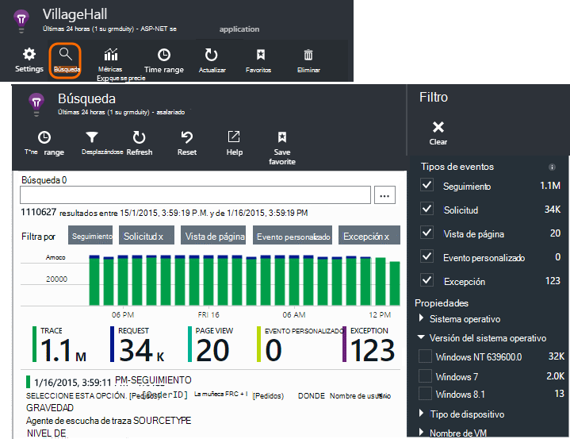

También se abre al hacer clic en a través de algunos gráficos y elementos de la cuadrícula. En este caso, los filtros se establecen previamente para centrarse en el tipo de elemento seleccionado. 

Por ejemplo, si la aplicación es un servicio web, la hoja de resumen muestra un gráfico del volumen de solicitudes. Haga clic en él y obtendrá un gráfico más detallado, con una lista que muestra el número de solicitudes realizado para cada dirección URL. Haga clic en cualquier fila y obtener una lista de las solicitudes individuales para esa dirección URL:

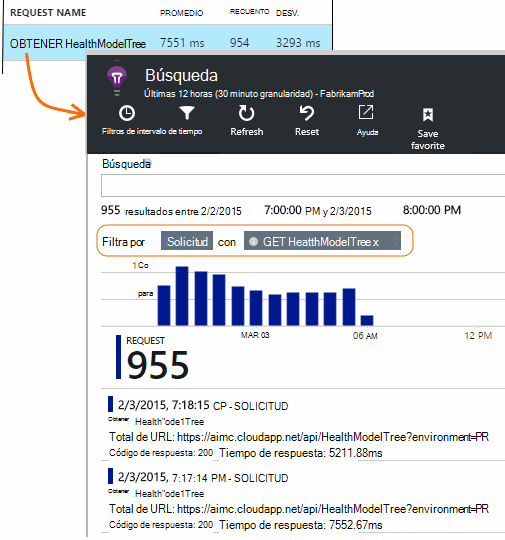

El cuerpo principal de diagnóstico de búsqueda es una lista de elementos de telemetría - solicitudes de servidor, la página vistas, los eventos personalizados que han codificado y así sucesivamente. En la parte superior de la lista es un resumen gráfico que muestra el número de eventos en un período.

Eventos normalmente aparecen en la búsqueda de diagnóstico antes de que aparezcan en el Explorador de métrica. Aunque el servidor blade se actualiza a intervalos, puede hacer clic en actualizar si está esperando un evento determinado.

### En Visual Studio

Abra la ventana de búsqueda en Visual Studio:

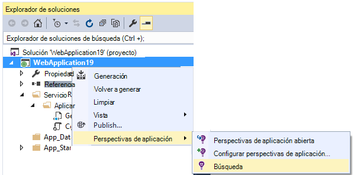

La ventana de búsqueda tiene las mismas características que el portal web:

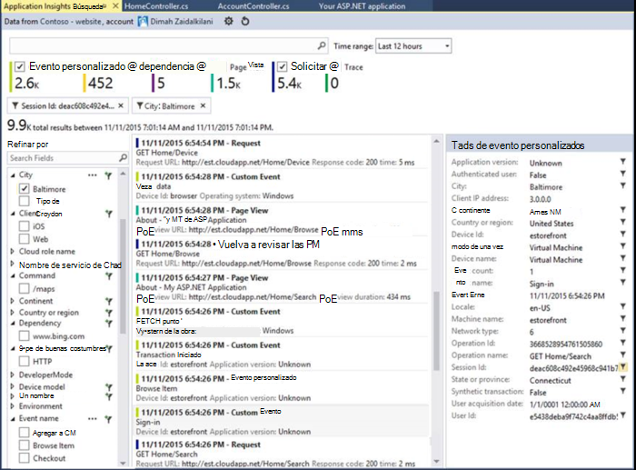

## Toma de muestras

Si la aplicación genera un lote de telemetría (y el uso de la 2.0.0-beta3 de la versión de SDK de ASP.NET o una versión posterior), el módulo de muestreo adaptativo reducirá automáticamente el volumen que se envía en el portal mediante el envío de sólo una fracción representativa de los eventos. Sin embargo, los eventos relacionados con la misma solicitud se activarse o desactivarse como un grupo, para que pueda desplazarse entre los eventos relacionados. 

[Conozca el muestreo](app-insights-sampling.md).

## Inspeccionar elementos individuales

Seleccione cualquier elemento de telemetría para ver los campos clave y artículos relacionados. Si desea ver el conjunto completo de campos, haga clic en "...". 

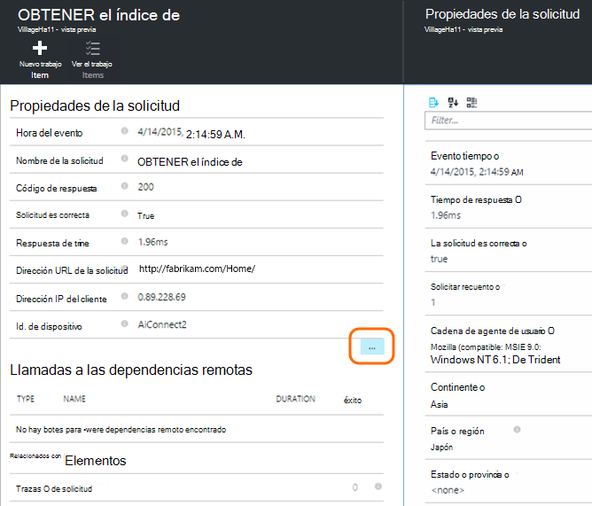

Para encontrar el conjunto completo de campos, utilice las cadenas sin formato (sin comodines). Los campos disponibles dependen del tipo de telemetría.

## Crear elemento de trabajo

Puede crear un error en Visual Studio Team Services con los detalles de cualquier elemento de telemetría. 

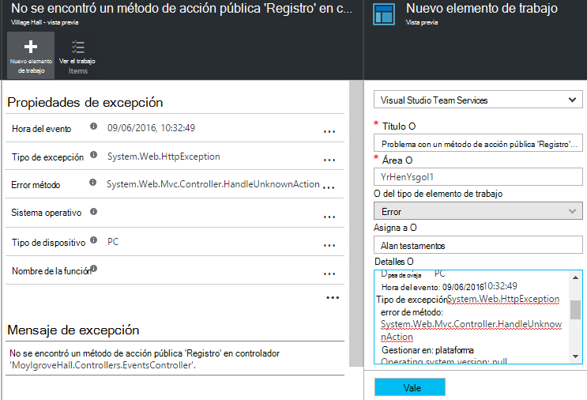

La primera vez que lo hace, deberá configurar un vínculo a la cuenta de servicios del equipo y el proyecto.

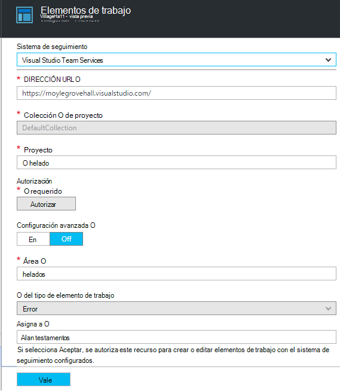

(También puede obtener la hoja de configuración de configuración > elementos de trabajo.)

## Filtrar tipos de eventos

Abra el módulo de filtro y elija los tipos de eventos que desea ver. (Si, posteriormente, desea restaurar los filtros con el que ha abierto la hoja, haga clic en Restablecer).

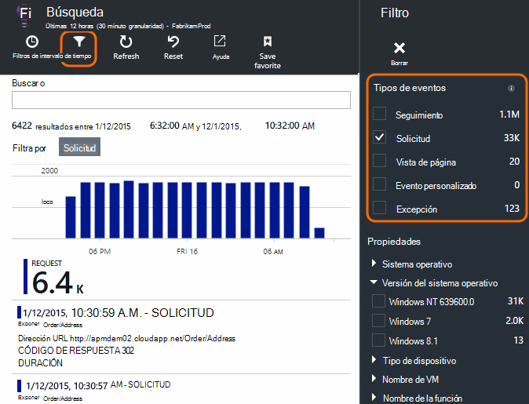

Los tipos de eventos son:

* **Trace** - registros de diagnóstico incluidas las llamadas TrackTrace, log4Net, nRegistro y System.Diagnostic.Trace.
* **Solicitud** - solicitudes HTTP recibidas por la aplicación de servidor, incluidas páginas, scripts, imágenes, archivos de estilo y datos. Estos eventos se utilizan para crear la solicitud y la respuesta de los gráficos de resumen.
* **Vista página** - telemetría enviado por el cliente web, se utiliza para crear la página Ver informes. 
* **Custom Event** - si insertan llamadas a TrackEvent() en orden al [uso de monitor][track], puede buscar aquí.
* **Excepción** : las excepciones no detectadas en el servidor y los que inicia sesión utilizando TrackException().

## Filtrar por valores de propiedad

Puede filtrar los eventos en los valores de sus propiedades. Las propiedades disponibles dependen de los tipos de sucesos seleccionados. 

Por ejemplo, seleccione todas las solicitudes con un código de respuesta específicos.

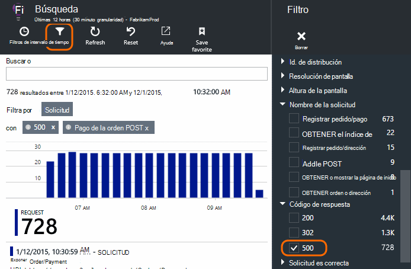

No elegir valores de una propiedad determinada tiene el mismo efecto que elegir todos los valores; desactiva el filtrado en esa propiedad.

### Limitar la búsqueda

Observe que los recuentos a la derecha de los valores de filtro Mostrar cuántas apariciones allí están en el conjunto actual de filtrado. 

En este ejemplo, queda claro que el `Reports/Employees` solicitar los resultados en la mayoría de los 500 errores:

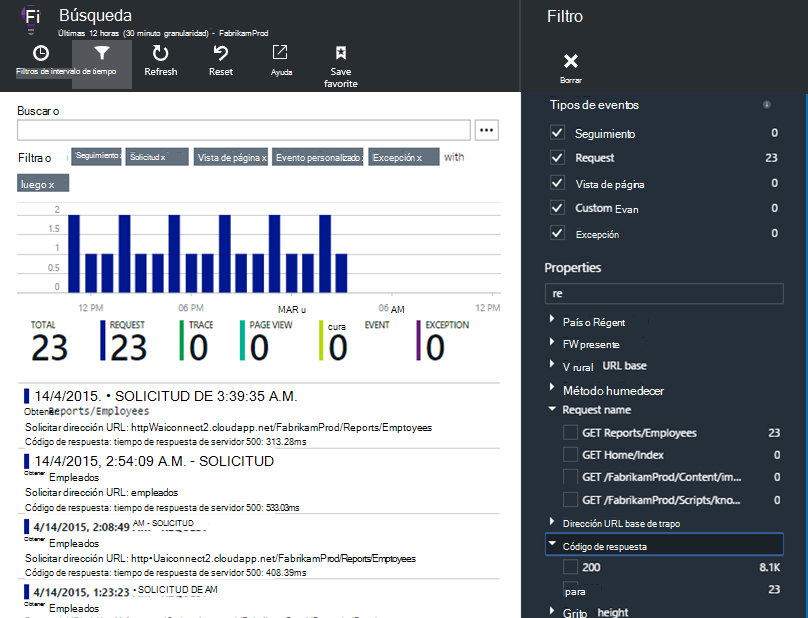

Además si desea ver también qué eventos se sucedían durante este tiempo, puede comprobar **incluir eventos con propiedades sin definir**.

## Quitar bot y prueba el tráfico web

Utilice el filtro de **tráfico Real o sintético** y compruebe **Real**.

También puede filtrar por **origen del tráfico sintético**.

## Inspeccionar las apariciones individuales

Agregar nombre de la solicitud para el conjunto de filtros y puede inspeccionar las repeticiones individuales de dicho evento.

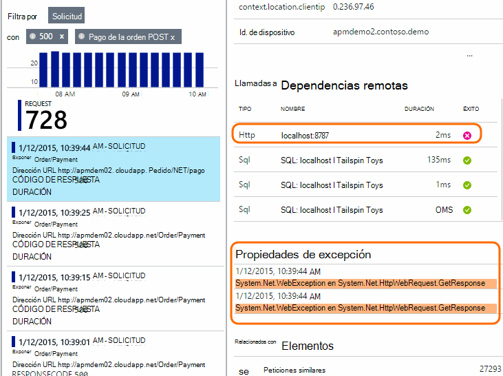

Para los eventos de la solicitud, los detalles muestran las excepciones que se produjeron mientras se procesaba la solicitud.

Haga clic en una excepción para ver sus detalles, incluido el seguimiento de pila.

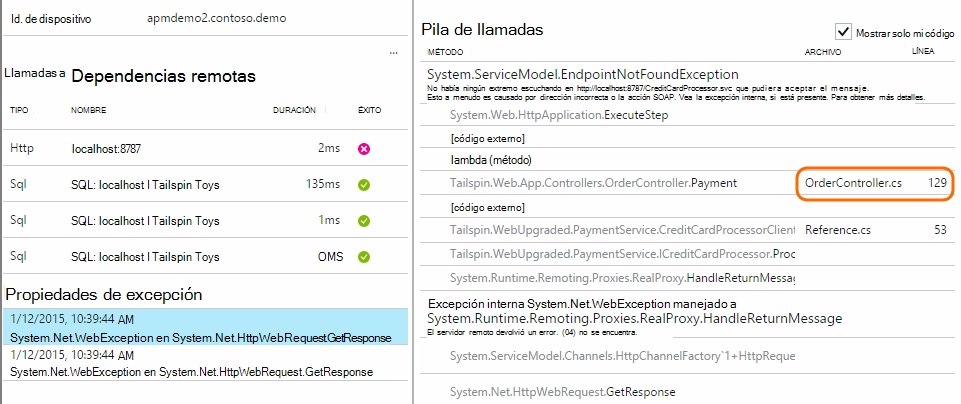

## Buscar eventos con la misma propiedad

Buscar todos los elementos con el mismo valor de propiedad:

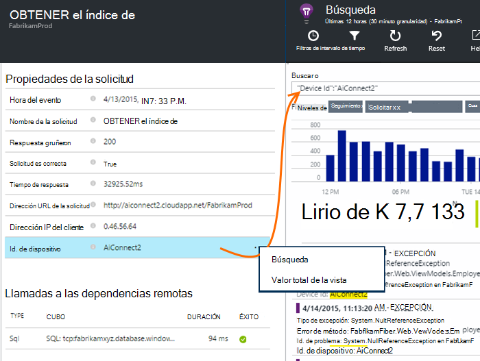

## Buscar por valor de métrica

Obtener todo el tiempo de respuesta > 5s de solicitudes.  Veces se representan en tics: tics de 10.000 = 1ms.

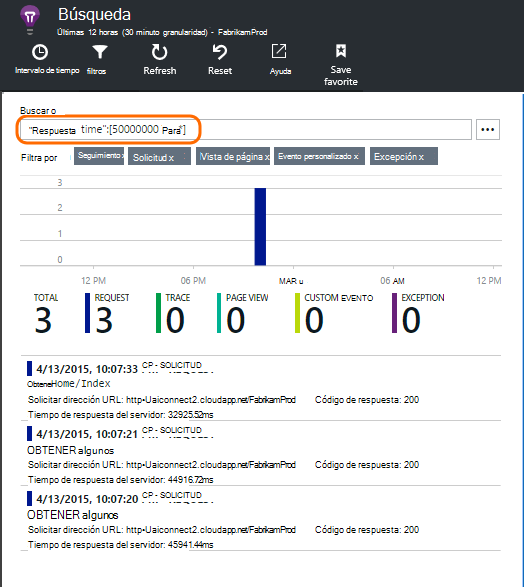

## Los datos de búsqueda

Puede buscar términos en cualquiera de los valores de propiedad. Esto resulta especialmente útil si ha escrito [eventos personalizados] [ track] con los valores de propiedad. 

Desea establecer un tiempo de intervalo, como búsquedas en un intervalo más corto son más rápidos. 

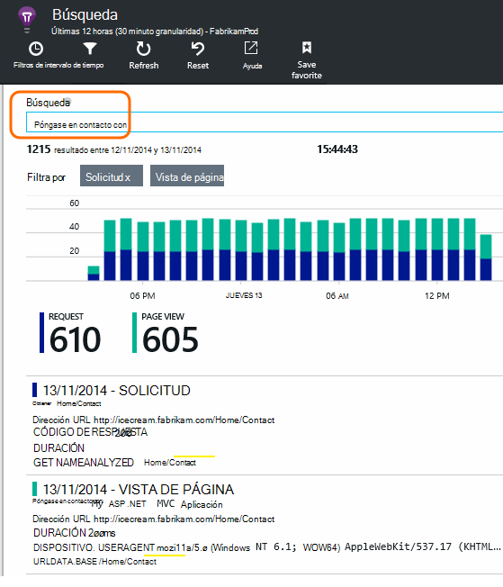

Búsqueda de términos, no subcadenas. Los términos son cadenas alfanuméricas incluidos ciertos signos de puntuación como '.' y '_'. Por ejemplo:

término|*no* coincide con|pero éstos coinciden
---|---|---
HomeController.About|acerca de Inicio|h\*acerca de Inicio\*
IsLocal|local es \*local|ISL\* IsLocal i\*l\*
Nuevo retraso|d. w|Nuevo retraso n\* y d.\*

Aquí están las expresiones de búsqueda que puede utilizar:

Consulta de ejemplo | Efecto 
---|---
lento|Buscar todos los eventos en el intervalo de fechas cuyos campos incluyen el término "lento"
¿base de datos?|Coincide con database01, databaseAB... ? no se permite en el inicio de un término de búsqueda.
base de datos * |Coincide con la base de datos, database01, databaseNNNN  * no se permite en el inicio de un término de búsqueda
Apple, banana y|Buscar eventos que contengan ambos términos. Utilizar capital "y" no "y".
Apple, banana OR banana de Apple|Buscar eventos que contengan cualquiera de los términos. Utilice "O" no "o". < /br/ > breve formulario.
Apple no plátano Apple-banana|Buscar eventos que contengan un término pero no el otro. Forma abreviada.
la aplicación * AND banana-(grape pear)|Operadores lógicos y corchetes.
"Métrica": 0 a 500. "Métrica": hasta 500 * | Buscar eventos que contienen la medida dentro del rango de valores con nombre.

## Guardar la búsqueda

Cuando se han establecido que todos los filtros que desea, puede guardar la búsqueda como favorito. Si trabaja en una organización cuenta, puede elegir si desea compartirlo con otros miembros del equipo.

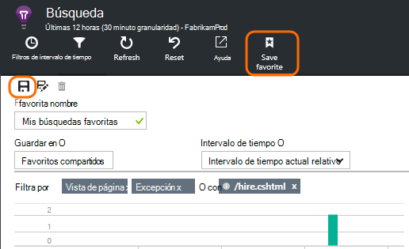

Para ver la búsqueda de nuevo, **vaya a la hoja de información general** y abrir favoritos:

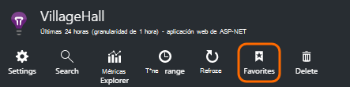

Si ha guardado con el intervalo de tiempo relativo, el blade vuelve a abrir tiene los datos más recientes. Si ha guardado con el intervalo de tiempo absoluto, verá los mismos datos cada vez.

## Enviar telemetría más a las perspectivas de aplicación

Además de la telemetría de cuadro enviada por SDK de perspectivas de aplicación, puede:

* Capturar trazas de registro desde el marco del Registro favoritas en [.NET] [ netlogs] o [Java][javalogs]. Esto significa que puede buscar a través de sus rastros de registro y correlaciona con vistas de página, excepciones y otros eventos. 
* [Escribir código] [ track] para enviar eventos personalizados, vistas de página y excepciones. 

[Aprenda a enviar registros y telemetría personalizado a las perspectivas de aplicación][trace].

## Q & A

### ¿Se conserva la cantidad de datos?

Hasta 500 eventos por segundo de cada aplicación. Los eventos se conservan durante siete días.

### ¿Cómo puedo ver datos POST en Mis solicitudes de servidor?

Nosotros no registrar automáticamente los datos de envío, pero puede utilizar [las llamadas TrackTrace o registro][trace]. Poner los datos de envío en el parámetro de mensaje. No se puede filtrar en el mensaje de la misma forma que propiedades, pero el límite de tamaño es más largo.

## Próximos pasos

* [Enviar registros y telemetría personalizado a las perspectivas de aplicación][trace]
* [Configurar pruebas de capacidad de respuesta y disponibilidad][availability]
* [Solución de problemas][qna]

<!--Link references-->

[availability]: app-insights-monitor-web-app-availability.md
[javalogs]: app-insights-java-trace-logs.md
[netlogs]: app-insights-asp-net-trace-logs.md
[qna]: app-insights-troubleshoot-faq.md
[start]: app-insights-overview.md
[trace]: app-insights-search-diagnostic-logs.md
[track]: app-insights-api-custom-events-metrics.md

 