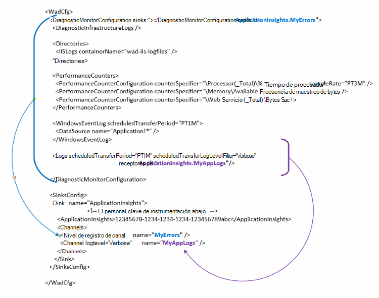

<properties
   pageTitle="Configurar la característica de diagnóstico de Azure para enviar datos a la aplicación Insights | Microsoft Azure"
   description="Actualizar la configuración pública de diagnóstico de Azure para enviar datos a las perspectivas de aplicación."
   services="multiple"
   documentationCenter=".net"
   authors="sbtron"
   manager="douge"
   editor="" />
<tags
   ms.service="application-insights"
   ms.devlang="na"
   ms.topic="article"
   ms.tgt_pltfrm="na"
   ms.workload="na"
   ms.date="12/15/2015"
   ms.author="saurabh" />

# Configurar la característica de diagnóstico de Azure para enviar datos a las perspectivas de aplicación

Diagnóstico de Azure almacena los datos en tablas de almacenamiento de Azure.  Sin embargo, también puede canalización todos o un subconjunto de los datos de las perspectivas de aplicación mediante la configuración de "receptores" y "canales" en la configuración cuando se utiliza la extensión de diagnóstico de Azure 1.5 o posterior.

Este artículo describe cómo crear la configuración de la extensión del diagnóstico de Azure pública para que su configurada para enviar datos a las perspectivas de aplicación.

## Configuración de las perspectivas de aplicación como un receptor

La extensión de diagnóstico de Azure 1.5 presenta el **<SinksConfig>** elemento de la configuración pública. Esto define el *receptor* adicional que se puedan enviar los datos de diagnóstico de Azure. Puede especificar los detalles del recurso perspectivas de aplicación donde desea enviar los datos de diagnóstico de Azure como parte de esta **<SinksConfig>**.
Un ejemplo **SinksConfig** tiene este aspecto:  

    <SinksConfig>
        <Sink name="ApplicationInsights">
          <ApplicationInsights>{Insert InstrumentationKey}</ApplicationInsights>
          <Channels>
            <Channel logLevel="Error" name="MyTopDiagData"  />
            <Channel logLevel="Verbose" name="MyLogData"  />
          </Channels>
        </Sink>
      </SinksConfig>

Para el elemento **receptor** el atributo *name* especifica un valor de cadena que se utilizará para referirse únicamente al receptor.
El elemento **ApplicationInsights** especifica la clave de instrumentación del recurso de perspectivas de aplicación donde se enviarán los datos de diagnóstico de Azure. Si no dispone de un recurso de información de aplicación existente, vea [crear un nuevo recurso de perspectivas de aplicación](./application-insights/app-insights-create-new-resource.md) para obtener más información sobre cómo crear un recurso y obtener la clave de la instrumentación.

Si está desarrollando un proyecto de servicio de nube con Azure SDK 2.8 esta clave Instrumental se rellena automáticamente en la configuración pública basándose en la configuración de servicio **APPINSIGHTS_INSTRUMENTATIONKEY** al empaquetar el proyecto de servicio de nube. Consulte [Uso de perspectivas de aplicación con Azure de diagnóstico para solucionar problemas del servicio de nube](./cloud-services/cloud-services-dotnet-diagnostics-applicationinsights.md).

El elemento de **canales** le permite definir uno o más elementos de **canal** para los datos que se enviarán al receptor. El canal actúa como un filtro y permite seleccionar los niveles de registro específicos que desee enviar al receptor. Por ejemplo puede recopilar registros detallados y enviarlos al almacenamiento de información, pero se puede definir un canal con un nivel de registro de Error y al enviar registros a través de que los registros de errores sólo de canal se enviará a dicho receptor.
Para un **canal** el atributo *name* se utiliza para referirse únicamente a ese canal.
El atributo de *nivel de registro* permite especificar el nivel de registro que le permitirá el canal. Los niveles de registro disponibles en orden de más a menos información son
 - Detallado
 - Información
 - Advertencia
 - Error
 - Crítica

## Enviar datos al receptor de las perspectivas de aplicación
Una vez que se ha definido el receptor perspectivas de aplicación puede enviar datos a dicho receptor agregando el atributo de *receptor* a los elementos en el nodo **DiagnosticMonitorConfiguration** . Agrega el elemento *receptores* a cada nodo especifica que desea que los datos recopilados desde ese nodo y cualquier nodo en el que se envíen al receptor especificado.

Por ejemplo, si desea enviar todos los datos recopilados por el diagnóstico de Azure puede agregar el atributo *receptor* directamente al nodo **DiagnosticMonitorConfiguration** . Establezca el valor de los *receptores* en el nombre de receptor que se especificó en la **SinkConfig**.

    <DiagnosticMonitorConfiguration overallQuotaInMB="4096" sinks="ApplicationInsights">

Si desea enviar sólo los registros de errores para las perspectivas de aplicación receptor, se podrá establecer el valor de *receptores* en el nombre de receptor seguido del nombre de canal separado por un punto ("."). Por ejemplo, para enviar los registros de errores sólo a las perspectivas de aplicación receptor utiliza el canal de MyTopDiagdata que se definió en el SinksConfig anterior.  

    <DiagnosticMonitorConfiguration overallQuotaInMB="4096" sinks="ApplicationInsights.MyTopDiagdata">

Si desea enviar los registros de aplicación detallados a perspectivas de aplicación sería agregar el atributo *receptores* para el nodo **registros** .

    <Logs scheduledTransferPeriod="PT1M" scheduledTransferLogLevelFilter="Verbose" sinks="ApplicationInsights.MyLogData"/>

También puede incluir varios receptores en la configuración en distintos niveles de la jerarquía. En ese caso el receptor especificado en el nivel superior de la jerarquía actúa como una configuración global y especificadas en los actos de elemento del elemento individual como un reemplazo en la configuración global.    

Aquí es un ejemplo completo del archivo de configuración públicas que envía todos los errores y registros de nivel detallados además de perspectivas de aplicación (especificado en el nodo **DiagnosticMonitorConfiguration** ) para los registros de aplicación (especificado en el nodo **registros** ).

    <WadCfg>
      <DiagnosticMonitorConfiguration overallQuotaInMB="4096"
           sinks="ApplicationInsights.MyTopDiagData"> <!-- All info below sent to this channel -->
        <DiagnosticInfrastructureLogs />
        <PerformanceCounters>
          <PerformanceCounterConfiguration counterSpecifier="\Processor(_Total)\% Processor Time" sampleRate="PT3M" sinks="ApplicationInsights.MyLogData/>
          <PerformanceCounterConfiguration counterSpecifier="\Memory\Available MBytes" sampleRate="PT3M" />
          <PerformanceCounterConfiguration counterSpecifier="\Web Service(_Total)\Bytes Total/Sec" sampleRate="PT3M" />
        </PerformanceCounters>
        <WindowsEventLog scheduledTransferPeriod="PT1M">
          <DataSource name="Application!*" />
        </WindowsEventLog>
        <Logs scheduledTransferPeriod="PT1M" scheduledTransferLogLevelFilter="Verbose"
                sinks="ApplicationInsights.MyLogData"/> <!-- This specific info sent to this channel -->
      </DiagnosticMonitorConfiguration>

    <SinksConfig>
        <Sink name="ApplicationInsights">
          <ApplicationInsights>{Insert InstrumentationKey}</ApplicationInsights>
          <Channels>
            <Channel logLevel="Error" name="MyTopDiagData"  />
            <Channel logLevel="Verbose" name="MyLogData"  />
          </Channels>
        </Sink>
      </SinksConfig>
    </WadCfg>

Existen algunas limitaciones a tener en cuenta con esta funcionalidad

- Los canales sólo están diseñados para funcionar con el tipo de registro y no los contadores de rendimiento. Si se especifica un canal con un elemento de contador de rendimiento se omitirá.
- El nivel de registro de un canal no puede exceder el nivel de registro de lo que está recogiendo el diagnóstico de Azure. Por ejemplo: no puede recopilar errores de registro de la aplicación en el elemento de registros y vuelva a intentar enviar Verbose registros al receptor Application Insight. El atributo *scheduledTransferLogLevelFilter* siempre debe cobrar igual o más registros que los registros está intentando enviar a un receptor.
- No puede enviar los datos blob recopilados por extensión de diagnóstico de Azure en perspectivas de la aplicación. Por ejemplo especificar nada en el nodo de *directorios* . Para archivos de volcado del volcado real será enviado al almacenamiento de blobs y sólo una notificación que se generó el archivo de volcado se enviará a las perspectivas de aplicación.

## Próximos pasos

- Usar [PowerShell](./cloud-services/cloud-services-diagnostics-powershell.md) para habilitar la extensión de diagnóstico de Azure para su aplicación. 
- Utilice [Visual Studio](vs-azure-tools-diagnostics-for-cloud-services-and-virtual-machines.md) para habilitar la extensión de diagnóstico de Azure para su aplicación
