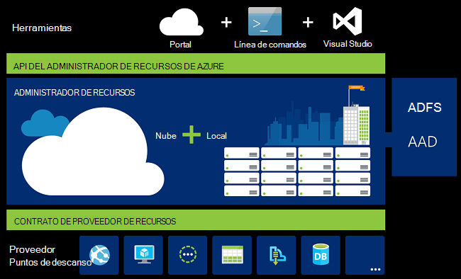
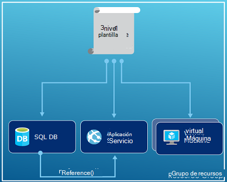
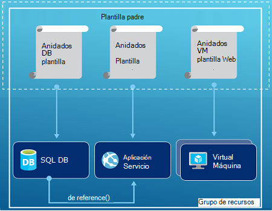
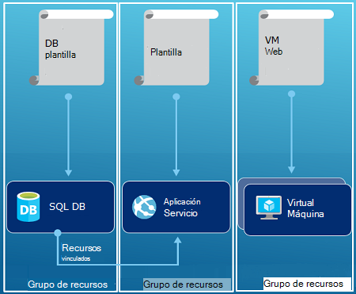

<properties
   pageTitle="Introducción al administrador de recursos Azure | Microsoft Azure"
   description="Describe cómo utilizar Administrador de recursos de Azure para la implementación, administración y acceso a control de recursos en Azure."
   services="azure-resource-manager"
   documentationCenter="na"
   authors="tfitzmac"
   manager="timlt"
   editor="tysonn"/>

<tags
   ms.service="azure-resource-manager"
   ms.devlang="na"
   ms.topic="get-started-article"
   ms.tgt_pltfrm="na"
   ms.workload="na"
   ms.date="10/21/2016"
   ms.author="tomfitz"/>

# Introducción al administrador de recursos Azure

La infraestructura de la aplicación normalmente se compone de muchos componentes: tal vez una máquina virtual, cuenta de almacenamiento y red virtual, o una aplicación web, base de datos, servidor de base de datos y 3 servicios de proveedores. No ve estos componentes como entidades independientes, en su lugar se ven elementos como relacionados e interdependientes de una sola entidad. Desea implementar, administrar y supervisarlos como grupo. Azure Resource Manager le permite trabajar con los recursos de la solución como un grupo. Puede implementar, actualizar o eliminar todos los recursos para la solución en una operación única y coordinada. Se utiliza una plantilla para la implementación y esa plantilla puede trabajar para distintos entornos, como pruebas, staging y producción. Administrador de recursos proporciona seguridad, auditoría y funciones para ayudarle a administrar sus recursos después de la implementación de etiquetado. 

## Terminología

Si usted es nuevo en el Administrador de recursos de Azure, hay algunos términos que puede que no esté familiarizado con.

- **recurso** - un elemento manejable que está disponible a través de Azure. Algunos recursos comunes son una máquina virtual cuenta de almacenamiento, la aplicación web, base de datos y redes virtuales, pero hay muchos más.
- **grupo de recursos** : un contenedor que alberga los recursos relacionados para una solución de Azure. El grupo de recursos puede incluir todos los recursos para la solución, o sólo aquellos recursos que se desea administrar como un grupo. Decide cómo desea asignar los recursos a los grupos de recursos basados en lo que más sentido tenga para su organización. Ver [grupos de recursos](#resource-groups).
- **proveedor de recursos** : un servicio que proporciona los recursos que pueden implementar y administrar mediante el Administrador de recursos. Cada proveedor de recursos ofrece operaciones para trabajar con los recursos que se implementan. Algunos proveedores de recursos comunes son Microsoft.Compute, que proporciona el recurso de máquina virtual, Microsoft.Storage, que proporciona el recurso de la cuenta de almacenamiento, y Microsoft.Web, que proporciona recursos relacionados con las aplicaciones web. Ver [proveedores de recursos](#resource-providers).
- **Plantilla de administrador de recursos** - archivo A JavaScript Object Notation (JSON) que define uno o más recursos para implementar en un grupo de recursos. También define las dependencias entre los recursos desplegados. La plantilla puede utilizarse para implementar los recursos de forma coherente y repetidamente. Vea la [implementación de la plantilla](#template-deployment).
- **sintaxis declarativa** : sintaxis de comandos permite indicar "Aquí es lo que pretende crear" sin tener que escribir la secuencia de la programación para crearlo. La plantilla de administrador de recursos es un ejemplo de sintaxis declarativa. En el archivo, defina las propiedades de la infraestructura para implementar en Azure. 

## Las ventajas de utilizar el Administrador de recursos

Administrador de recursos ofrece varias ventajas:

- Puede implementar, administrar y monitorear todos los recursos para la solución como un grupo, en lugar de controlar estos recursos individualmente.
- Puede implementar la solución durante el ciclo de vida de desarrollo repetidamente y tienen confianza que sus recursos se implementan en un estado coherente.
- Puede administrar su infraestructura a través de plantillas declarativas en lugar de secuencias de comandos.
- Puede definir las dependencias entre los recursos para que se implementen en el orden correcto.
- Puede aplicar control de acceso a todos los servicios en el grupo de recursos como Control de acceso basado en roles (RBAC) nativa está integrado en la plataforma de administración.
- Puede aplicar etiquetas a los recursos para organizar de forma lógica todos los recursos de su suscripción.
- Para aclarar la facturación de la organización viendo los costos para un grupo de recursos compartiendo la misma etiqueta.  

Administrador de recursos proporciona una nueva forma para implementar y administrar las soluciones. Si utiliza el modelo de implementación anterior y desean aprender acerca de los cambios, vea [Administrador de recursos del conocimiento y la implementación clásica](../resource-manager-deployment-model.md).

## Capa de administración coherente

Administrador de recursos proporciona una capa de administración coherente de las tareas que se realizan a través de PowerShell de Azure, CLI de Azure, portal de Azure, REST API y herramientas de desarrollo. Todas las herramientas utilizan un conjunto común de operaciones. Utilice las herramientas que mejor le acomoden y pueden utilizar de manera intercambiable sin confusión. 

La siguiente imagen muestra cómo todas las herramientas que interactúan con la misma API del Administrador de recursos de Azure. La API pasa las solicitudes para el servicio Administrador de recursos, que autentica y autoriza las solicitudes. Administrador de recursos enruta las solicitudes a los proveedores de recursos correspondiente.

## Orientación

Las siguientes sugerencias ayudan a aprovechar al máximo del Administrador de recursos cuando se trabaja con las soluciones.

1. Definir e implementar su infraestructura mediante la sintaxis declarativa en las plantillas del Administrador de recursos, en lugar de comandos imperativos.
2. Definir todos los pasos de implementación y configuración de la plantilla. No debería tener ninguna pasos manuales para configurar la solución.
3. Ejecutar comandos imperativos para administrar los recursos, por ejemplo, para iniciar o detener una aplicación o una máquina.
4. Organizar los recursos con el mismo ciclo de vida en un grupo de recursos. Utilice etiquetas para todos los demás organizar de recursos.

Para obtener más recomendaciones, vea [prácticas recomendadas para crear plantillas de administrador de recursos de Azure](../resource-manager-template-best-practices.md).

## Grupos de recursos

Hay algunos factores importantes a tener en cuenta al definir el grupo de recursos:

1. Todos los recursos del grupo deben compartir el mismo ciclo de vida. Implementar, actualizar y eliminarlos de forma conjunta. Si un recurso, como un servidor de base de datos, debe existir en un ciclo de implementación diferentes debe ser en otro grupo de recursos.
2. Cada recurso sólo puede existir en un grupo de recursos.
3. Puede agregar o quitar un recurso a un grupo de recursos en cualquier momento.
4. Puede mover un recurso de un grupo de recursos a otro grupo. Para obtener más información, vea [mover los recursos al nuevo grupo de recursos o de suscripción](../resource-group-move-resources.md).
4. Un grupo de recursos puede contener recursos que residen en diferentes regiones.
5. Un grupo de recursos puede utilizarse para establecer el ámbito de control de acceso para acciones administrativas.
6. Un recurso puede interactuar con los recursos de otros grupos de recursos. Esta interacción es común cuando los dos recursos relacionados pero no comparten el mismo ciclo de vida (por ejemplo, aplicaciones web para conectarse a una base de datos).

Al crear un grupo de recursos, debe proporcionar una ubicación para ese grupo de recursos. Quizás se pregunte, "¿por qué un grupo de recursos necesita una ubicación? Y, si los recursos pueden tener distintas ubicaciones que el grupo de recursos, ¿por qué la ubicación del grupo recurso importa en absoluto?" El grupo de recursos almacena metadatos acerca de los recursos. Por lo tanto, al especificar una ubicación para el grupo de recursos, se especifica dónde se almacenan metadatos. Por razones de cumplimiento de normas, debe asegurarse de que sus datos están almacenados en una región determinada.

## Proveedores de recursos

Cada proveedor de recursos ofrece un conjunto de recursos y operaciones para trabajar con un servicio de Azure. Por ejemplo, si desea almacenar las claves y secretos, trabajar con el proveedor de recursos de **Microsoft.KeyVault** . Este proveedor de recursos ofrece un tipo de recurso denominado **depósitos** para la creación de la caja fuerte de clave y un tipo de recurso denominado **depósitos o secretos** para crear un secreto en el depósito de claves. 

Antes de comenzar con la implementación de los recursos, debe tener una comprensión de los proveedores de recursos disponibles. Conocer los nombres de proveedores de recursos y recursos le ayuda a definir los recursos que desee implementar en Azure.

Recuperar todos los proveedores de recursos con el siguiente cmdlet de PowerShell:

    Get-AzureRmResourceProvider -ListAvailable

O bien, con CLI de Azure, recuperar todos los proveedores de recursos con el siguiente comando:

    azure provider list

Puede buscar en la lista devuelta para los proveedores de recursos que debe utilizar.

Para obtener detalles acerca de un proveedor de recursos, agregue el espacio de nombres de proveedor al comando. El comando devuelve los tipos de recursos admitidos por el proveedor de recursos y las versiones de API para cada tipo de recurso y ubicaciones compatibles. El siguiente cmdlet de PowerShell obtiene detalles sobre Microsoft.Compute:

    (Get-AzureRmResourceProvider -ProviderNamespace Microsoft.Compute).ResourceTypes

O bien, con CLI de Azure, recuperar los tipos de recurso admitidos, ubicaciones y versiones de API para Microsoft.Compute, con el siguiente comando:

    azure provider show Microsoft.Compute --json > c:\Azure\compute.json

Para obtener más información, vea [proveedores del Administrador de recursos, regiones, versiones de API y los esquemas](../resource-manager-supported-services.md).

## Implementación de plantilla

Con el Administrador de recursos, puede crear una plantilla (en formato JSON) que define la infraestructura y la configuración de su solución de Azure. Mediante una plantilla, puede implementar su solución a lo largo de su ciclo de vida repetidamente y tienen confianza que sus recursos se implementan en un estado coherente. Cuando se crea una solución desde el portal, la solución incluye automáticamente una plantilla de implementación. No es necesario que crear tu plantilla desde cero, ya puede empezar con la plantilla de la solución y personalizarlo para satisfacer sus necesidades específicas. Puede recuperar una plantilla para un grupo de recursos existente por exportar el estado actual del grupo de recursos o visualización de la plantilla que se utiliza para una implementación concreta. Ver el [Exportar plantilla](../resource-manager-export-template.md) es una forma útil para aprender acerca de la sintaxis de la plantilla.

Para obtener más información sobre el formato de la plantilla y cómo se construye, consulte [Creación de plantillas de administrador de recursos de Azure](../resource-group-authoring-templates.md) y [Tutorial de plantilla del Administrador de recursos](../resource-manager-template-walkthrough.md).

Administrador de recursos procesa la plantilla como cualquier otra solicitud (ver la imagen de la [capa de administración coherente](#consistent-management-layer)). Analiza la plantilla y convierte su sintaxis en operaciones de REST API para los proveedores de recursos correspondiente. Por ejemplo, cuando el Administrador de recursos recibe una plantilla con la siguiente definición de recursos:

    "resources": [
      {
        "apiVersion": "2016-01-01",
        "type": "Microsoft.Storage/storageAccounts",
        "name": "mystorageaccount",
        "location": "westus",
        "sku": {
          "name": "Standard_LRS"
        },
        "kind": "Storage",
        "properties": {
        }
      }
      ]

Convierte la definición en la siguiente operación de REST API, que se envía al proveedor de recursos Microsoft.Storage:

    PUT
    https://management.azure.com/subscriptions/{subscriptionId}/resourceGroups/{resourceGroupName}/providers/Microsoft.Storage/storageAccounts/mystorageaccount?api-version=2016-01-01
    REQUEST BODY
    {
      "location": "westus",
      "properties": {
      }
      "sku": {
        "name": "Standard_LRS"
      },   
      "kind": "Storage"
    }

Cómo definir plantillas y grupos de recursos es totalmente hasta que y cómo desea gestionar su solución. Por ejemplo, puede implementar su aplicación de tres niveles a través de una única plantilla a un único grupo de recursos.

Pero no es necesario definir su infraestructura completa en una única plantilla. A menudo, tiene sentido dividir los requisitos de implementación en un conjunto de plantillas destinadas, propósito específico. Puede reutilizar fácilmente estas plantillas de soluciones diferentes. Para implementar una solución determinada, cree una plantilla maestra que vincula todas las plantillas necesarias. La imagen siguiente muestra cómo implementar una solución de tres niveles a través de una plantilla primaria que incluye tres plantillas anidadas.

Si envision sus niveles con ciclos de vida independientes, puede implementar los tres niveles para separar grupos de recursos. Observe que aún es pueden vincular los recursos a los recursos de otros grupos de recursos.

Para obtener más sugerencias acerca de cómo diseñar las plantillas, vea [modelos para diseñar plantillas de administrador de recursos de Azure](../best-practices-resource-manager-design-templates.md). Para obtener información acerca de las plantillas anidadas, vea [utilizar plantillas enlazadas con el Administrador de recursos de Azure](../resource-group-linked-templates.md).

Administrador de recursos del Azure analiza las dependencias para asegurarse de que los recursos se crean en el orden correcto. Si un recurso se basa en un valor de otro recurso (como una máquina virtual que necesitan una cuenta de almacenamiento de discos), establecer una dependencia. Para obtener más información, vea [definir dependencias en las plantillas del Administrador de recursos de Azure](../resource-group-define-dependencies.md).

También puede utilizar la plantilla para las actualizaciones de la infraestructura. Por ejemplo, puede agregar un recurso a la solución y agregar reglas de configuración para los recursos que ya están implementadas. Si la plantilla especifica la creación de un recurso, pero que el recurso ya existe, el Administrador de recursos de Azure realiza una actualización en lugar de crear un nuevo activo. Azure Resource Manager actualiza el activo existente con el mismo estado como sería como nuevo.  

Administrador de recursos proporciona extensiones para escenarios cuando necesite operaciones adicionales como la instalación de software en particular que no está incluido en el programa de instalación. Si está utilizando un servicio de administración de configuración, como DSC, Chef o de posición libre, puede seguir trabajando con ese servicio mediante extensiones. Para obtener información acerca de las extensiones de la máquina virtual, consulte [acerca de características y extensiones de la máquina virtual](../virtual-machines/virtual-machines-windows-extensions-features.md). 

Por último, la plantilla se convierte en parte del código fuente para la aplicación. Puede proteger en el repositorio de código fuente y actualizarla a medida que evoluciona su aplicación. Puede editar la plantilla a través de Visual Studio.

Después de definir la plantilla, está listo para distribuir los recursos en Azure. Para los comandos implementar los recursos, vea:

- [Implementar recursos con el Administrador de recursos plantillas y PowerShell de Azure](../resource-group-template-deploy.md)
- [Implementar recursos con plantillas de administrador de recursos y la CLI de Azure](../resource-group-template-deploy-cli.md)
- [Implementar recursos con plantillas de administrador de recursos y el portal de Azure](../resource-group-template-deploy-portal.md)
- [Implementar recursos con plantillas de administrador de recursos y el Administrador de recursos REST API](../resource-group-template-deploy-rest.md)

## Etiquetas

Administrador de recursos proporciona una característica de etiquetado que permite clasificar los recursos según sus requisitos para administrar o facturación. Utilizar etiquetas cuando tiene un conjunto complejo de grupos de recursos y recursos y necesita visualizar los activos de la manera que más sentido para usted. Por ejemplo, puede etiquetar recursos que pertenecen al mismo departamento o que desempeñan una función similar en su organización. Sin etiquetas, usuarios de la organización pueden crear varios recursos que pueden ser difíciles de identificar más adelante y administrar. Por ejemplo, puede eliminar todos los recursos de un proyecto en particular. Si dichos recursos no están etiquetados para el proyecto, deberá encontrarlos manualmente. Etiquetado puede ser una forma importante de reducir costos innecesarios en su suscripción. 

Recursos no deben residir en el mismo grupo de recursos para compartir una etiqueta. Puede crear su propia taxonomía de la etiqueta para asegurarse de que todos los usuarios de su organización utilizan etiquetas comunes en lugar de usuarios sin querer aplicar etiquetas ligeramente diferentes (por ejemplo, "dept" en lugar de "departamento").

En el ejemplo siguiente se muestra una etiqueta aplicada a una máquina virtual.

    "resources": [    
      {
        "type": "Microsoft.Compute/virtualMachines",
        "apiVersion": "2015-06-15",
        "name": "SimpleWindowsVM",
        "location": "[resourceGroup().location]",
        "tags": {
            "costCenter": "Finance"
        },
        ...
      }
    ]

Para recuperar todos los recursos con un valor de etiqueta, utilice el siguiente cmdlet de PowerShell:

    Find-AzureRmResource -TagName costCenter -TagValue Finance

O bien, el siguiente comando CLI de Azure:

    azure resource list -t costCenter=Finance --json

También puede ver recursos etiquetados a través del portal de Azure.

El [informe de uso](../billing/billing-understand-your-bill.md) de la suscripción incluye nombres de etiquetas y valores, lo que permite dividir los costos por etiquetas. Para obtener más información acerca de las etiquetas, vea [mediante etiquetas para organizar los recursos de Azure](../resource-group-using-tags.md).

## Control de acceso

Administrador de recursos le permite controlar quién tiene acceso a acciones específicas de su organización. Forma nativa integra control de acceso basado en roles (RBAC) en la plataforma de administración y se aplica dicho control de acceso a todos los servicios en el grupo de recursos. 

Hay dos conceptos principales para entender al trabajar con control de acceso basada en funciones:

- Definiciones de función - describen un conjunto de permisos y puede utilizarse en muchas asignaciones.
- Asignaciones de funciones - asociar una definición con una identidad (usuario o grupo) de un ámbito determinado (suscripción, grupo de recursos o recursos). Ámbitos inferiores heredan la asignación.

Puede agregar usuarios a plataforma predefinido y funciones específicas del recurso. Por ejemplo, puede aprovechar el rol predefinido llamado lector que permite a los usuarios ver los recursos, pero no modificarlos. Agregar usuarios de la organización que necesitan este tipo de acceso a la función Lector y aplica la función a la suscripción, el grupo de recursos o el recurso.

Azure proporciona las siguientes funciones de cuatro plataformas:

1.  Propietario - puede administrar todo, incluido el acceso
2.  Colaborador - puede administrar todo excepto access
3.  Lector - puede ver todo el contenido, pero no realizar cambios
4.  Administrador de acceso de usuario - puede administrar el acceso de usuario a los recursos de Azure

Azure también proporciona varias funciones de recursos específicos. Algunos de los más comunes son:

1.  Colaborador de la máquina virtual - puede administrar máquinas virtuales, pero no permita el acceso a ellos y no puede administrar la cuenta de red o de almacenamiento de información virtual al que están conectados
2.  Colaborador de red - puede administrar todos los recursos de red, pero no concede acceso a ellos
3.  Colaborador de la cuenta de almacenamiento - puede administrar cuentas de almacenamiento, pero no concede acceso a ellos
4. Colaborador de SQL Server - puede administrar servidores SQL y bases de datos, pero no sus políticas relacionadas con la seguridad
5. Colaborador del sitio Web - puede administrar sitios Web, pero no los planes de web al que están conectados

Para obtener la lista completa de las funciones y acciones permitidas, vea [RBAC: construido en funciones](../active-directory/role-based-access-built-in-roles.md). Para obtener más información acerca de control de acceso basado en funciones, vea [Control de acceso basado en roles de Azure](../active-directory/role-based-access-control-configure.md). 

En algunos casos, para ejecutar el código o script que tiene acceso a recursos, pero no desea que se ejecuta bajo las credenciales de un usuario. En su lugar, desea crear una identidad denominada servicio principal para la aplicación y asignar el rol apropiado para el servicio principal. Administrador de recursos permite crear credenciales para la aplicación y autenticar mediante programación de la aplicación. Para obtener información acerca de cómo crear identidades de servicio, consulte uno de los siguientes temas:

- [Usar PowerShell de Azure para crear una entidad de seguridad del servicio acceso a los recursos](../resource-group-authenticate-service-principal.md)
- [Utilice CLI de Azure para crear una entidad de seguridad del servicio acceso a los recursos](../resource-group-authenticate-service-principal-cli.md)
- [Utilizar el portal para crear la aplicación de Active Directory y el principal de servicio que puede tener acceso a los recursos](../resource-group-create-service-principal-portal.md)

Puede bloquear explícitamente recursos críticos para impedir que los usuarios eliminen o modifiquen ellos. Para obtener más información, vea [recursos de bloqueo con el Administrador de recursos de Azure](../resource-group-lock-resources.md).

## Registros de actividad

Administrador de recursos registra todas las operaciones que crean, modificar o eliminar un recurso. Puede utilizar los registros de actividad para encontrar un error al solucionar problemas o para supervisar cómo un usuario de la organización modifica un recurso. Para ver los registros, seleccione los **registros de actividad** en la hoja de **configuración** para un grupo de recursos. Puede filtrar los registros por muchos valores diferentes, incluyendo el usuario que inició la operación. Para obtener información sobre cómo trabajar con los registros de actividad, consulte [con el Administrador de recursos de operaciones de auditoría](../resource-group-audit.md).

## Directivas personalizadas

Administrador de recursos permite crear directivas personalizadas para la administración de los recursos. Los tipos de directivas que cree pueden incluir diversos escenarios. Se puede exigir una convención de nomenclatura de recursos, limitar qué tipos e instancias de recursos puede implementarse o limitar qué regiones pueden hospedar un tipo de recurso. Puede requerir un valor tag de recursos para organizar la facturación por departamentos. Puede crear directivas para ayudar a reducir los costos y mantener la coherencia en la suscripción. 

Definir directivas con JSON y, a continuación, aplicar esas políticas a través de su suscripción o dentro de un grupo de recursos. Las directivas son diferentes de control de acceso basado en funciones porque se aplican a los tipos de recursos.

En el ejemplo siguiente se muestra una directiva que garantiza la coherencia de las etiquetas especificando que todos los recursos incluyen una etiqueta costCenter.

    {
      "if": {
        "not" : {
          "field" : "tags",
          "containsKey" : "costCenter"
        }
      },
      "then" : {
        "effect" : "deny"
      }
    }

Existen muchos más tipos de directivas que puede crear. Para obtener más información, vea [Utilizar directivas para administrar los recursos y controlar el acceso](../resource-manager-policy.md).

## SDK

Azure SDK están disponibles para varios idiomas y plataformas.
Cada una de estas implementaciones de idioma está disponible a través del Administrador de paquetes del ecosistema y GitHub.

Se genera el código en cada uno de estos SDK de las especificaciones de la API de REST de Azure.
Estas especificaciones son de código abierto y basado en la especificación 2.0 Swagger.
El código del SDK se genera a través de un proyecto de código abierto denominado AutoRest.
AutoRest transforma estas especificaciones de la API de REST en bibliotecas de cliente en varios idiomas.
Si desea mejorar algún aspecto del código generado en el SDK, el conjunto completo de herramientas para crear los SDK son open, disponible de forma gratuita y basándose en un formato de especificación de API ampliamente adoptado.

Aquí están nuestros repositorios de SDK de código fuente abierto. Damos la bienvenida a comentarios, problemas y tire de las solicitudes.

[.NET](https://github.com/Azure/azure-sdk-for-net) | [Java](https://github.com/Azure/azure-sdk-for-java) | [Node.js](https://github.com/Azure/azure-sdk-for-node) | [PHP](https://github.com/Azure/azure-sdk-for-php) | [Python](https://github.com/Azure/azure-sdk-for-python) | [Ruby](https://github.com/Azure/azure-sdk-ruby)

> [AZURE.NOTE]Si el SDK no proporciona la funcionalidad necesaria, usted también puede llamar a la [API de REST de Azure](https://msdn.microsoft.com/library/azure/dn790568.aspx) directamente.

## Ejemplos

### .NET

- [Administrar Azure y grupos de recursos](https://azure.microsoft.com/documentation/samples/resource-manager-dotnet-resources-and-groups/)
- [Implementar un SSH habilitado VM con una plantilla](https://azure.microsoft.com/documentation/samples/resource-manager-dotnet-template-deployment/)

### Java

- [Administrar recursos de Azure](https://azure.microsoft.com/documentation/samples/resources-java-manage-resource/)
- [Administrar grupos de recursos de Azure](https://azure.microsoft.com/documentation/samples/resources-java-manage-resource-group/)
- [Implementar un SSH habilitado VM con una plantilla](https://azure.microsoft.com/documentation/samples/resources-java-deploy-using-arm-template/)

### Node.js

- [Administrar Azure y grupos de recursos](https://azure.microsoft.com/documentation/samples/resource-manager-node-resources-and-groups/)
- [Implementar un SSH habilitado VM con una plantilla](https://azure.microsoft.com/documentation/samples/resource-manager-node-template-deployment/)

### Python

- [Administrar Azure y grupos de recursos](https://azure.microsoft.com/documentation/samples/resource-manager-python-resources-and-groups/)
- [Implementar un SSH habilitado VM con una plantilla](https://azure.microsoft.com/documentation/samples/resource-manager-python-template-deployment/)

### Ruby

- [Administrar Azure y grupos de recursos](https://azure.microsoft.com/documentation/samples/resource-manager-ruby-resources-and-groups/)
- [Implementar un SSH habilitado VM con una plantilla](https://azure.microsoft.com/documentation/samples/resource-manager-ruby-template-deployment/)

Además de estos ejemplos, se puede buscar en los ejemplos de la galería.

[.NET](https://azure.microsoft.com/documentation/samples/?service=azure-resource-manager&platform=dotnet) | [Java](https://azure.microsoft.com/documentation/samples/?service=azure-resource-manager&platform=java) | [Node.js](https://azure.microsoft.com/documentation/samples/?service=azure-resource-manager&platform=nodejs) | [Python](https://azure.microsoft.com/documentation/samples/?service=azure-resource-manager&platform=python) | [Ruby](https://azure.microsoft.com/documentation/samples/?service=azure-resource-manager&platform=ruby)

## Próximos pasos

- Para una introducción sencilla al trabajar con plantillas, consulte [exportar una plantilla de Azure el Administrador de recursos de los recursos existentes](../resource-manager-export-template.md).
- Para ver un tutorial más completo de la creación de una plantilla, vea el [Tutorial de la plantilla de administrador de recursos](../resource-manager-template-walkthrough.md).
- Para comprender las funciones que puede utilizar en una plantilla, consulte [las funciones de plantilla](../resource-group-template-functions.md)
- Para obtener información acerca de cómo utilizar Visual Studio con el Administrador de recursos, vea [crear e implementar grupos de Azure recursos a través de Visual Studio](../vs-azure-tools-resource-groups-deployment-projects-create-deploy.md).
- Para obtener información acerca de cómo utilizar código de VS con el Administrador de recursos, vea [trabajar con plantillas de administrador de recursos de Azure en código de Visual Studio](../resource-manager-vs-code.md).

Aquí está una demostración en vídeo de este resumen:

[AZURE.VIDEO azure-resource-manager-overview]

[powershellref]: https://msdn.microsoft.com/library/azure/dn757692(v=azure.200).aspx
