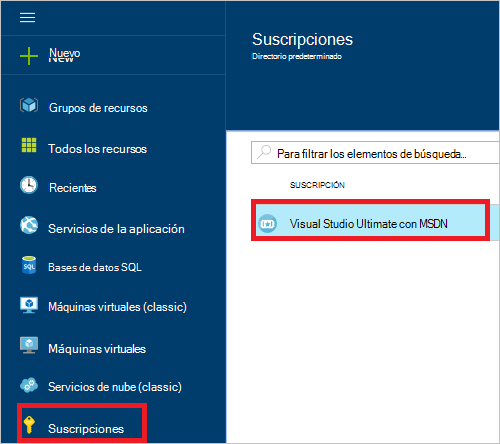
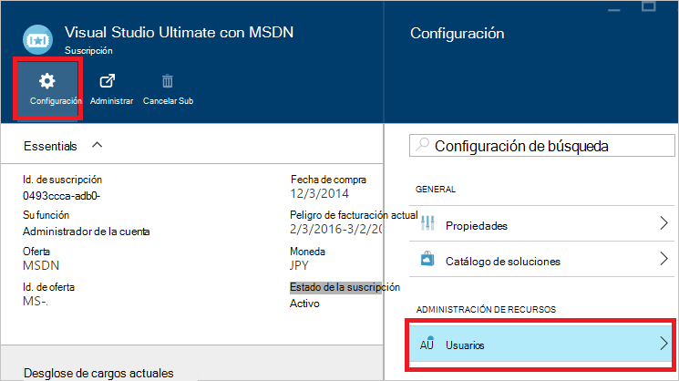
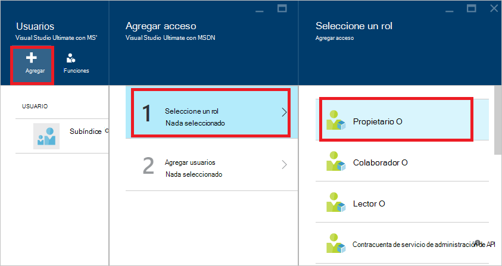
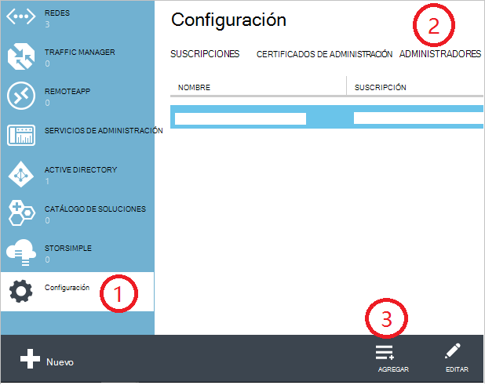
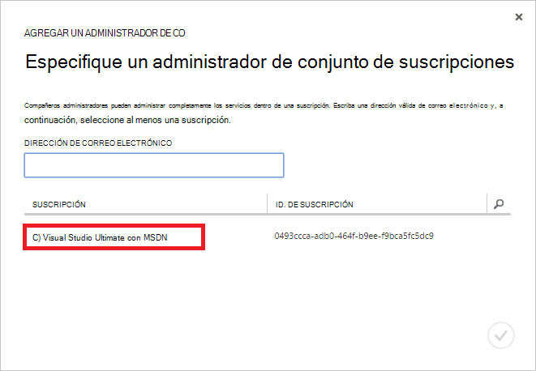
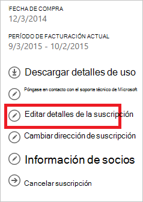
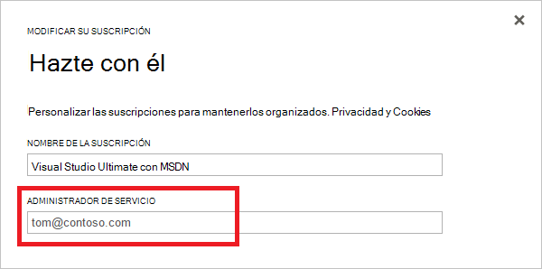

<properties
    pageTitle="Cómo agregar o cambiar las funciones de administrador de Azure | Microsoft Azure"
    description="Describe cómo agregar o cambiar el Administrador de compañeros de Azure, Administrador de servicio y Administrador de cuenta"
    services=""
    documentationCenter=""
    authors="genlin"
    manager="mbaldwin"
    editor=""
    tags="billing"/>

<tags
    ms.service="billing"
    ms.workload="na"
    ms.tgt_pltfrm="na"
    ms.devlang="na"
    ms.topic="article"
    ms.date="08/17/2016"
    ms.author="genli"/>

# Cómo agregar o cambiar las funciones de administrador de Azure

Hay tres tipos de funciones de administrador de Microsoft Azure:

| Función administrativa   | Límite de  | Descripción
| ------------- | ------------- |---------------|
|Cuenta de administrador (AA)  | 1 por cuenta de Azure  |Se trata de la persona que registrado o comprado suscripciones Azure y está autorizada para tener acceso al [Centro de cuentas](https://account.windowsazure.com/Home/Index) y realizar diversas tareas de administración. Estos incluyen poder crear suscripciones, cancelar suscripciones, cambiar la facturación de una suscripción y cambiar el Administrador de servicio.
| Servicio de administrador (SA) | 1 por cada suscripción de Azure  |Esta función está autorizada para administrar servicios en el [portal de Azure](https://portal.azure.com). De forma predeterminada, una nueva suscripción, el Administrador de la cuenta también es el Administrador de servicio.|
|CO Administrador (CA) en el [portal de clásico de Azure](https://manage.windowsazure.com)|200 por suscripción| Esta función tiene los mismos privilegios de acceso como el Administrador de servicio, pero no puede cambiar la asociación de las suscripciones a directorios de Azure. |

> [AZURE.NOTE] Azure basada en funciones de Active Directory Access Control (RBAC) permite a los usuarios que se agregarán a varias funciones. Para obtener más información, vea [Control de acceso basada en funciones de Azure Active Directory](./active-directory/role-based-access-control-configure.md).

> [AZURE.NOTE] Si necesita más ayuda en cualquier punto de este artículo, póngase [en contacto con soporte técnico](https://portal.azure.com/?#blade/Microsoft_Azure_Support/HelpAndSupportBlade) para obtener su problema resolverse rápidamente.

## Cómo agregar un administrador de una suscripción

**Portal de Azure**

1. Iniciar sesión en el [portal de Azure](https://portal.azure.com).

2. En el menú de concentrador, seleccione **suscripción** > *la suscripción que desea tener acceso al administrador*.

    

3. En la hoja de suscripción, seleccione **configuración de**> **los usuarios**.

    
4. En el módulo de usuarios, seleccione **Agregar**>**selecciona un rol** > **propietario**.

    

    **Nota**
    - El rol de propietario tiene como administrador CO los mismos privilegios de acceso. Esta función no tiene privilegio de acceso al [Centro de cuenta de Azure](https://account.windowsazure.com/subscriptions).
    - Los propietarios que agregan a través del [portal de Azure](https://portal.azure.com) no pueden administrar servicios en el [portal de clásico de Azure](https://manage.windowsazure.com).  

5. Escriba la dirección de correo electrónico del usuario que desea agregar como propietario, haga clic en el usuario y, a continuación, haga clic en **Seleccionar**.

    

**Portal clásico de Azure**

1. Iniciar sesión en el [portal de clásico de Azure](https://manage.windowsazure.com/).

2. En el panel de exploración, seleccione **configuración de**> **administradores**> **Agregar**.  

    

3. Escriba la dirección de correo electrónico de la persona que desea agregar como compañero administrador y, a continuación, seleccione la suscripción que desee que el compañero administrador para tener acceso a. 

     

La siguiente dirección de correo electrónico puede agregarse como administrador de colaboración:

* **Cuenta de Microsoft** (anteriormente Windows Live ID)  
 Puede utilizar un Microsoft Account para iniciar sesión en todos los productos de Microsoft orientados al consumidor y la nube de servicios, como Outlook (Hotmail), Skype (MSN), OneDrive, Windows Phone y Xbox LIVE.
* **Cuenta organizacional** 
 Una organización cuenta es una cuenta que se crea en Active Directory de Azure. La dirección de cuenta organizacional similar a la siguiente: user@ &lt;el dominio&gt;. onmicrosoft.com

### Limitaciones y restricciones

 * Cada suscripción está asociada con un directorio AD Azure (también conocido como el directorio predeterminado). Para buscar el directorio predeterminado está asociada con la suscripción, vaya al [portal clásico Azure](https://manage.windowsazure.com/), seleccione **configuración de** > **suscripciones**. Compruebe el ID para buscar el directorio predeterminado.

 * Si se ha iniciado con un Microsoft Account, sólo puede agregar otras Accounts de Microsoft o los usuarios en el directorio predeterminado como compañero administrador.

 * Si ha iniciado sesión con una cuenta de la organización, puede agregar otras cuentas de organización en su organización como administrador de compañeros. Por ejemplo, abby@contoso.com puede agregar bob@contoso.com como administrador de servicio o de colaboración, pero no se puede agregar john@notcontoso.com , a menos que john@noncontoso.com es el usuario en el directorio predeterminado. Los usuarios iniciar una sesión con las cuentas de la organización pueden continuar agregar los usuarios de Microsoft Account como administrador de servicio o de compañeros.

 * Ahora que es posible iniciar sesión en Azure con una cuenta de la organización, estos son los cambios en los requisitos de la cuenta de administrador de servicio y compañeros:

    Método de inicio de sesión| ¿Agregar Microsoft Account o usuarios en el directorio predeterminado como CA o SA?  |¿Agregar cuenta organizacional en la misma organización como entidad emisora de certificados o de SA? |¿Agregar cuenta de organización en organización diferente como CA o SA?
    ------------- | ------------- |---------------|---------------
    Cuenta de Microsoft |Sí|No|No
    Cuenta organizacional|Sí|Sí|No

## Cómo cambiar el Administrador de servicio de una suscripción

El Administrador de la cuenta puede cambiar el Administrador de servicio de una suscripción.

1. Inicie sesión en el [Centro de la cuenta de Azure](https://account.windowsazure.com/subscriptions) mediante el Administrador de la cuenta.

2. Seleccione la suscripción que desea cambiar.

3. En el lado derecho, haga clic en **Editar suscripción** detalles.  

    

4. En el cuadro **Administrador de servicio** , escriba la dirección de correo electrónico del Administrador de servicio nuevo.  

    

## Cómo cambiar la cuenta de administrador

Para transferir la propiedad de la cuenta de Azure en otra cuenta, consulte [Transferencia de titularidad de una suscripción de Azure](billing-subscription-transfer.md).

## Próximos pasos

* Para más información acerca de cómo se controla el acceso a los recursos en Microsoft Azure, consulte [aspectos básicos del acceso recursos en Azure](./active-directory/active-directory-understanding-resource-access.md)

* Para obtener más información acerca de cómo Active Directory de Azure se relaciona con la suscripción de Azure, consulte [cómo Azure suscripciones están asociadas con Active Directory de Azure](./active-directory/active-directory-how-subscriptions-associated-directory.md)

* Para obtener más información acerca de cómo Active Directory de Azure se relaciona con la suscripción de Azure, consulte [asignar roles de administrador en Active Directory de Azure](./active-directory/active-directory-assign-admin-roles.md)

> [AZURE.NOTE] Si tienes más preguntas, por favor [póngase en contacto con soporte técnico](https://portal.azure.com/?#blade/Microsoft_Azure_Support/HelpAndSupportBlade) para obtener su problema resuelto rápidamente.
