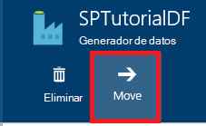

<properties 
    pageTitle="Supervisar y administrar las tuberías de la factoría de datos de Azure" 
    description="Aprenda a usar el Portal de Azure y Azure PowerShell para supervisar y administrar los generadores de datos Azure y canalizaciones que haya creado." 
    services="data-factory" 
    documentationCenter="" 
    authors="spelluru" 
    manager="jhubbard" 
    editor="monicar"/>

<tags 
    ms.service="data-factory" 
    ms.workload="data-services" 
    ms.tgt_pltfrm="na" 
    ms.devlang="na" 
    ms.topic="article" 
    ms.date="09/06/2016" 
    ms.author="spelluru"/>

# Supervisar y administrar las tuberías de la factoría de datos de Azure
> [AZURE.SELECTOR]
- [Utilizar el portal de Azure y Azure PowerShell](data-factory-monitor-manage-pipelines.md)
- [Mediante la supervisión y administración de la aplicación](data-factory-monitor-manage-app.md)

El servicio de generador de datos proporciona una vista completa y confiable de los servicios de movimiento de datos, procesamiento y almacenamiento de información. El servicio proporciona un monitoreo ayuda de panel que puede utilizar para realizar las siguientes tareas: 

- Evaluar rápidamente el estado de canalización de datos end-to-end.
- Identificar los problemas y tomar medidas correctivas si es necesario. 
- Linaje de datos de seguimiento. 
- Realizar un seguimiento de las relaciones entre los datos a través de cualquiera de los orígenes.
- Contabilidad histórica completa de vista de la ejecución del trabajo, el estado del sistema y dependencias.

En este artículo se describe cómo supervisar, administrar y depurar las canalizaciones. También proporciona información acerca de cómo crear alertas y recibir una notificación cuando se produzcan errores.

## Comprender las tuberías y los Estados de actividad
Mediante el portal de Azure, usted puede:

- Ver el generador de datos como un diagrama
- Ver actividades en una canalización
- Ver los conjuntos de datos de entrada y salida
- y mucho más. 

Esta sección proporciona también cómo un sector pasa de un estado a otro estado.   

### Desplácese hasta el generador de datos
1.  Iniciar sesión en el [portal de Azure](https://portal.azure.com).
2.  En el menú de la izquierda, haga clic en **generadores de datos** . Si no la ve, haga clic en **más servicios >** y haga clic en **generadores de datos** en **inteligencia + ANALYTICS** categoría. 

    

    Debería ver todos los generadores de datos en la hoja de **generadores de datos** . 
4. En la hoja de generadores de datos, seleccione el generador de datos que le interese.

      
5.  y debería ver la página principal (blade de la**factoría de datos** ) para el generador de datos.

    

#### Vista de diagrama de la factoría de datos
La vista de diagrama de un generador de datos proporciona un solo panel de vidrio para supervisar y administrar sus activos y el generador de datos.

Para ver la vista de diagrama de la factoría de datos, haga clic en **diagrama** en la página de inicio del generador de datos.

Puede acercar, alejar, zoom para ajustar, ajustar el zoom al 100%, bloquear el diseño del diagrama y colocar automáticamente las tuberías y tablas. También puede ver la información de linaje de datos (mostrar elementos ascendentes y descendentes de elementos seleccionados).
 

### Actividades dentro de una tubería 
1. (Ratón) en la canalización y haga clic en **abrir canalización** para ver todas las actividades en la canalización junto con los conjuntos de datos de entrada y salida para las actividades. Esta característica es útil cuando la canalización se compone de más de una actividad y desea conocer el linaje operativo de una sola tubería.

      
2. En el ejemplo siguiente, verá dos actividades en la canalización con sus entradas y salidas. La actividad titulada **JoinData** del tipo de actividad de subárbol de HDInsight y **EgressDataAzure** del tipo de actividad de copia se encuentran en esta canalización de ejemplo. 
    
     
3. Puede navegar a la página de inicio de la factoría de datos haciendo clic en el vínculo generador de datos en la ruta de exploración en la esquina superior izquierda.

    

### Estado de vista de cada actividad dentro de una tubería
Puede ver el estado actual de una actividad por ver el estado de cualquiera de los conjuntos de datos producidas por la actividad. 

Por ejemplo: en el ejemplo siguiente, el **BlobPartitionHiveActivity** se ejecutó correctamente y produce un conjunto de datos denominado **PartitionedProductsUsageTable**, que se encuentra en estado **Listo** .

Haga doble clic en el **PartitionedProductsUsageTable** en la vista diagrama muestra todos los sectores producidos por ejecuciones de actividad diferentes dentro de una canalización. Puede ver que el **BlobPartitionHiveActivity** se ejecutó correctamente cada mes para los últimos ocho meses y producido los sectores en estado **Listo** .

Los sectores del conjunto de datos en la factoría de datos pueden tener uno de los siguientes estados:

<table>
<tr>
    <th align="left">Estado</th><th align="left">Subestado</th><th align="left">Descripción</th>
</tr>
<tr>
    <td rowspan="8">En espera</td><td>ScheduleTime</td><td>No ha llegado el momento de ejecutar el sector.</td>
</tr>
<tr>
<td>DatasetDependencies</td><td>Las dependencias que precede en la cadena no están listas.</td>
</tr>
<tr>
<td>ComputeResources</td><td>Los recursos de cálculo no están disponibles.</td>
</tr>
<tr>
<td>ConcurrencyLimit</td> <td>Todas las instancias de actividad están ocupadas ejecutando otros sectores.</td>
</tr>
<tr>
<td>ActivityResume</td><td>Actividad está en pausa y no puede ejecutar los sectores hasta que se reanude.</td>
</tr>
<tr>
<td>Vuelva a intentar</td><td>Se vuelve a intentar la ejecución de la actividad.</td>
</tr>
<tr>
<td>Validación</td><td>Aún no ha iniciado la validación.</td>
</tr>
<tr>
<td>ValidationRetry</td><td>Esperando la validación volver a intentar.</td>
</tr>
<tr>
<tr
<td rowspan="2">En curso</td><td>Validar</td><td>Validación en curso.</td>
</tr>
<td></td>
<td>El sector se está procesando.</td>
</tr>
<tr>
<td rowspan="4">No se pudo</td><td>Tiempo de espera agotado</td><td>Ejecución tardó más tiempo del permitido por la actividad.</td>
</tr>
<tr>
<td>Cancelado</td><td>Cancelado por acción del usuario.</td>
</tr>
<tr>
<td>Validación</td><td>Error de validación.</td>
</tr>
<tr>
<td></td><td>No se pudo generar o validar el sector.</td>
</tr>
<td>Listo</td><td></td><td>El sector está listo para el consumo.</td>
</tr>
<tr>
<td>Omitido</td><td></td><td>La división no se procesa.</td>
</tr>
<tr>
<td>Ninguno</td><td></td><td>Un sector que solía existe con estados distintos, pero se ha restablecido.</td>
</tr>
</table>

Puede ver los detalles sobre un sector haciendo clic en una entrada del sector en el blade de **Sectores de actualizado recientemente** .

 
Si el sector se ha ejecutado varias veces, verá varias filas en la lista **actividad se ejecuta** . Puede ver detalles acerca de una actividad que se ejecuta haciendo clic en la entrada de ejecución en la lista **que actividad se ejecuta** . La lista muestra todos los archivos de registro junto con un mensaje de error si existe. Esta característica es útil para ver y depurar registros sin tener que abandonar su generador de datos.

Si el sector no está en el estado **Listo** , puede ver los sectores ascendente que no están preparados y están bloqueando el sector actual de ejecución en la lista de **sectores Upstream no preparados** . Esta característica es útil cuando el sector está en estado de **espera** y desea conocer las dependencias precede en la cadena en la que el sector está en espera.

### Diagrama de estado del conjunto de datos
Una vez que se implementa un generador de datos y las tuberías tienen un período válido de activo, el conjunto de datos rebanadas de transición de un estado a otro. Actualmente, el estado del sector sigue el siguiente diagrama de estado:

El flujo de transición de estado de dataset en fábrica de datos: espera -> en curso o en curso (validar) -> Listo/fallido

Los sectores se inician en un estado de **espera** para las condiciones previas que deben cumplir antes de ejecutar. A continuación, inicia la ejecución de la actividad y el sector está en estado **En curso** . La ejecución de la actividad puede triunfan o fracasan. El sector se marca como **Listo**' o **error** basándose en el resultado de la ejecución. 

Puede restablecer el sector para volver desde el estado **Listo** o **error** al estado de **espera** . Puede marcar también el estado del sector a **Omitir**, que impide la ejecución de la actividad y no procesar el sector.

## Administrar las tuberías
Puede administrar sus tuberías mediante PowerShell de Azure. Por ejemplo, puede pausar y reanudar las tuberías mediante la ejecución de cmdlets de PowerShell de Azure. 

### Pausar y reanudar las tuberías
Puede pausar o suspender tuberías mediante el cmdlet de Powershell **Suspend-AzureRmDataFactoryPipeline** . Este cmdlet es útil cuando no desea ejecutar las canalizaciones hasta que se solucione un problema.

Por ejemplo: en la siguiente pantalla, se ha identificado un problema con el **PartitionProductsUsagePipeline** en la factoría de datos de **productrecgamalbox1dev** y deseamos suspender la canalización.

Para suspender una canalización, ejecute el siguiente comando de PowerShell:

    Suspend-AzureRmDataFactoryPipeline [-ResourceGroupName] <String> [-DataFactoryName] <String> [-Name] <String>

Por ejemplo:

    Suspend-AzureRmDataFactoryPipeline -ResourceGroupName ADF -DataFactoryName productrecgamalbox1dev -Name PartitionProductsUsagePipeline 

Una vez que se ha solucionado el problema con el **PartitionProductsUsagePipeline**, se puede reanudar la canalización suspendida ejecutando el siguiente comando de PowerShell:

    Resume-AzureRmDataFactoryPipeline [-ResourceGroupName] <String> [-DataFactoryName] <String> [-Name] <String>

Por ejemplo:

    Resume-AzureRmDataFactoryPipeline -ResourceGroupName ADF -DataFactoryName productrecgamalbox1dev -Name PartitionProductsUsagePipeline 

## Depurar las tuberías
Generador de datos Azure ofrece amplias capacidades a través del portal de Azure y Azure PowerShell para depurar y solucionar problemas de las tuberías.

### Buscar errores en una canalización
Si se produce un error en la ejecución de la actividad en una canalización, el conjunto de datos generada por la canalización está en estado de error debido al error. Se puede depurar y solucionar errores en la factoría de datos de Azure mediante los mecanismos siguientes.

#### Utilice el portal de Azure para depurar un error:

3.  En la hoja de la **tabla** , haga clic en el sector del problema con el **estado** se establece en **fallida**.

    
4.  En la hoja de **REBANADA de datos** , haga clic en la actividad no se pudo ejecutar.
    
    
5.  En la hoja **Detalles de ejecución de la actividad** , puede descargar los archivos asociados con el procesamiento de HDInsight. Haga clic en descargar para estado/stderr descargar el archivo de registro de errores que contiene detalles sobre el error.

      

#### Utilizar la PowerShell para depurar un error
1.  Iniciar **PowerShell Azure**.
3.  Ejecute el comando **Get-AzureRmDataFactorySlice** para ver los sectores y sus Estados. Debería ver un sector con el estado: **error**.       

            Get-AzureRmDataFactorySlice [-ResourceGroupName] <String> [-DataFactoryName] <String> [-TableName] <String> [-StartDateTime] <DateTime> [[-EndDateTime] <DateTime> ] [-Profile <AzureProfile> ] [ <CommonParameters>]
    
    Por ejemplo:
        
            Get-AzureRmDataFactorySlice -ResourceGroupName ADF -DataFactoryName LogProcessingFactory -TableName EnrichedGameEventsTable -StartDateTime 2014-05-04 20:00:00

    Reemplazar **StartDateTime** por StartDateTime con el valor especificado para el conjunto de AzureRmDataFactoryPipelineActivePeriod.
4. Ahora, ejecute el cmdlet **Get-AzureRmDataFactoryRun** para obtener detalles sobre la actividad de ejecución para el sector.

        Get-AzureRmDataFactoryRun [-ResourceGroupName] <String> [-DataFactoryName] <String> [-TableName] <String> [-StartDateTime] 
        <DateTime> [-Profile <AzureProfile> ] [ <CommonParameters>]
    
    Por ejemplo:

        Get-AzureRmDataFactoryRun -ResourceGroupName ADF -DataFactoryName LogProcessingFactory -TableName EnrichedGameEventsTable -StartDateTime "5/5/2014 12:00:00 AM"

    El valor de StartDateTime es la hora de inicio del sector de error o problema que anotó en el paso anterior. La fecha y hora debe estar entre comillas dobles.
5.  Debe ver el resultado con detalles sobre el error (similar a la siguiente):

            Id                      : 841b77c9-d56c-48d1-99a3-8c16c3e77d39
            ResourceGroupName       : ADF
            DataFactoryName         : LogProcessingFactory3
            TableName               : EnrichedGameEventsTable
            ProcessingStartTime     : 10/10/2014 3:04:52 AM
            ProcessingEndTime       : 10/10/2014 3:06:49 AM
            PercentComplete         : 0
            DataSliceStart          : 5/5/2014 12:00:00 AM
            DataSliceEnd            : 5/6/2014 12:00:00 AM
            Status                  : FailedExecution
            Timestamp               : 10/10/2014 3:04:52 AM
            RetryAttempt            : 0
            Properties              : {}
            ErrorMessage            : Pig script failed with exit code '5'. See wasb://     adfjobs@spestore.blob.core.windows.net/PigQuery
                                            Jobs/841b77c9-d56c-48d1-99a3-
                        8c16c3e77d39/10_10_2014_03_04_53_277/Status/stderr' for
                        more details.
            ActivityName            : PigEnrichLogs
            PipelineName            : EnrichGameLogsPipeline
            Type                    :
    
    
6.  Puede ejecutar el cmdlet **Guardar AzureRmDataFactoryLog** con Id ver en la salida y descargar los archivos de registro mediante la **-DownloadLogsoption** para el cmdlet.

            Save-AzureRmDataFactoryLog -ResourceGroupName "ADF" -DataFactoryName "LogProcessingFactory" -Id "841b77c9-d56c-48d1-99a3-8c16c3e77d39" -DownloadLogs -Output "C:\Test"

## Vuelva a ejecutar los errores en una canalización

### Mediante el portal de Azure

Una vez solucionar problemas y depurar los errores en una canalización, puede volver a ejecutar errores navegando por el sector de error y haciendo clic en el botón **Ejecutar** de la barra de comandos.

En caso de que el sector ha fallado la validación debido a un error de la directiva (para ex: datos no disponibles), puede corregir el error y vuelva a validar haciendo clic en el botón **Validar** en la barra de comandos.

### Uso de PowerShell de Azure

Puede volver a ejecutar los errores mediante el cmdlet Set-AzureRmDataFactorySliceStatus. Consulte el tema [Set-AzureRmDataFactorySliceStatus](https://msdn.microsoft.com/library/mt603522.aspx) para la sintaxis y otros detalles acerca del cmdlet. 

**Ejemplo:** En el ejemplo siguiente se establece el estado de todos los sectores para la tabla 'DAWikiAggregatedData' 'En espera' en la factoría de datos de Azure 'WikiADF'.

El UpdateType se establece en UpstreamInPipeline, lo que significa que los Estados de cada sector para la tabla y todas las tablas dependientes (upstream) se establecen en "Espera". Otro valor posible para este parámetro es "Persona".

    Set-AzureRmDataFactorySliceStatus -ResourceGroupName ADF -DataFactoryName WikiADF -TableName DAWikiAggregatedData -Status Waiting -UpdateType UpstreamInPipeline -StartDateTime 2014-05-21T16:00:00 -EndDateTime 2014-05-21T20:00:00

## Crear alertas
Eventos de usuario de Azure registros cuando un recurso de Azure (por ejemplo, un generador de datos) se crea, actualiza o elimina. Puede crear alertas en estos eventos. Factoría de datos le permite capturar varias métricas y crear avisos de las estadísticas. Se recomienda utilizar eventos para monitoreo en tiempo real y la métrica para fines históricos. 

### Alertas de eventos
Eventos Azure proporcionan información útil en lo que está sucediendo en los recursos de Azure. Eventos de usuario de Azure registros cuando un recurso de Azure (por ejemplo, un generador de datos) se crea, actualiza o elimina. Cuando se utiliza el generador de datos de Azure, los eventos se generan cuando:

- Generador de datos Azure es crea, actualiza o elimina.
- Procesamiento de datos (denominado mientras se ejecuta) inició y finalizó.
- Un clúster de HDInsight en la demanda se crea y se elimina.

Puede crear alertas en estos eventos de usuario y configurarlos para enviar notificaciones por correo electrónico al administrador y co-administradores de la suscripción. Además, puede especificar direcciones de correo electrónico adicionales de los usuarios que necesiten recibir notificaciones por correo electrónico cuando se cumplen las condiciones. Esta característica es útil cuando desea recibir una notificación cuando se produzcan errores y no desea supervisar continuamente su generador de datos.

> [AZURE.NOTE] Actualmente, el portal no muestra alertas sobre eventos. Utilice la [supervisión y administración de la aplicación](data-factory-monitor-manage-app.md) para ver todas las alertas.

#### Especificar una definición de alerta:
Para especificar una definición de alerta, crea un archivo JSON que describe las operaciones que desea que se le avise en. En el ejemplo siguiente, la alerta envía una notificación de correo electrónico para la operación de RunFinished. Para ser más específicos, se envía una notificación por correo electrónico cuando una ejecución en la factoría de datos se ha completado y ha fallado la ejecución (estado = FailedExecution).

    {
        "contentVersion": "1.0.0.0",
         "$schema": "http://schema.management.azure.com/schemas/2014-04-01-preview/deploymentTemplate.json#",
        "parameters": {},
        "resources": 
        [
            {
                "name": "ADFAlertsSlice",
                "type": "microsoft.insights/alertrules",
                "apiVersion": "2014-04-01",
                "location": "East US",
                "properties": 
                {
                    "name": "ADFAlertsSlice",
                    "description": "One or more of the data slices for the Azure Data Factory has failed processing.",
                    "isEnabled": true,
                    "condition": 
                    {
                        "odata.type": "Microsoft.Azure.Management.Insights.Models.ManagementEventRuleCondition",
                        "dataSource": 
                        {
                            "odata.type": "Microsoft.Azure.Management.Insights.Models.RuleManagementEventDataSource",
                            "operationName": "RunFinished",
                            "status": "Failed",
                            "subStatus": "FailedExecution"   
                        }
                    },
                    "action": 
                    {
                        "odata.type": "Microsoft.Azure.Management.Insights.Models.RuleEmailAction",
                        "customEmails": [ "<your alias>@contoso.com" ]
                    }
                }
            }
        ]
    }

De la definición de JSON, **subestado** puede quitarse si no desea recibir una alerta sobre un error específico.

Este ejemplo configura la alerta para todos los generadores de datos en su suscripción. Si desea que la alerta esté configurada para un generador de datos concreto, puede especificar datos fábrica **resourceUri** en el **origen de datos**:

    "resourceUri" : "/SUBSCRIPTIONS/<subscriptionId>/RESOURCEGROUPS/<resourceGroupName>/PROVIDERS/MICROSOFT.DATAFACTORY/DATAFACTORIES/<dataFactoryName>"

En la siguiente tabla se proporciona la lista de operaciones disponibles y Estados (y estados secundarios).

Nombre de la operación | Estado | Estado de Sub
-------------- | ------ | ----------
RunStarted | Iniciado | A partir de
RunFinished | Falló y tuvo éxito | FailedResourceAllocation  Se realizó correctamente  FailedExecution  Tiempo de espera agotado  < cancelado  FailedValidation  Abandonadas
OnDemandClusterCreateStarted | Iniciado
OnDemandClusterCreateSuccessful | Se realizó correctamente
OnDemandClusterDeleted | Se realizó correctamente

Para obtener más información acerca de los elementos JSON utilizados en el ejemplo, vea [Crear regla de alertas](https://msdn.microsoft.com/library/azure/dn510366.aspx) . 

#### Implementación de la alerta 
Para implementar la alerta, use el cmdlet de PowerShell de Azure: **AzureRmResourceGroupDeployment de nuevo**, como se muestra en el ejemplo siguiente:

    New-AzureRmResourceGroupDeployment -ResourceGroupName adf -TemplateFile .\ADFAlertFailedSlice.json  

Una vez completada correctamente la implementación del grupo de recursos, vea los siguientes mensajes:

    VERBOSE: 7:00:48 PM - Template is valid.
    WARNING: 7:00:48 PM - The StorageAccountName parameter is no longer used and will be removed in a future release.
    Please update scripts to remove this parameter.
    VERBOSE: 7:00:49 PM - Create template deployment 'ADFAlertFailedSlice'.
    VERBOSE: 7:00:57 PM - Resource microsoft.insights/alertrules 'ADFAlertsSlice' provisioning status is succeeded
    
    DeploymentName    : ADFAlertFailedSlice
    ResourceGroupName : adf
    ProvisioningState : Succeeded
    Timestamp         : 10/11/2014 2:01:00 AM
    Mode              : Incremental
    TemplateLink      :
    Parameters        :
    Outputs           :

> [AZURE.NOTE] Puede utilizar la API de REST [Crear regla de alerta](https://msdn.microsoft.com/library/azure/dn510366.aspx) para crear una regla de alerta. La carga JSON es similar al ejemplo JSON.  

#### Recuperando la lista de las implementaciones de grupo de recursos de Azure
Para recuperar la lista de implementaciones de grupo de recursos de Azure implementadas, use el cmdlet: **Get-AzureRmResourceGroupDeployment**, como se muestra en el ejemplo siguiente:

    Get-AzureRmResourceGroupDeployment -ResourceGroupName adf
    
    DeploymentName    : ADFAlertFailedSlice
    ResourceGroupName : adf
    ProvisioningState : Succeeded
    Timestamp         : 10/11/2014 2:01:00 AM
    Mode              : Incremental
    TemplateLink      :
    Parameters        :
    Outputs           :

#### Solución de problemas de eventos de usuario

1. Puede ver todos los eventos generados después de hacer clic en el mosaico de **métricas y las operaciones** .

    

2. Haga clic en mosaico de **eventos** para ver los eventos. 

    
3. En la hoja de **eventos** , puede ver detalles sobre los eventos, filtrar los sucesos y así sucesivamente. 

    
4. Haga clic en una **operación** en la lista de operaciones que se produce un error.
    
     
5. Haga clic en un evento de **error** para ver detalles sobre el error.

    
  

Consulte el artículo de [Azure Insight Cmdlets](https://msdn.microsoft.com/library/mt282452.aspx) para los cmdlets de PowerShell que puede utilizar para agregar get o eliminar alertas. A continuación presentamos algunos ejemplos de uso del cmdlet **Get-AlertRule** : 

    PS C:\> get-alertrule -res $resourceGroup -n ADFAlertsSlice -det
        
            Properties :
            Action      : Microsoft.Azure.Management.Insights.Models.RuleEmailAction
            Condition   :
            DataSource :
            EventName             :
            Category              :
            Level                 :
            OperationName         : RunFinished
            ResourceGroupName     :
            ResourceProviderName  :
            ResourceId            :
            Status                : Failed
            SubStatus             : FailedExecution
            Claims                : Microsoft.Azure.Management.Insights.Models.RuleManagementEventClaimsDataSource
            Condition   :
            Description : One or more of the data slices for the Azure Data Factory has failed processing.
            Status      : Enabled
            Name:       : ADFAlertsSlice
            Tags       :
            $type          : Microsoft.WindowsAzure.Management.Common.Storage.CasePreservedDictionary, Microsoft.WindowsAzure.Management.Common.Storage
            Id: /subscriptions/<subscription ID>/resourceGroups/<resource group name>/providers/microsoft.insights/alertrules/ADFAlertsSlice
            Location   : West US
            Name       : ADFAlertsSlice
    
    PS C:\> Get-AlertRule -res $resourceGroup

            Properties : Microsoft.Azure.Management.Insights.Models.Rule
            Tags       : {[$type, Microsoft.WindowsAzure.Management.Common.Storage.CasePreservedDictionary, Microsoft.WindowsAzure.Management.Common.Storage]}
            Id         : /subscriptions/<subscription id>/resourceGroups/<resource group name>/providers/microsoft.insights/alertrules/FailedExecutionRunsWest0
            Location   : West US
            Name       : FailedExecutionRunsWest0
    
            Properties : Microsoft.Azure.Management.Insights.Models.Rule
            Tags       : {[$type, Microsoft.WindowsAzure.Management.Common.Storage.CasePreservedDictionary, Microsoft.WindowsAzure.Management.Common.Storage]}
            Id         : /subscriptions/<subscription id>/resourceGroups/<resource group name>/providers/microsoft.insights/alertrules/FailedExecutionRunsWest3
            Location   : West US
            Name       : FailedExecutionRunsWest3

    PS C:\> Get-AlertRule -res $resourceGroup -Name FailedExecutionRunsWest0
    
            Properties : Microsoft.Azure.Management.Insights.Models.Rule
            Tags       : {[$type, Microsoft.WindowsAzure.Management.Common.Storage.CasePreservedDictionary, Microsoft.WindowsAzure.Management.Common.Storage]}
            Id         : /subscriptions/<subscription id>/resourceGroups/<resource group name>/providers/microsoft.insights/alertrules/FailedExecutionRunsWest0
            Location   : West US
            Name       : FailedExecutionRunsWest0

Ejecute los siguientes comandos get-help para ver detalles y ejemplos para el cmdlet Get-AlertRule. 

    get-help Get-AlertRule -detailed 
    get-help Get-AlertRule -examples

- Si ver los eventos de generación de alertas en el blade portal pero no recibirá notificaciones por correo electrónico, compruebe si se ha establecido la dirección de correo electrónico especificada para recibir correos electrónicos de remitentes externos. Los correos electrónicos de alerta que ha bloqueado por la configuración de correo electrónico.

### Alertas de las estadísticas
Factoría de datos le permite capturar varias métricas y crear avisos de las estadísticas. Puede supervisar y crear alertas en las siguientes métricas para los sectores en el generador de datos.
 
- Error ejecuciones
- Se ejecuta correctamente

Estas mediciones son útiles y permiten obtener una visión general de ejecuciones global correctos y erróneos en la fábrica de sus datos. Métricas se emiten cada vez que hay una ejecución del sector. Encima de la hora, estas métricas se suman y se envían a la cuenta de almacenamiento. Por tanto, para habilitar métricas, configurar una cuenta de almacenamiento.

#### Habilitación de métricas:
Para habilitar las métricas, haga clic en los siguientes puntos de blade de la factoría de datos:

**Supervisión de** -> **métrica** -> **Opciones de diagnóstico** -> **diagnóstico**

En la hoja de **diagnóstico** , haga clic **en** y seleccione la cuenta de almacenamiento y guardar.

Una vez guardado, puede tardar hasta una hora para las métricas que estén visibles en la hoja de supervisión, como agregación de métrica se realiza cada hora.

### Configuración de alerta de las estadísticas:

Haga clic en hoja de **métricas de la factoría de datos** : 

En la hoja de **métrica** , haga clic en **+ Agregar alerta** en la barra de herramientas. 

En la página **Agregar una regla de alerta** , siga los pasos siguientes y haga clic en **Aceptar**.
 
- Escriba un nombre para la alerta (ejemplo: alerta de error).
- Escriba una descripción para la alerta (ejemplo: enviar un correo electrónico cuando se produce un error).
- Seleccione una métrica (error se ejecuta y se ejecuta correctamente).
- Especifique una condición y un valor de umbral.   
- Especifique el período. 
- Especificar si debe enviarse un correo electrónico a los lectores, colaboradores y propietarios.
- y mucho más. 

Una vez que la regla de alerta se agrega correctamente, se cierra la hoja y verá la nueva alerta en la página de **métrica** . 

También debería ver el número de alertas en el mosaico de **alertas** . Haga clic en mosaico de **alertas** .

En el módulo de **alertas** , puede ver las alertas existentes. Para agregar una alerta, haga clic en **Agregar aviso** en la barra de herramientas.

### Notificaciones de alerta:
Una vez que la regla de alerta coincide con la condición, recibirá una alerta por correo electrónico activada. Una vez que se resuelva el problema y la condición de alerta no coincide con ninguna más, obtendrá una alerta por correo electrónico resuelta.

Este comportamiento es diferente a los eventos que se envía una notificación sobre cada error de la regla de alerta califica.

### Implementación de alertas a través de PowerShell
Puede implementar alertas para las mediciones de la misma manera como lo hace para los eventos. 

**Definición de alerta:**

    {
        "contentVersion" : "1.0.0.0",
        "$schema" : "http://schema.management.azure.com/schemas/2014-04-01-preview/deploymentTemplate.json#",
        "parameters" : {},
        "resources" : [
        {
                "name" : "FailedRunsGreaterThan5",
                "type" : "microsoft.insights/alertrules",
                "apiVersion" : "2014-04-01",
                "location" : "East US",
                "properties" : {
                    "name" : "FailedRunsGreaterThan5",
                    "description" : "Failed Runs greater than 5",
                    "isEnabled" : true,
                    "condition" : {
                        "$type" : "Microsoft.WindowsAzure.Management.Monitoring.Alerts.Models.ThresholdRuleCondition, Microsoft.WindowsAzure.Management.Mon.Client",
                        "odata.type" : "Microsoft.Azure.Management.Insights.Models.ThresholdRuleCondition",
                        "dataSource" : {
                            "$type" : "Microsoft.WindowsAzure.Management.Monitoring.Alerts.Models.RuleMetricDataSource, Microsoft.WindowsAzure.Management.Mon.Client",
                            "odata.type" : "Microsoft.Azure.Management.Insights.Models.RuleMetricDataSource",
                            "resourceUri" : "/SUBSCRIPTIONS/<subscriptionId>/RESOURCEGROUPS/<resourceGroupName
    >/PROVIDERS/MICROSOFT.DATAFACTORY/DATAFACTORIES/<dataFactoryName>",
                            "metricName" : "FailedRuns"
                        },
                        "threshold" : 5.0,
                        "windowSize" : "PT3H",
                        "timeAggregation" : "Total"
                    },
                    "action" : {
                        "$type" : "Microsoft.WindowsAzure.Management.Monitoring.Alerts.Models.RuleEmailAction, Microsoft.WindowsAzure.Management.Mon.Client",
                        "odata.type" : "Microsoft.Azure.Management.Insights.Models.RuleEmailAction",
                        "customEmails" : ["abhinav.gpt@live.com"]
                    }
                }
            }
        ]
    }
 
Reemplazar subscriptionId, resourceGroupName y dataFactoryName en la muestra con los valores apropiados.

*metricName* a partir de ahora admite dos valores:
- FailedRuns
- SuccessfulRuns

**Implementación de la alerta:**

Para implementar la alerta, use el cmdlet de PowerShell de Azure: **AzureRmResourceGroupDeployment de nuevo**, como se muestra en el ejemplo siguiente:

    New-AzureRmResourceGroupDeployment -ResourceGroupName adf -TemplateFile .\FailedRunsGreaterThan5.json

Debería ver el siguiente mensaje después de la implementación correcta:

    VERBOSE: 12:52:47 PM - Template is valid.
    VERBOSE: 12:52:48 PM - Create template deployment 'FailedRunsGreaterThan5'.
    VERBOSE: 12:52:55 PM - Resource microsoft.insights/alertrules 'FailedRunsGreaterThan5' provisioning status is succeeded
    
    
    DeploymentName    : FailedRunsGreaterThan5
    ResourceGroupName : adf
    ProvisioningState : Succeeded
    Timestamp         : 7/27/2015 7:52:56 PM
    Mode              : Incremental
    TemplateLink      :
    Parameters        :
    Outputs           

También puede utilizar el cmdlet **Add-AlertRule** para implementar una regla de alerta. Vea el tema de [Agregar AlertRule](https://msdn.microsoft.com/library/mt282468.aspx) para obtener información detallada y ejemplos.  

## Fábrica de mover datos a una suscripción o de otro grupo de recursos
Puede mover un generador de datos a otro grupo de recursos o una suscripción diferente utilizando el botón de la barra de comando **mover** en la página principal de la factoría de datos. 

También puede mover todos los recursos relacionados (como alertas asociadas a la factoría de datos) junto con el generador de datos.

