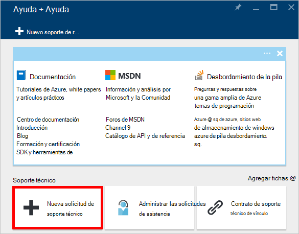

<properties
    pageTitle="Solicitud de aumenta cuotas de cuenta DocumentDB | Microsoft Azure"
    description="Obtenga información sobre cómo solicitar un ajuste en las cuotas de la base de datos DocumentDB como almacenamiento de documentos y rendimiento por colección."
    services="documentdb"
    authors="AndrewHoh"
    manager="jhubbard"
    editor="monicar"
    documentationCenter=""/>

<tags
    ms.service="documentdb"
    ms.workload="data-services"
    ms.tgt_pltfrm="na"
    ms.devlang="na"
    ms.topic="article"
    ms.date="08/25/2016"
    ms.author="anhoh"/>

# Solicitar el aumento de los límites de cuentas de DocumentDB

[Microsoft Azure DocumentDB](https://azure.microsoft.com/services/documentdb/) tiene un conjunto de cuotas predeterminadas que se pueden ajustar por ponerse en contacto con el soporte de Azure.  En este artículo se muestra cómo solicitar un aumento de la cuota.

Después de leer este artículo, podrá responder a las preguntas siguientes:  

-   ¿Pueden ajustar las cuotas de la base de datos DocumentDB póngase en contacto con el soporte de Azure?
-   ¿Cómo puedo solicitar un ajuste de cuota DocumentDB cuenta?

##Cuotas de cuenta de DocumentDB

La tabla siguiente describe los contingentes DocumentDB. Las cuotas que tienen un asterisco (*) pueden ser ajustadas por ponerse en contacto con el soporte de Azure:

[AZURE.INCLUDE [azure-documentdb-limits](../../includes/azure-documentdb-limits.md)]

##Solicitar un ajuste de cuota
Los pasos siguientes muestran cómo solicitar un ajuste de cuota.

1. En el [portal de Azure](https://portal.azure.com), haga clic en **Más servicios**y, a continuación, haga clic en **Ayuda + Ayuda**.

    

2. En la hoja de **Ayuda + Ayuda** , haga clic en **nueva solicitud de soporte técnico**.

    

3. En la hoja **nueva solicitud de soporte técnico** , haga clic en **conceptos básicos**. La cuenta siguiente, establezca **el tipo de problema** para la **cuota de** **suscripción** para la suscripción que aloja su DocumentDB, **tipo de cuota** para **DocumentDB**y **plan de soporte** para **Soporte de cuota - incluido**. A continuación, haga clic en **siguiente**.

    

4. En la hoja del **problema** , elija un nivel de gravedad e incluyen información sobre el aumento de la cuota de **Detalles**. Haga clic en **siguiente**.

    

5. Finalmente, rellene la información de contacto en la hoja de **información de contacto** y haga clic en **crear**.

Una vez que se ha creado el ticket de soporte, debe recibir el número de solicitud de soporte técnico por correo electrónico.  También puede ver la solicitud de soporte técnico haciendo clic en **Administrar soporte solicita** en la hoja de **Ayuda + Ayuda** .

##Próximos pasos
- Para obtener más información acerca de DocumentDB, haga clic en [aquí](http://azure.com/docdb).
