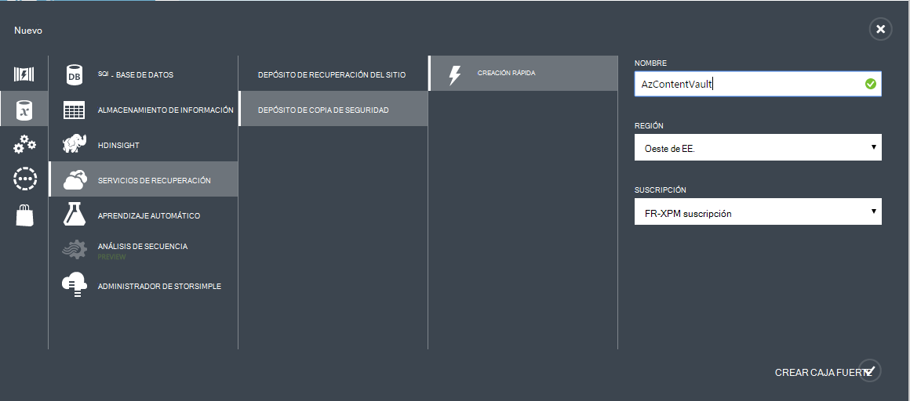
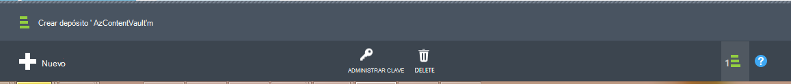

## Crear un depósito de copia de seguridad
Para realizar una copia de archivos y datos de Windows Server o Data Protection Manager (DPM) a Azure o cuando la copia de seguridad de máquinas virtuales de IaaS en Azure, debe crear un depósito de copia de seguridad en la región geográfica donde desea almacenar los datos.

Los siguientes pasos le guiará a través de la creación del depósito utilizada para almacenar las copias de seguridad.

1. Iniciar sesión en el [Portal de administración](https://manage.windowsazure.com/)
2. Haga clic en **nuevo** > **Data Services** > **Servicios de recuperación de** > **Depósito de copia de seguridad** y elija **Crear rápido**.

    

3. Para el parámetro de **nombre** , escriba un nombre descriptivo para identificar la caja fuerte de copia de seguridad. Debe ser único para cada suscripción.

4. Para el parámetro de **región** , seleccione la región geográfica de la caja fuerte de copia de seguridad. La elección determina la región geográfica a la que se envían los datos de backup. Al elegir una región cerca de su ubicación geográfica, puede reducir la latencia de red al realizar copias de seguridad en Azure.

5. Haga clic en **Crear depósito** para completar el flujo de trabajo. Puede que tarde un tiempo para el depósito de reserva que se cree. Para comprobar el estado, puede supervisar las notificaciones en la parte inferior del portal.

    

6. Una vez se ha creado la caja fuerte de copia de seguridad, un mensaje le indicará que el depósito se ha creado correctamente. El depósito aparece también en los recursos para los servicios de recuperación como **activa**.

    

### Copia de seguridad de Azure - opciones de redundancia de almacenamiento

>[AZURE.IMPORTANT] El mejor momento para identificar su opción de redundancia de almacenamiento es justo después de la creación de la caja fuerte, y antes de que los equipos están registrados en el depósito. Una vez que un elemento se ha registrado en el depósito, la opción de redundancia de almacenamiento está bloqueada y no se puede modificar.

Necesidades de su empresa deben determinar la redundancia de almacenamiento del almacenamiento de información de back-end de copia de seguridad de Azure. Si está utilizando Azure como un extremo de la copia de seguridad de almacenamiento de información primario (por ejemplo, copia de seguridad a Azure desde un servidor de Windows), debe considerar picking (predeterminado) la opción de almacenamiento Geo redundantes. Esto se ve en la opción **Configurar** de la caja fuerte de la copia de seguridad.

#### Almacenamiento redundante geo (GRS)
GRS mantiene seis copias de sus datos. Con GRS, los datos se replican tres veces dentro de la región primaria y también se replican tres veces en una zona secundaria cientos de millas lejos de la región principal, ofrecer el más alto nivel de durabilidad. En el caso de una falla en la región principal, almacenando datos en GRS, copia de seguridad de Azure garantiza que sus datos están duraderos en dos regiones separadas.

#### Almacenamiento redundante local (LRS)
Almacenamiento redundante local (LRS) mantiene tres copias de los datos. LRS se replica tres veces en una sola instalación de una única región. LRS protege sus datos de fallas de hardware normal, pero no de la falta de una instalación completa de Azure.

Si utilizas Azure como un extremo de almacenamiento terciario (por ejemplo, utiliza SCDPM para tener una copia de seguridad local copia local & uso de Azure para las necesidades de su retención a largo plazo), debería elegir almacenamiento redundante localmente desde la opción **Configurar** de la caja fuerte de la copia de seguridad. Esto trae el coste de almacenar los datos en Azure, proporcionando un menor nivel de durabilidad para los datos que podrían ser aceptables para copias terciarios.

