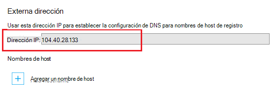

El sistema de nombres de dominio (DNS) se utiliza para buscar recursos en internet. Por ejemplo, cuando escribe una dirección de la aplicación web en un explorador, o haga clic en un vínculo en una página web, utiliza DNS para traducir el dominio en una dirección IP. La dirección IP es algo así como una dirección, pero no es muy humano descriptivo. Por ejemplo, es mucho más fácil recordar un nombre DNS como **contoso.com** lo es recordar una dirección IP, como 192.168.1.88 o 2001:0:4137:1f67:24a2:3888:9cce:fea3.

El sistema DNS se basa en *registros*. Los registros asocian un determinado *nombre*, como **contoso.com**, con otro nombre DNS o una dirección IP. Cuando una aplicación, como un explorador web, busca un nombre en DNS, busca el registro y se utiliza lo señala a la dirección. Si el valor al que señala es una dirección IP, el explorador utilizará ese valor. Si señala a otro nombre DNS, la aplicación debe realizar resolución otra vez. En última instancia, la resolución de nombres terminará en una dirección IP.

Cuando se crea una aplicación web de servicio de la aplicación, se asigna automáticamente un nombre DNS a la aplicación web. Este nombre tiene el formato de ** &lt;yourwebappname&gt;. azurewebsites.net**. También hay una dirección IP virtual disponible para su uso cuando se registra la creación de DNS, por lo que puede crear registros que apuntan a la **. azurewebsites.net**, o puede apuntar a la dirección IP.

> [AZURE.NOTE] Si eliminar y volver a crear la aplicación web o cambiar el modo de plan de servicio de la aplicación en **libre** una vez se ha establecido a **básica**, **compartida**o **estándar**, cambiará la dirección IP de su aplicación web.

También existen varios tipos de registros, cada uno con sus propias funciones y limitaciones, pero para aplicaciones web sólo nos interesan dos registros *A* y *CNAME* .

###Registro de dirección (registro)

Un registro asigna un dominio, como **contoso.com** o **www.contoso.com**, *o un dominio comodín* como ** \*. contoso.com**, a una dirección IP. En el caso de una aplicación web del servicio de la aplicación, la dirección IP virtual del servicio o una dirección IP específica de direcciones que compró para su aplicación web.

Las ventajas principales de un registro a través de un registro CNAME son:

* Puede asignar un dominio raíz como **contoso.com** a una dirección IP; muchos de los registradores sólo permiten esta mediante registros

* Puede tener una entrada que utiliza un carácter comodín, como ** \*. contoso.com**, que debería controlar las solicitudes de varios subdominios, como **mail.contoso.com**, **blogs.contoso.com**o **www.contso.com**.

> [AZURE.NOTE] Dado que un registro se asigna a una dirección IP estática, no se puede resolver automáticamente cambios a la dirección IP de su aplicación web. Se proporciona una dirección IP para su uso con los registros al configurar las opciones de nombre de dominio personalizado para su aplicación web; Sin embargo, puede cambiar este valor si eliminar y volver a crear la aplicación web o cambiar el modo de plan de servicio de la aplicación hacia atrás en **libre**.

###Registro de alias (registros CNAME)

Un registro CNAME asigna un nombre DNS *específico* , por ejemplo, **mail.contoso.com** o **www.contoso.com**, a otro nombre de dominio (canónico). En el caso de la aplicación de servicio Web Apps, el nombre de dominio canónico es el ** &lt;yourwebappname >. azurewebsites.net** nombre de dominio de su aplicación web. Una vez creado, el registro CNAME crea un alias para la ** &lt;yourwebappname >. azurewebsites.net** nombre de dominio. La entrada CNAME resolverá con la dirección IP de su ** &lt;yourwebappname >. azurewebsites.net** nombre de dominio automáticamente, por lo que si cambia la dirección IP de la aplicación web, no tiene que realizar ninguna acción.

> [AZURE.NOTE] Algunos registradores de dominio sólo permiten asignar subdominios al utilizar un registro CNAME, como **www.contoso.com**y no nombres de raíz, como **contoso.com**. Para obtener más información sobre registros CNAME, consulte la documentación proporcionada por el registrador, <a href="http://en.wikipedia.org/wiki/CNAME_record">la entrada de Wikipedia en registro CNAME</a>o el documento de <a href="http://tools.ietf.org/html/rfc1035">IETF Domain Names - implementación y especificación</a> .

###Características del DNS de la aplicación Web

Utiliza un registro con aplicaciones Web debe crear primero uno de los siguientes registros TXT:

* **Para el dominio raíz** - TXT de DNS de un registro de **@** a ** &lt;yourwebappname&gt;. azurewebsites.net**.

* **Para un subdominio específico** : un nombre DNS de ** &lt;subdominio >** a ** &lt;yourwebappname&gt;. azurewebsites.net**. Por ejemplo, **blogs** si el registro es para **blogs.contoso.com**.

* **Para el comodín sub-dodmains** - registro A DNS TXT de *** a ** &lt;yourwebappname&gt;. azurewebsites.net**.

Este registro TXT se utiliza para comprobar que el propietario del dominio que está intentando utilizar. Se trata además de crear un registro que señala a la dirección IP virtual de su aplicación web.

Puede encontrar la dirección IP y **. azurewebsites.net** nombres para las aplicaciones web realizando los pasos siguientes:

1. En el explorador, abra el [Portal de Azure](https://portal.azure.com).

2. En el módulo de **Aplicaciones Web** , haga clic en el nombre de su aplicación web y, a continuación, seleccione los **dominios personalizados** desde la parte inferior de la página.

    

3. En la hoja de **dominios personalizados** , verá la dirección IP virtual. Guardar esta información, ya que se utilizará al crear los registros DNS

    

    > [AZURE.NOTE] No puede utilizar nombres de dominio personalizado con una aplicación de web **libre** y debe actualizar el plan de servicio de la aplicación a **Shared**, **básico**, **estándar**o nivel **Premium** . Para obtener más información sobre el plan de servicio de la aplicación de precios niveles, incluida la forma de cambiar el nivel de precios de su aplicación web, vea [cómo escalar las aplicaciones web](../articles/web-sites-scale.md).
