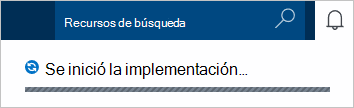
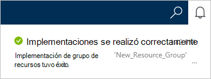
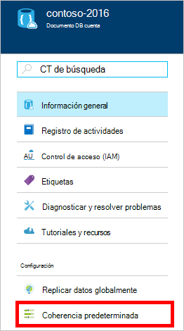
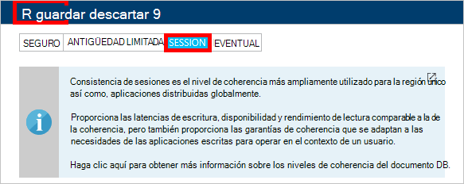

1.  Iniciar sesión en el [portal de Azure](https://portal.azure.com/).
2.  En el Jumpbar, haga clic en **nuevo**, haga clic en **datos + almacenamiento**y, a continuación, haga clic en **DocumentDB (NoSQL)**.

      

3. En la hoja **nueva cuenta** , especifique la configuración deseada para la cuenta de DocumentDB.

    

    - En el cuadro **ID** , escriba un nombre para identificar la cuenta DocumentDB.  Cuando se valida el **identificador** , una marca de verificación verde aparece en el cuadro **ID** . El valor del **identificador** se convierte en el nombre de host en el URI. El **identificador** puede contener sólo letras minúsculas, números y el '-' de caracteres y debe estar entre 3 y 50 caracteres. Tenga en cuenta que *documents.azure.com* se anexa al nombre de extremo que elige, el resultado es el extremo de la cuenta DocumentDB.

    - En el cuadro de la **API de NoSQL** , seleccione **DocumentDB**.  

    - De **suscripción**, seleccione la suscripción de Azure que desea utilizar para la cuenta de DocumentDB. Si su cuenta tiene sólo una suscripción, esa cuenta está seleccionada por defecto.

    - En el **Grupo de recursos**, seleccione o cree un grupo de recursos para su cuenta de DocumentDB.  De forma predeterminada, se crea un nuevo grupo de recursos. Para obtener más información, vea [utilizar el portal de Azure para administrar los recursos de Azure](../articles/azure-portal/resource-group-portal.md).

    - Usar **ubicación** para especificar la ubicación geográfica en la que se va a alojar su cuenta DocumentDB. 

4.  Una vez configuradas las opciones de cuenta de DocumentDB nueva, haga clic en **crear**. Para comprobar el estado de la implementación, revise el concentrador de notificaciones.  

      

    

5.  Después de crea la cuenta de DocumentDB, está listo para su uso con la configuración predeterminada. La coherencia predeterminada de la cuenta de DocumentDB se establece en la **sesión**.  Puede ajustar la coherencia predeterminada haciendo clic en **Coherencia predeterminada** en el menú de recursos. Para obtener más información acerca de los niveles de coherencia ofrecidos por DocumentDB, vea [niveles de coherencia en DocumentDB](../articles/documentdb/documentdb-consistency-levels.md).

      

      

[How to: Create a DocumentDB account]: #Howto
[Next steps]: #NextSteps
[documentdb-manage]:../articles/documentdb/documentdb-manage.md
